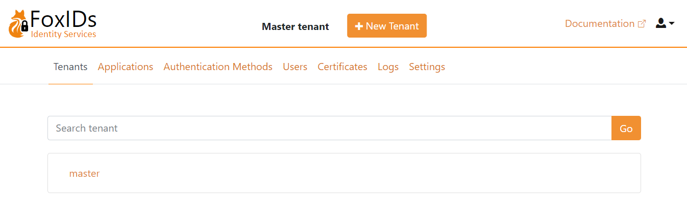

# FoxIDs

FoxIDs is an open source identity service supporting login, OAuth 2.0, OpenID Connect 1.0, SAML 2.0 and convention between the standards e.g. from SAML 2.0 to OpenID Connect.

> STATUS: I'm currently working on the documentation and the first FoxIDs release.

FoxIDs consist of two services:

- Identity service called FoxIDs handling user login and all other security traffic.
- Client and API called FoxIDs Control. The FoxIDs Control Client is used to configure FoxIDs, or alternatively by calling the FoxIDs Control API directly.

Deployment or as a service:

- FoxIDs is a cloud service ready to be [deployed](https://www.foxids.com/docs/deployment) in you Azure tenant.
- Or you can use FoxIDs as an identity as a service (IDaaS) at [FoxIDs.com](https://foxids.com).

> For [Getting started](https://www.foxids.com/docs/getting-started) guide and more documentation please see the [documentation](https://www.foxids.com/docs).

> FoxIDs is .NET 5.0 and the Control FoxIDs Control Client is Blazor .NET Standard 2.1.

## Deployment

Deploy FoxIDs in your Azure tenant. 

The Azure deployment include:

- Two App Services one for FoxIDs and one for the FoxIDs Control (Client and API). Both App Services is hosted in the same App Service plan and the App Services has both a production and test slot. 
- FoxIDs is deployed to the two App Services test slots from the `master` branch with Kudu. When the branch is updated an automatically deployment update is initiated with webhooks. Deployment updates is automatically promoted from the test slots to the production slots. In a production environment It is recommended to chanting the production promotion to manually initiated.
- Key vault. Secrets are placed in Key vault.
- Cosmos DB.
- Redis cache.
- Application Insights.

### Send emails with Sendgrid
FoxIDs relay on Sendgrid to send emails to the users for account verification and password reset.  
You can optionally configure a Sendgrid from email address and Sendgrid API key in the Azure deployment configuration. You can either [create Sendgrid in Azure](https://docs.microsoft.com/en-us/azure/sendgrid-dotnet-how-to-send-email) or directly on [Sendgrid](https://Sendgrid.com), there are more free emails in an Azure manage Sendgrid.

> Remember to setup up [domain authentication](https://sendgrid.com/docs/ui/account-and-settings/how-to-set-up-domain-authentication/) in Sendgrid for the from email.

A Sendgrid from email address and API Key can at a later time be configure per track.

### First login and admin users
After successfully deployment open [FoxIDs Control Client](control.md#foxids-control-client) on `https://foxidscontrolxxxxxxxxxx.azurewebsites.net` (the app service starting with foxidscontrol...) which brings you to the master tenant.

> The default admin user is: `admin@foxids.com` with password: `FirstAccess!` (you are required to change the password on first login)

> Create your one admin users with a valid email address and grant the users the admin role 'foxids:tenant.admin'.

#### Troubleshooting deployent errors

**Key Vault soft deleted**
If you have deleted a previous deployment the Key Vault is only soft deleted and sill exist with the same name for some months. 
In this case you can experience getting a 'ConflictError' with the error message 'Exist soft deleted vault with the same name.'.

The solution is to delete (purge) the old Key Vault, which will release the name.

### Seed

#### Upload risk passwords

You can upload risk passwrods in FoxIDs Control Client master tenant on the Rrisk Passwords tap. 

Download the `SHA-1` pwned passwords `ordered by prevalence` from [haveibeenpwned.com/passwords](https://haveibeenpwned.com/Passwords).

> Be aware that it takes some time to upload all risk passwords. This step can be omitted and postponed to later.  
> The risk passwords are uploaded as bulk which has a higher consumption. Please make sure to adjust the Cosmos DB provisioned throughput (e.g. to 20000 RU/s) temporarily.

#### Add sample configuration to a track

It is possible to run the sample applications after they are configured in a FoxIDs track. The sample configuration can be added with the [sample seed tool](docs/samples.md#configure-samples-in-foxids-track).

## Support

If you have questions please ask them on [Stack Overflow](https://stackoverflow.com/questions/tagged/foxids). Tag your questions with 'foxids' and I will answer as soon as possible.

## Development

FoxIDs  
`https://localhost:44330`

FoxIDs Control (Blazor WebAssembly Client and API)  
`https://localhost:44331`
