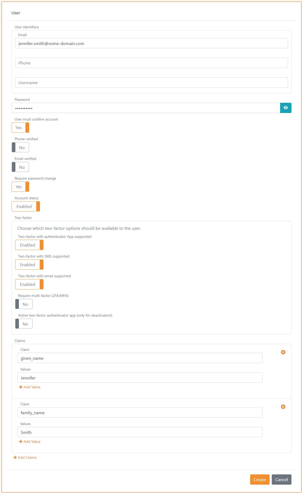
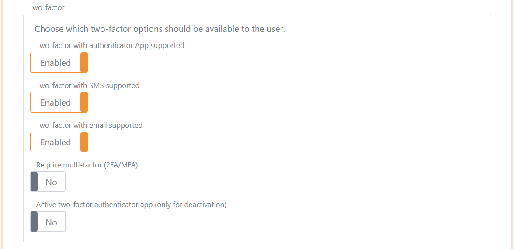

# Users
Users are saved in [user repositories](#user-repository) where each track contains exactly one user repository. Users are authenticated using the [up-party login](login.md) user interface (UI).

## Configuration
New users can be created by the administrator through [FoxIDs Control Client](control.md#foxids-control-client) or be provisioned through [FoxIDs Control API](control.md#foxids-control-api).

### Configure multi-factor authentication (MFA)
Multi-factor authentication can be required per user. The user will then be required to authenticate with a two-factor authenticator app in a [up-party login](login.md#two-factor-authentication-2famfa) and to configure the authenticator app if not already configured.

It is possible to see whether a two-factor authenticator app is configured for the user, and the administrator can deactivate the configured two-factor authenticator app.

## User repository 
Each track contains a user repository supporting an unlimited number of users because they are saved in Cosmos DB. The users id, email and other claims are saved as text.  
The password is never saved needer in logs or in Cosmos DB. Instead, a hash of the password is saved along with the rest of the user information.

### Password hash
FoxIDs is designed to support a growing number of algorithms with different iterations by saving information about the hash algorithm used alongside the actually hash. Therefore, FoxIDs can validate an old hash algorithm and at the same time save new hashes with a new hash algorithm.

Currently FoxIDs support and use hash algorithm `P2HS512:10` which is defined as:

- The `HMAC` algorithm (`RFC 2104`) using the `SHA-512` hash function (`FIPS 180-4`).
- With 10 iterations.
- Salt is generated from 64 bytes.
- Derived key length is 80 bytes.

Standard .NET liberals are used to calculate the hash.
