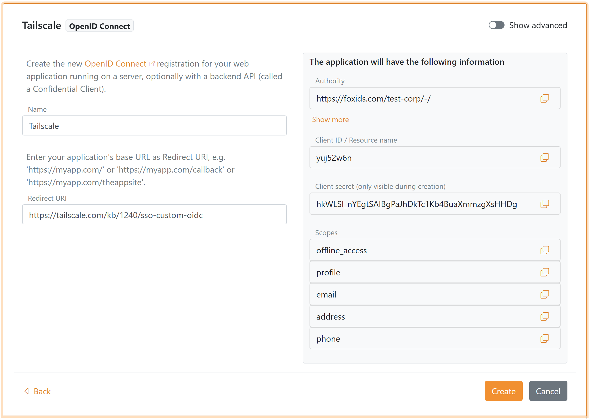
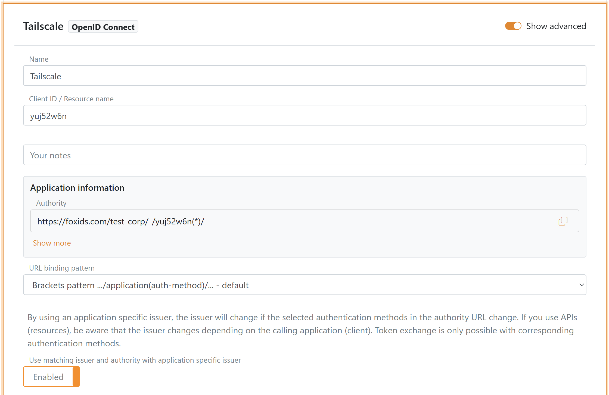

# Connect to Tailscale with OpenID Connect

Connect FoxIDs as an **external identity provider for Tailscale** with OpenID Connect (OIDC) 1.0.

Tailscale requires proof of domain ownership through [WebFinger discovery](https://datatracker.ietf.org/doc/html/rfc7033) when you use a custom OIDC provider. Configure a WebFinger response that points to the FoxIDs application you create for Tailscale.

## Configure FoxIDs

**1 - Start creating an OpenID Connect application in [FoxIDs Control Client](control.md#foxids-control-client)**

1. Select the **Applications** tab
2. Click **New application**
3. Click **Web application (OpenID Connect)** to create an OIDC client application
4. Enter the **Name**, e.g. `Tailscale`
5. Set **Redirect URI** to `https://login.tailscale.com/a/oauth_response`
6. In the panel on the right labeled **The application will have the following information**
    - Copy the **Client ID** and **Client Secret** for later use in the Tailscale sign-up

7. Click **Create**
8. Click **Change application** to open the application in edit mode
9. Click **Show advanced**
10. Enable **Use matching issuer and authority with application specific issuer**
11. Click **Update**

12. Go to the top of the application, find the **Application information** section and click **Show more**
    - Copy the **Authority** which is the FoxIDs issuer URL for Tailscale

## Configure WebFinger for your domain

**2 - Then set up a WebFinger endpoint on your domain**

To allow Tailscale to discover your FoxIDs issuer, host a WebFinger endpoint at `https://<your-domain>/.well-known/webfinger`. The response must point to the FoxIDs issuer URL. Example JSON for the administrator account `admin@contoso.com`:

```json
{
  "subject": "acct:admin@contoso.com",
  "links": [
    {
      "rel": "http://openid.net/specs/connect/1.0/issuer",
      "href": "https://foxids.com/test-corp/-/yuj52w6n(*)/"
    }
  ]
}
```

Update the `subject` and `href` values for each domain you plan to use with Tailscale.

## Configure Tailscale

**3 - Start the custom OIDC setup in Tailscale**

1. Open the Tailscale admin console and go to **Sign up with OIDC**
2. Enter an email address that uses the domain served by your WebFinger endpoint
3. Click **Get OIDC Issuer** - Tailscale will resolve your WebFinger response and display the FoxIDs issuer
4. Continue to the credential entry step

**4 - Register the FoxIDs client in Tailscale**

1. Enter the FoxIDs **Client ID** and **Client Secret**
2. Confirm the configuration to complete registration
3. Authenticate through FoxIDs to verify the sign-in flow and create your tailnet

> You probably need to create your admin user with the email in the FoxIDs environment to log in (depending on your FoxIDs configuration)
