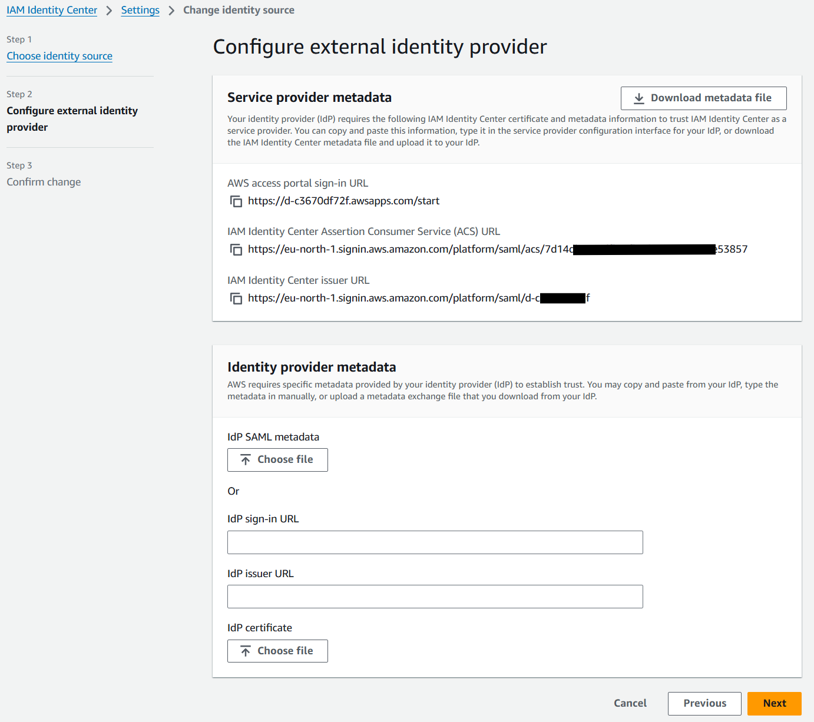
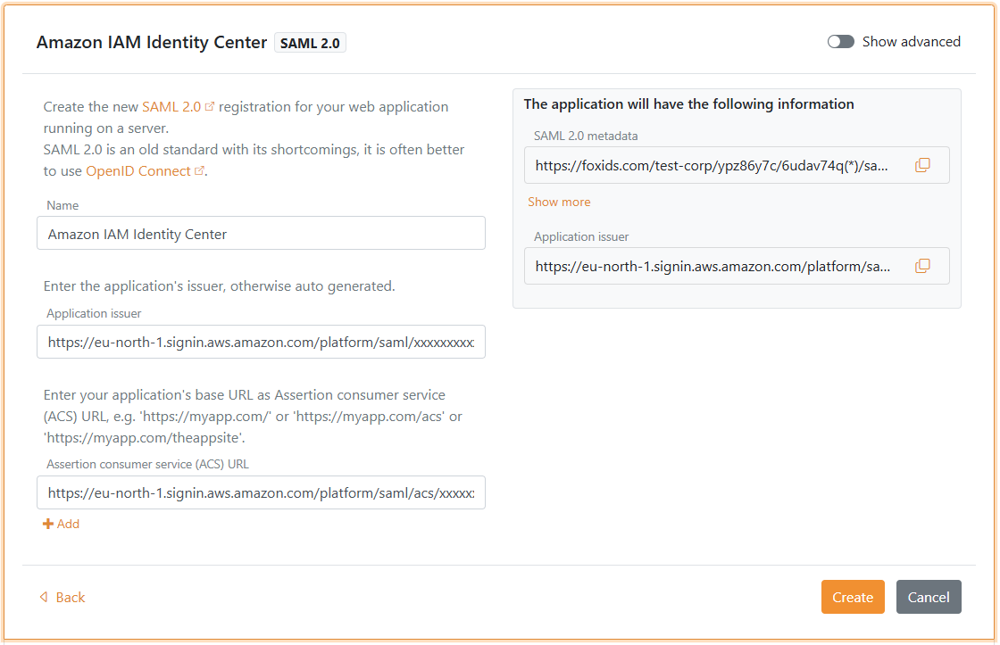
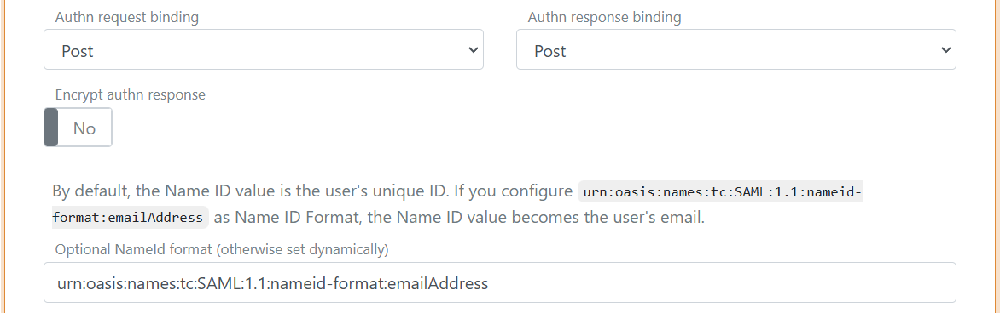

# Connect to Amazon IAM Identity Center with SAML 2.0

Connect FoxIDs as an **external identity provider for Amazon IAM Identity Center** with SAML 2.0.

By configuring an [OpenID Connect authentication method](auth-method-oidc.md) and Amazon IAM Identity Center as a [SAML 2.0 application](app-reg-saml-2.0.md) FoxIDs become a [bridge](bridge.md) between OpenID Connect and SAML 2.0 and automatically convert JWT (OAuth 2.0) claims to SAML 2.0 claims.

## Configure Amazon IAM Identity Center

This guide describe how to setup FoxIDs as an external identity provider for Amazon IAM Identity Center. Users is connected with there email address and is required to exist in Amazon IAM Identity Center.

**1 - Start by configuring a certificate in [FoxIDs Control Client](control.md#foxids-control-client)**

You are required to upload the SAML 2.0 metadata from FoxIDs to Amazon IAM Identity Center. It is therefor necessary to use a long living certificate in FoxIDs, e.g. valid for 3 years.

1. Select the **Certificates** tab
2. Click **Change Container type**

3. Find **Self-signed or your certificate** and click **Change to this container type**
4. The self-signed certificate is valid for 3 years, and you can optionally upload you own certificate

**2 - Then go to the Amazon IAM Identity Center in [AWS portal](https://aws.amazon.com/)**

 1. Navigate to **Amazon IAM Identity Center**
 2. Click **Settings** 
 3. Click **Choose identity source** (may be located in the **Identity source** section and **Actions** button)
 4. Select **External identity provider**
 5. Click **Next**
 6. Copy the **IAM Identity Center Assertion Consumer Service (ACS) URL** and save it for later
 7. Copy the **IAM Identity Center issuer URL** and save it for later

**3 - Then creating an SAML 2.0 application in [FoxIDs Control Client](control.md#foxids-control-client)**

1. Select the **Applications** tab
2. Click **New application**
3. Click **Show advanced**
4. Click **Web application (SAML 2.0)**
5. Add the **Name** e.g. `Amazon IAM Identity Center`
6. Add the **Application issuer** from Amazon IAM Identity Center called **IAM Identity Center issuer URL**
7. Add the **Assertion consumer service (ACS) URL** from Amazon IAM Identity Center called **IAM Identity Center Assertion Consumer Service (ACS) URL** 

8. Click **Create**
9. Click **Change application** - to open the application opens in edit mode
10. Click **Show advanced**
11. Set the **Authn request binding** to **Post**
12. Set the **NameID format** to `urn:oasis:names:tc:SAML:1.1:nameid-format:emailAddress`

13. Set the **NameID format in metadata** to `urn:oasis:names:tc:SAML:1.1:nameid-format:emailAddress` at the bottom of the application
14. Click **Update**
15. Go to the top of the application and click the **SAML 2.0 Metadata URL** link to open it in a browser
16. Download the metadata as a metadata file
 
**4 - Go back to the Amazon IAM Identity Center in [AWS portal](https://aws.amazon.com/)**

1. Find the **IdP SAML metadata** and click **Choose file**
2. Select the metadata file from FoxIDs
3. Click **Next**
4. Write **ACCEPT**
5. Click **Change identity source**
6. Find the **Identity source** section and the **AWS access portal URL**, click the link to test login (you may need to create a user in FoxIDs)

> Amazon IAM Identity Center do not support logout.