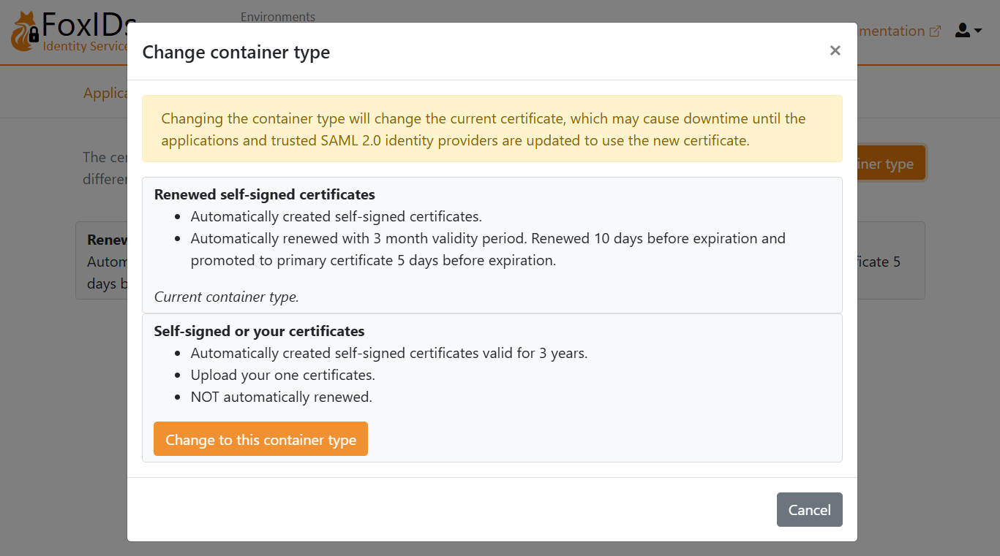

# Connect to Google Workspace with SAML 2.0

Connect FoxIDs as an **external identity provider for Google Workspace** with SAML 2.0.

By configuring an [OpenID Connect authentication method](auth-method-oidc.md) and Google Workspace as a [SAML 2.0 application](app-reg-saml-2.0.md) FoxIDs become a [bridge](bridge.md) between OpenID Connect and SAML 2.0 and automatically convert JWT (OAuth 2.0) claims to SAML 2.0 claims.

## Configure Google Workspace

This guide describes how to set up FoxIDs as an external identity provider for Google Workspace. Users are connected with their email address and must already exist in Google Workspace.

**1 - Start by configuring a certificate in [FoxIDs Control Client](control.md#foxids-control-client)**

You are required to upload the SAML 2.0 metadata from FoxIDs to Google Workspace. It is therefore necessary to use a long-lived certificate in FoxIDs, e.g. valid for 3 years.

1. Select the **Certificates** tab
2. Click **Change Container type**

3. Find **Self-signed or your certificate** and click **Change to this container type**
4. The self-signed certificate is valid for 3 years, and you can optionally upload your own certificate

**2 - Then start to create a SAML 2.0 application in [FoxIDs Control Client](control.md#foxids-control-client)**

1. Select the **Applications** tab
2. Click **New application**
3. Click **Show advanced**
4. Click **Web application (SAML 2.0)**
5. Add the **Name** e.g. `Google Workspace`
6. Click **Show more** in the **The application will have the following information** section to the right

7. Save application information for later use in Google Workspace:
    - Copy the **IdP Issuer**
    - Copy the **Single Sign-On URL**
    - In **IdP Signing Certificate** click **Download certificate**
8. Keep the FoxIDs application UI open for later use

**3 - Then go to the [Google Workspace portal](https://workspace.google.com/)**

1. Click **Admin console** where you are prompted to sign in
2. Click **Security** and then **Authentication** and then **SSO with third party IdP**
3. In the **Third-party SSO profiles** section, click **ADD SAML PROFILE**
4. Add a **SSO profile name**
5. In **Autofill email** select **Send email address in the URL as the login_hint parameter**
6. Find the **IDP details** section
7. Set the **IDP entity ID** to the FoxIDs applications **IdP Issuer** you copied
8. Set the **Sign-in page URL** to the FoxIDs applications **Single Sign-On UR** you copied
9. Optionally set the **Sign-out page URL** to web page where users are redirected after sign-out (Google Workspace does not support single sign-out and FoxIDs is not called on sign-out)

11. Click **UPLOAD CERTIFICATE** and upload the **IdP Signing Certificate** you downloaded from FoxIDs
11. Click **Save**
12. Find the **SP details** section and save the information for later use in FoxIDs:
    - Copy the **EntityID Issuer**
    - Copy the **ACS URL**
     
**4 - Then continue creating the SAML 2.0 application in [FoxIDs Control Client](control.md#foxids-control-client)**

1. Go back to the FoxIDs application UI you kept open
2. Set the **Application issuer** to the Google Workspace **EntityID Issuer** you copied
3. Set the **Assertion consumer service (ACS) URL** to the Google Workspace **ACS URL** you copied

4. Click **Create**
5. Click **Change application** to open the application in edit mode
6. Select the **Claims Transform** tab
7. Click **Add claim transform** and click **Map** to add a NameID claim with the user's email address matching the Google Workspace user's email address.
8. Set **New claim** to `http://schemas.xmlsoap.org/ws/2005/05/identity/claims/nameidentifier` - which is the NameID claim URI
9. Set **Select claim** to `http://schemas.xmlsoap.org/ws/2005/05/identity/claims/emailaddress`
10. Click **Update**

> You need to activate the single sign-on for users in Google Workspace. See [Google Workspace documentation](https://support.google.com/a/answer/6087519?hl=en) for more information.