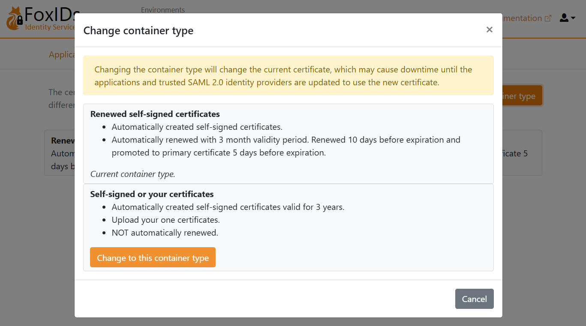
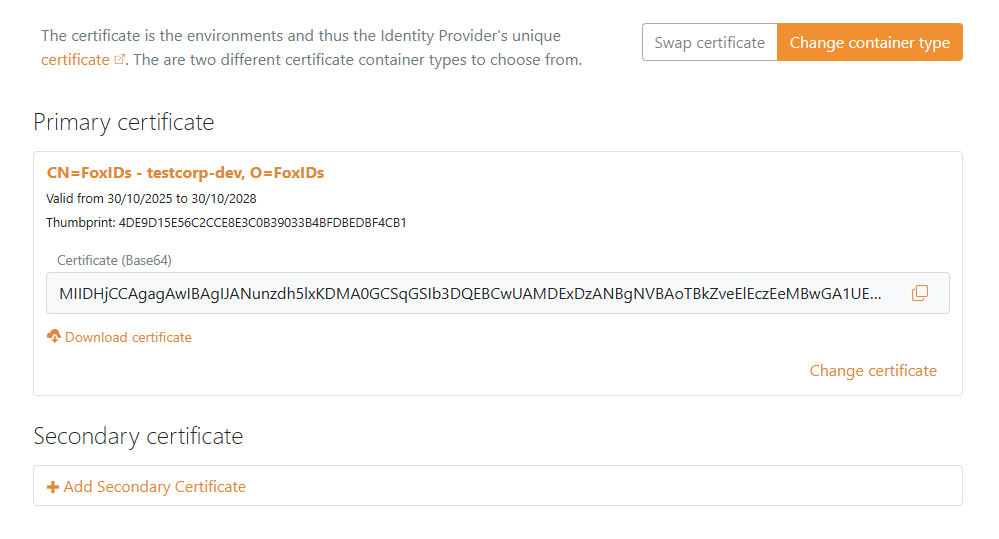
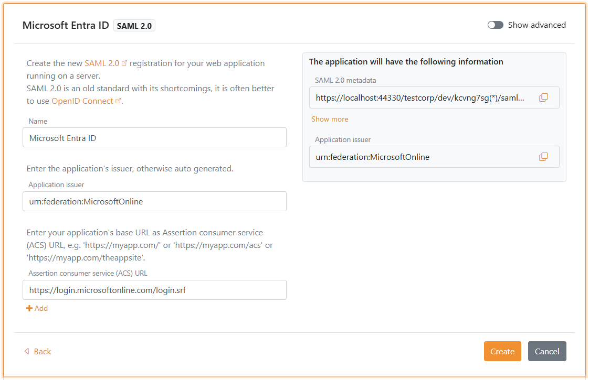
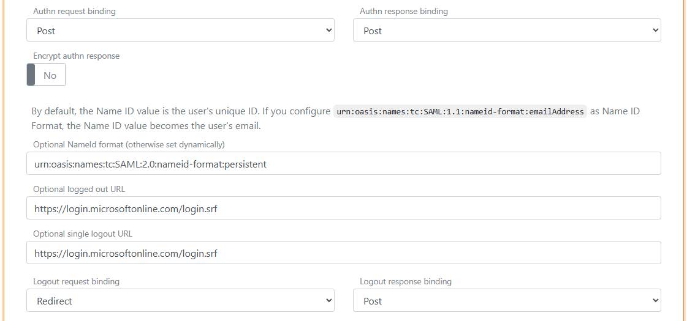
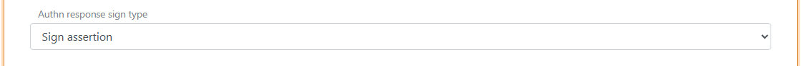

<!--
{
    "title":  "Connect to Microsoft Entra ID with SAML 2.0",
    "description":  "Connect FoxIDs as an **external identity provider for Microsoft Entra ID** with SAML 2.0.",
    "ogTitle":  "Connect to Microsoft Entra ID with SAML 2.0",
    "ogDescription":  "Connect FoxIDs as an **external identity provider for Microsoft Entra ID** with SAML 2.0.",
    "ogType":  "article",
    "ogImage":  "/images/foxids_logo.png",
    "twitterCard":  "summary_large_image",
    "additionalMeta":  {
                           "keywords":  "app reg howto saml microsoft entra id, FoxIDs docs"
                       }
}
-->

# Connect to Microsoft Entra ID with SAML 2.0

Connect FoxIDs as an **external identity provider for Microsoft Entra ID** with SAML 2.0.

By configuring an [OpenID Connect authentication method](auth-method-oidc.md) and Microsoft Entra ID as a [SAML 2.0 application](app-reg-saml-2.0.md) FoxIDs become a [bridge](bridge.md) between OpenID Connect and SAML 2.0 and automatically convert JWT (OAuth 2.0) claims to SAML 2.0 claims.

## Configure Microsoft Entra ID

This guide describes how to set up FoxIDs as an external identity provider for Microsoft Entra ID. Users are connected to Microsoft Entra ID users with their Immutable ID.

**1 - Start by configuring a certificate in [FoxIDs Control Client](control.md#foxids-control-client)**

You are required to upload the SAML 2.0 signing certificate used in FoxIDs to Microsoft Entra ID. It is therefore necessary to use a long-lived certificate in FoxIDs, e.g. valid for 3 years.

1. Select the **Certificates** tab
2. Click **Change Container type**

3. Find **Self-signed or your certificate** and click **Change to this container type**
4. The self-signed certificate is valid for 3 years, and you can optionally upload your own certificate


**2 - Then create a SAML 2.0 application in [FoxIDs Control Client](control.md#foxids-control-client)**

1. Select the **Applications** tab
2. Click **New application**
3. Click **Show advanced**
4. Click **Web application (SAML 2.0)**
5. Add the **Name** e.g. `Microsoft Entra ID`
6. Set the **Application issuer** to `urn:federation:MicrosoftOnline`
7. Set the **Assertion consumer service (ACS) URL** to `https://login.microsoftonline.com/login.srf`

8. Click **Create**
9. Click **Change application** to open the application in edit mode
10. Click **Show advanced**
11. Set the **Authn request binding** to **Post**
12. Set the **NameID format** to `urn:oasis:names:tc:SAML:2.0:nameid-format:persistent`
13. Set the **Optional logged out URL** and **Optional single logout URL** to `https://login.microsoftonline.com/login.srf`

14. Set the **Authn response sign type** to `Sign assertion`

15. Go to the top of the application, find the **Application information** section and click **Show more**
    - Copy the **IdP Issuer**
    - Copy the **Single Sign-On URL**
    - Copy the **Single Logout URL**
    - Copy the **IdP Signing Certificate** in Base64 format
16. Select the **Claims Transform** tab
17. Click **Add claim transform** and click **Map** to add a NameID claim with the user's Immutable ID matching the Microsoft Entra ID user's Immutable ID.
18. Set **New claim** to `http://schemas.xmlsoap.org/ws/2005/05/identity/claims/nameidentifier` - which is the NameID claim URI
19. Set **Select claim** to `http://schemas.foxids.com/ws/identity/claims/immutableid`
20. Click **Update**

> **You need to set the user's Immutable ID as a claim in FoxIDs.**  
  To set the Immutable ID on an internal user, select the **Users** tab and then **Internal Users** tab find the user and add a claim with the claim type `immutable_id` and the value of the Immutable ID in Microsoft Entra ID - it should be base64 encoded.  
  The `immutable_id` claim type is mapped to the SAML 2.0 claim URI `http://schemas.foxids.com/ws/identity/claims/immutableid` in FoxIDs.

**3 - Then configure domain federation in Microsoft Entra ID with PowerShell**

It is not possible to configure an external SAML 2.0 identity provider in the [Microsoft Entra ID Portal](https://entra.microsoft.com/). You need to use PowerShell.

1. Open PowerShell as administrator
2. Install the [Microsoft Graph](https://www.powershellgallery.com/packages/Microsoft.Graph/) PowerShell module if not already installed: `Install-Module -Name Microsoft.Graph` and select `A`
   - Optionally, install for current user: `Install-Module Microsoft.Graph -Scope CurrentUser -Force`
   - Or update the module: `Update-Module -Name Microsoft.Graph` and select `A`
3. Connect to Microsoft Graph: `Connect-MgGraph -Scopes "Domain.ReadWrite.All,Directory.AccessAsUser.All"`
4. Set up the configuration variables:
   ```powershell
   $domainName = "your-domain.com" # The domain name to configure federation for
   $idpIssuer = "copied IdP Issuer from FoxIDs"
   $ssoUrl = "copied Single Sign-On URL from FoxIDs"
   $sloUrl = "copied Single Logout URL from FoxIDs"
   $signingCertBase64 = @"
   -----BEGIN CERTIFICATE-----
   copied IdP Signing Certificate from FoxIDs
   -----END CERTIFICATE-----
   "@
   ```
5. configure the domain federation:
   ```powershell
   New-MgDomainFederationConfiguration -DomainId $domainName `
     -IssuerUri $idpIssuer `
     -PassiveSignInUri $ssoUrl `
     -LogoutUri $sloUrl `
     -SigningCertificate $signingCertBase64 `
     -PreferredAuthenticationProtocol "saml" ` 
     -FederatedIdpMfaBehavior "acceptIfMfaDoneByFederatedIdp" `
   ```
   **FederatedIdpMfaBehavior** can be set to:
   - `acceptIfMfaDoneByFederatedIdp` – Entra accepts MFA from FoxIDs; if FoxIDs didn’t do MFA, Entra will do it.
   - `enforceMfaByFederatedIdp` – If a policy needs MFA, Entra will send the user back to FoxIDs to complete MFA.
   - `rejectMfaByFederatedIdp` – Entra always does MFA itself; MFA at FoxIDs is ignored.
6. Validate the configuration:
   ```powershell
   Get-MgDomainFederationConfiguration -DomainId $domainName
   # or
   Get-MgDomain -DomainId $domainName | fl Id, AuthenticationType
   ``` 

**4a - Then configure the user's Immutable ID in Microsoft Entra ID with PowerShell**

1. Open PowerShell as administrator
2. Install the [Microsoft Graph](https://www.powershellgallery.com/packages/Microsoft.Graph/) PowerShell module if not already installed: `Install-Module -Name Microsoft.Graph` and select `A`
   - Optionally, install for current user: `Install-Module Microsoft.Graph -Scope CurrentUser -Force`
   - Or update the module: `Update-Module -Name Microsoft.Graph` and select `A`
3. Connect to Microsoft Graph: `Connect-MgGraph -Scopes "Domain.ReadWrite.All"`
4. Set up the configuration variables:
   ```powershell
   $userId = "user-id@my-domain.com" # The user's User Principal Name (UPN) or the Object ID
   $immutableId = "immutable-id" # The user's Immutable ID - base64 encoded.
   ```
5. Configure the user's Immutable ID:
   ```powershell
   Set-MgUser -UserId $userId -OnPremisesImmutableId $immutableId
   ```
6. Validate the configuration:
   ```powershell
   Get-MgUser -UserId $userId | fl Id, OnPremisesImmutableId
   ```

If the user already has an Immutable ID set, you need to move the user away from the federated domain, set the Immutable ID, and then move the user back to the federated domain.
1. Move the user to a non-federated domain:
   ```powershell
   $userId = "user-id@my-domain.com"
   $userIdTemp = "user-id@yourtenant.onmicrosoft.com"
   Update-MgUser -UserId $userId -UserPrincipalName $userIdTemp
   ```
2. Set the user's new Immutable ID:
   ```powershell
   $immutableId = "immutable-id" # The user's Immutable ID - base64 encoded.
   Set-MgUser -UserId $userIdTemp -OnPremisesImmutableId $immutableId
   ```  
3. Move the user back to the federated domain:
   ```powershell
   Update-MgUser -UserId $userIdTemp -UserPrincipalName $userId
   ```

**4b - Or alternatively configure the user's Immutable ID in Microsoft Entra ID with Graph API**  
1. Get an access token for Microsoft Graph API with the required scopes.
2. Make a `PATCH` request to the `/users/{id | userPrincipalName}` endpoint with the following JSON body:
   ```json
   {
     "onPremisesImmutableId": "immutable-id"
   }
   ```
   Replace `immutable-id` with the desired Immutable ID value that matches the NameID claim sent from FoxIDs.
3. Validate the configuration by making a `GET` request to the `/users/{id | userPrincipalName}` endpoint and checking the `onPremisesImmutableId` property in the response.

If the user already has an Immutable ID set, you need to move the user away from the federated domain, set the Immutable ID, and then move the user back to the federated domain.
1. Make a `PATCH` request to the `/users/{id | userPrincipalName}` endpoint to change the `userPrincipalName` to a non-federated domain.
2. Make a `PATCH` request to set the new Immutable ID.
3. Make a `PATCH` request to change the `userPrincipalName` back to the federated domain.
4. Validate the configuration by making a `GET` request to the `/users/{id | userPrincipalName}` endpoint and checking the `onPremisesImmutableId` property in the response.

