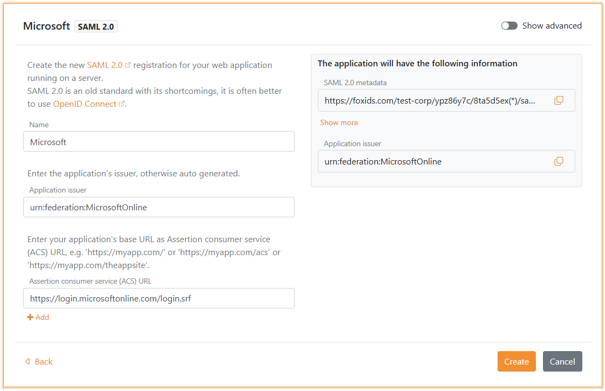

# Connect to Microsoft Entra ID with SAML 2.0

FoxIDs can be added as an external identity provider for Microsoft Entra ID with SAML 2.0.

By configuring an [OpenID Connect authentication method](auth-method-oidc.md) and Microsoft Entra ID as a [SAML 2.0 application](app-reg-saml-2.0.md) FoxIDs become a [bridge](bridge.md) between OpenID Connect and SAML 2.0 and automatically convert JWT (OAuth 2.0) claims to SAML 2.0 claims.

## Configure Microsoft Entra ID

This guide describe how to setup FoxIDs as an external identity provider for Microsoft Entra ID. Users is connected with there email address and is required to exist in Microsoft Entra ID.

**1 - Start by configuring a certificate in [FoxIDs Control Client](control.md#foxids-control-client)**

You are required to upload the SAML 2.0 signing certificate used in FoxIDs to Microsoft Entra ID. It is therefor necessary to use a long living certificate in FoxIDs, e.g. valid for 3 years.

1. Select the **Certificates** tab
2. Click **Change Container type**

3. Find **Self-signed or your certificate** and click **Change to this container type**
4. The self-signed certificate is valid for 3 years, and you can optionally upload you own certificate


**2 - Then creating an SAML 2.0 application in [FoxIDs Control Client](control.md#foxids-control-client)**

1. Select the **Applications** tab
2. Click **New application**
3. Click **Show advanced**
4. Click **Web application (SAML 2.0)**
5. Add the **Name** e.g. `Microsoft Entra ID`
6. Set the **Application issuer** to `urn:federation:MicrosoftOnline`
7. Set the **Assertion consumer service (ACS) URL** to `https://login.microsoftonline.com/login.srf`

8. Click **Create**
9. Click **Change application**
10. The application opens in edit mode
11. Click **Show advanced**
12. Set the **Authn request binding** to **Post**
13. Set the **NameID format** to `urn:oasis:names:tc:SAML:2.0:nameid-format:persistent`
14. Set the **Optional logged out URL** and **Optional single logout URL** to `https://login.microsoftonline.com/login.srf`

15. Go to the top of the application, find the **Application information** section and click **Show more**
    - Copy the signing certificate in Base64 format
    - Copy the **IdP Issuer**
    - Copy the **Single Sign-On URL**
    - Copy the **Single Logout URL**
16. Select the **Claims Transform** tab
17. Click **Add claim transform** and click **Map** to add a NameID claim with the users email address matching the Microsoft Entra ID users Immutable ID.
18. Set **New claim** to `http://schemas.xmlsoap.org/ws/2005/05/identity/claims/nameidentifier` - which is the NameID claim URI
19. Set **Select claim** to `http://schemas.xmlsoap.org/ws/2005/05/identity/claims/emailaddress`
20. Click **Update**

> You can optionally use a different claim value for the NameID then a email address, but it must match the Immutable ID of the user in Microsoft Entra ID.

**3 - Then configure domain federation in Microsoft Entra ID with PowerShell**

It is not possible to configure an external SAML 2.0 identity provider in the [Microsoft Entra ID Portal](https://entra.microsoft.com/). You need to use PowerShell.

1. Open PowerShell as administrator
2. Install the [Microsoft Graph](https://www.powershellgallery.com/packages/Microsoft.Graph/) PowerShell module if not already installed: `Install-Module -Name Microsoft.Graph` and select `A`
   - Optionally, install for current user: `Install-Module Microsoft.Graph -Scope CurrentUser -Force`
   - Or update the module: `Update-Module -Name Microsoft.Graph` and select `A`
3. Connect to Microsoft Graph: `Connect-MgGraph -Scopes "Domain.ReadWrite.All,Directory.AccessAsUser.All"`
4. Setup the configuration variables:
   ```powershell
   $domainName = "your-domain.com" # The domain name to configure federation for
   $idpIssuer = "copied IdP Issuer from FoxIDs"
   $ssoUrl = "copied Single Sign-On URL from FoxIDs"
   $sloUrl = "copied Single Logout URL from FoxIDs"
   $signingCertBase64 = @"
   -----BEGIN CERTIFICATE-----
   copied signing certificate from FoxIDs
   -----END CERTIFICATE-----
   "@
   ```
5. configure the domain federation:
   ```powershell
   New-MgDomainFederationConfiguration -DomainName $domainName `
     -IssuerUri $idpIssuer `
     -PassiveSignInUri $ssoUrl `
     -LogoutUri $sloUrl `
     -SigningCertificate $signingCertBase64 `
     -PreferredAuthenticationProtocol "saml" ` 
     -FederatedIdpMfaBehavior "acceptIfMfaDoneByFederatedIdp" `
   ```
   `FederatedIdpMfaBehavior` can be set to:
   - `acceptIfMfaDoneByFederatedIdp` – Entra accepts MFA from FoxIDs; if FoxIDs didn’t do MFA, Entra will do it.
   - `enforceMfaByFederatedIdp` – If a policy needs MFA, Entra will send the user back to FoxIDs to complete MFA.
   - `rejectMfaByFederatedIdp` – Entra always does MFA itself; MFA at FoxIDs is ignored.
6. Validate the configuration:
   ```powershell
   Get-MgDomainFederationConfiguration -DomainName $domainName
   # or
   Get-MgDomain -DomainId $Domain | fl Id, AuthenticationType
   ``` 

**3 - Then configure the users Immutable ID in Microsoft Entra ID with PowerShell**

1. Open PowerShell as administrator
2. Install the [Microsoft Graph](https://www.powershellgallery.com/packages/Microsoft.Graph/) PowerShell module if not already installed: `Install-Module -Name Microsoft.Graph` and select `A`
   - Optionally, install for current user: `Install-Module Microsoft.Graph -Scope CurrentUser -Force`
   - Or update the module: `Update-Module -Name Microsoft.Graph` and select `A`
3. Connect to Microsoft Graph: `Connect-MgGraph -Scopes "Domain.ReadWrite.All"`
4. Setup the configuration variables:
   ```powershell
   $userId = "user-id@my-domain.com" # The user ID to configure which is the User Principal Name (UPN) or the Object ID
   $immutableId = "immutable-id" # The Immutable ID to set which must match the NameID claim sent from FoxIDs and can e.g. the user's email address / UPN
   ```
5. Configure the user's Immutable ID:
   ```powershell
   Set-MgUser -UserId $userId -OnPremisesImmutableId $immutableId
   ```
6. Validate the configuration:
   ```powershell
   Get-MgUser -UserId $userId | fl Id, OnPremisesImmutableId
   ```

If the user already has an Immutable ID set, you need to move the user away from the federated domain, set the Immutable ID, and then move the user back to the federated domain.
1. Move the user to a non-federated domain:
   ```powershell
   $userId = "user-id@my-domain.com"
   $userIdTemp = "user-id@yourtenant.onmicrosoft.com"
   Update-MgUser -UserId $userId -UserPrincipalName $userIdTemp
   ```
2. Set the user's new Immutable ID:
   ```powershell
   Set-MgUser -UserId $userIdTemp -OnPremisesImmutableId $immutableId
   ```  
3. Move the user back to the federated domain:
   ```powershell
   Update-MgUser -UserId $userIdTemp -UserPrincipalName $userId
   ```

**3 - Then configure the users Immutable ID in Microsoft Entra ID with Graph API**  
1. Get an access token for Microsoft Graph API with the required scopes.
2. Make a `PATCH` request to the `/users/{id | userPrincipalName}` endpoint with the following JSON body:
   ```json
   {
     "onPremisesImmutableId": "immutable-id"
   }
   ```
   Replace `immutable-id` with the desired Immutable ID value that matches the NameID claim sent from FoxIDs.
3. Validate the configuration by making a `GET` request to the `/users/{id | userPrincipalName}` endpoint and checking the `onPremisesImmutableId` property in the response.

//Add a Postman example here for Graph API requests.


If the user already has an Immutable ID set, you need to move the user away from the federated domain, set the Immutable ID, and then move the user back to the federated domain.
1. Make a `PATCH` request to the `/users/{id | userPrincipalName}` endpoint to change the `userPrincipalName` to a non-federated domain.
2. Make a `PATCH` request to set the new Immutable ID.
3. Make a `PATCH` request to change the `userPrincipalName` back to the federated domain.
4. Validate the configuration by making a `GET` request to the `/users/{id | userPrincipalName}` endpoint and checking the `onPremisesImmutableId` property in the response.
5. If the user already has an Immutable ID set, you need to move the user away from the federated domain, set the Immutable ID, and then move the user back to the federated domain.
