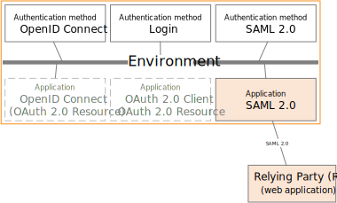
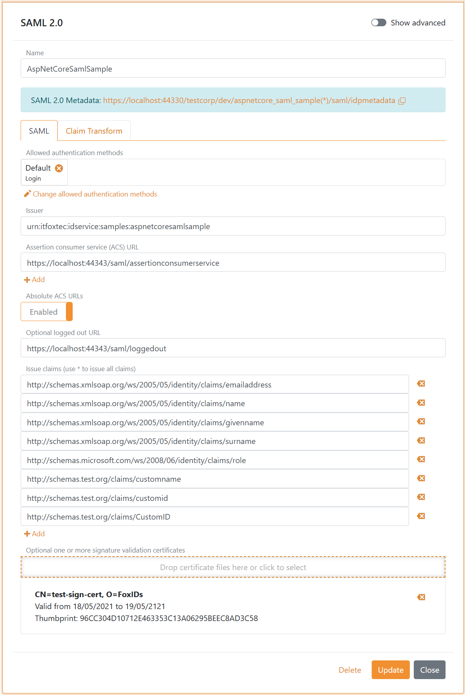

# SAML 2.0 application registration

FoxIDs [SAML 2.0](https://docs.oasis-open.org/security/saml/v2.0/saml-core-2.0-os.pdf) application registration enable you to connect an SAML 2.0 based application. 

Your application become a SAML 2.0 Relying Party (RP) and FoxIDs acts as an SAML 2.0 Identity Provider (IdP).

FoxIDs support [SAML 2.0 redirect and post bindings](https://docs.oasis-open.org/security/saml/v2.0/saml-bindings-2.0-os.pdf).

A application registration expose [SAML 2.0 metadata](https://docs.oasis-open.org/security/saml/v2.0/saml-metadata-2.0-os.pdf) where your application can discover the SAML 2.0 Identity Provider (IdP).

Both the login, logout and single logout [SAML 2.0 profiles](https://docs.oasis-open.org/security/saml/v2.0/saml-profiles-2.0-os.pdf) are supported. The Artifact profile is not supported.

> The FoxIDs SAML 2.0 metadata do only include logout and single logout information if logout is configured in the SAML 2.0 application registration.

How to guides:

- Connect [AD FS](app-reg-howto-saml-2.0-adfs.md)
- Connect [Context Handler (Danish IdP)](howto-saml-2.0-context-handler.md#app-reg---connect-to-context-handler)

## Require multi-factor authentication (MFA)
The SAML 2.0 Relying Party (RP) can require multi-factor authentication by specifying the `urn:foxids:mfa` value in the `RequestedAuthnContext.AuthnContextClassRef` property.

The `AuthnContextClassRef` property can be set in the `Login` method in `SamlController.cs`:

    public IActionResult Login(string returnUrl = null)
    {
        var binding = new Saml2RedirectBinding();
        binding.SetRelayStateQuery(new Dictionary<string, string>
        {
            { relayStateReturnUrl, returnUrl ?? Url.Content("~/") }
        });

        var saml2AuthnRequest = new Saml2AuthnRequest(saml2Config)
        {
            // To require MFA
            RequestedAuthnContext = new RequestedAuthnContext
            {
                Comparison = AuthnContextComparisonTypes.Exact,
                AuthnContextClassRef = new string[] { "urn:foxids:mfa" },
            }
        };

        return binding.Bind(saml2AuthnRequest).ToActionResult();
    }

See more code in the [AspNetCoreSamlSample](samples.md#aspnetcoresamlsample) and [SamlController.cs line 104](https://github.com/ITfoxtec/FoxIDs.Samples/blob/master/src/AspNetCoreSamlSample/Controllers/SamlController.cs#L104).

## Configuration
How to configure your application as an SAML 2.0 Relying Party (RP).

> The FoxIDs SAML 2.0 application registration metadata endpoint is `https://foxids.com/tenant-x/environment-y/application-saml-pr1/saml/idpmetadata`  
> if the application is configured in tenant `tenant-x` and environment `environment-y` with the application registration name `application-saml-pr1`.

> A application registration can possibly support login through multiple [authentication methods](connections.md#authentication-method) by adding the authentication method name to the URL.  
> An authentication method name e.g. `login` can possible be added to the metadata URL like this `https://foxids.com/tenant-x/environment-y/application-saml-pr1(login)/saml/idpmetadata`

The following screen shot show the basic FoxIDs SAML 2.0 application registration configuration available in [FoxIDs Control Client](control.md#foxids-control-client).

> More configuration options become available by clicking `Show advanced settings`.

> Change the issued SAML 2.0 claim collection with [claim transforms](claim-transform.md).