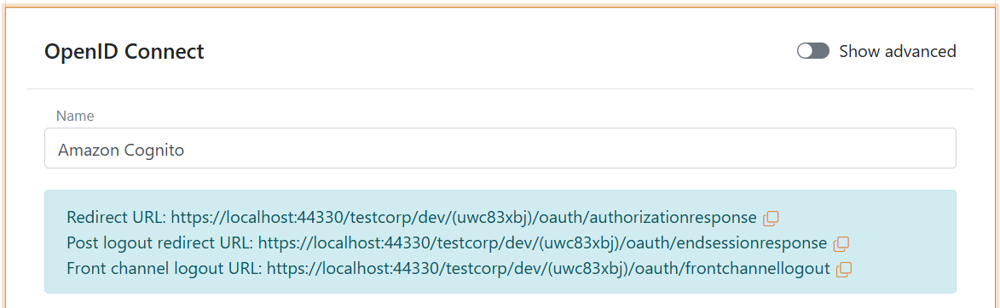
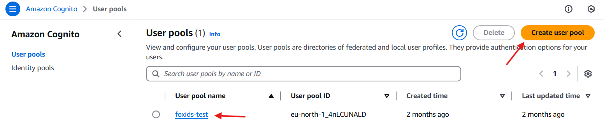
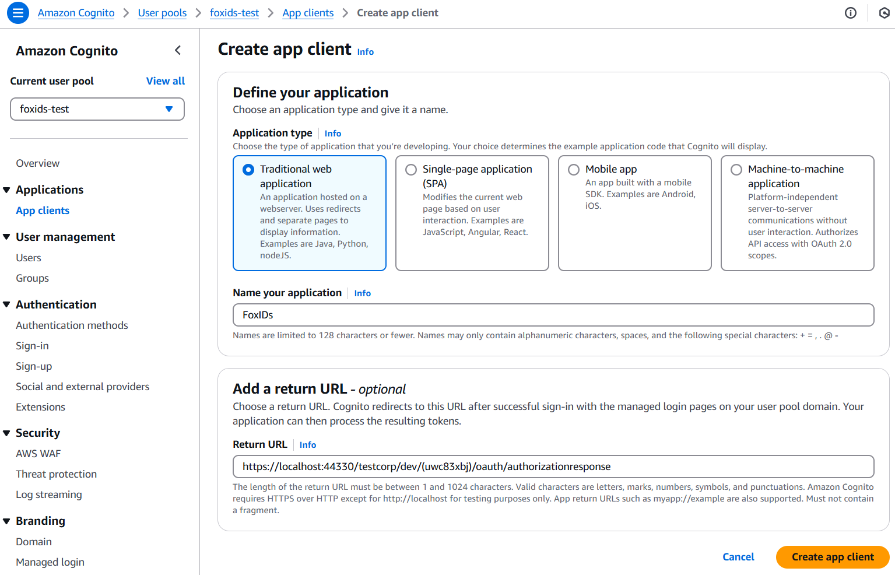
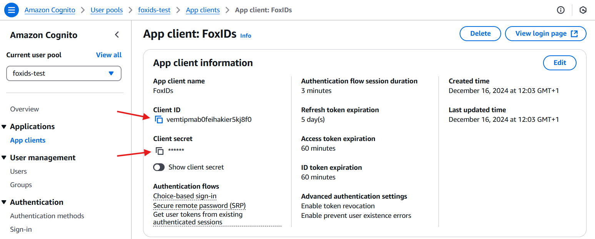
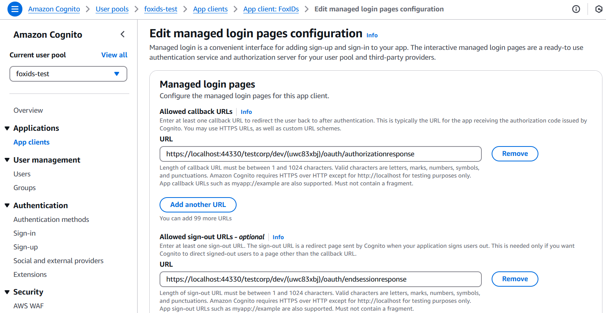
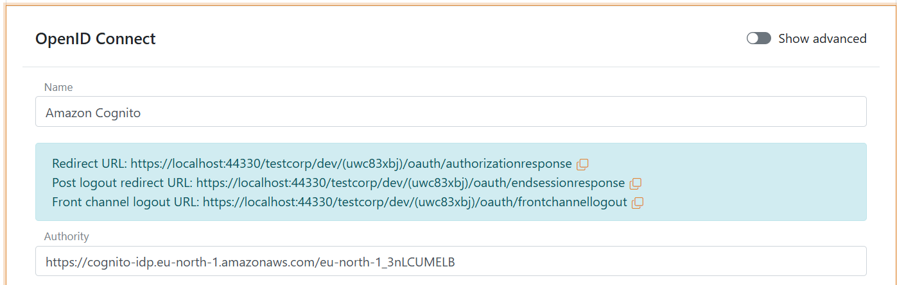
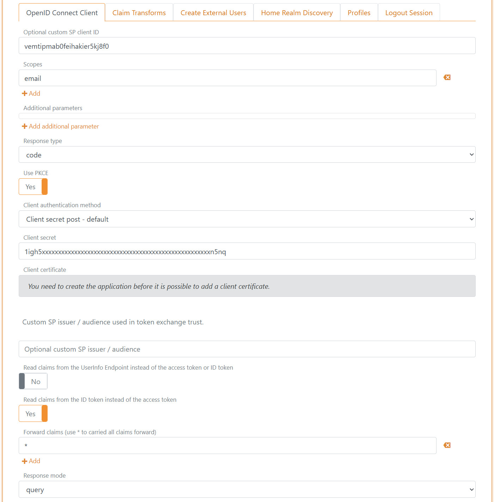

# Connect to Amazon Cognito with OpenID Connect

FoxIDs can be connected to Amazon Cognito with OpenID Connect and authenticate users in your Amazon Cognito user pool.

You can add support for SAML 2.0 to your Amazon Cognito. 
By configuring Amazon Cognito as an [OpenID Connect authentication method](auth-method-oidc.md) and a [SAML 2.0 application](app-reg-saml-2.0.md) FoxIDs become a [bridge](bridge.md) between OpenID Connect and SAML 2.0 and automatically convert JWT (OAuth 2.0) claims to SAML 2.0 claims.

## Configure Amazon Cognito

This chapter describes how to configure a connection with OpenID Connect Authorization Code flow and read the users claims from the ID token.

**1 - Start by creating an OpenID Connect authentication method in [FoxIDs Control Client](control.md#foxids-control-client)**

 1. Navigate to the **Authentication** tab
 2. Click **New authentication**
 3. Select **OpenID Provider**
 4. Add the **Name** e.g. Amazon Cognito
 

 5. Read the **Redirect URL** and **Post logout redirect URL** and save it for later

**2 - Then go to the Amazon Cognito [AWS portal](https://aws.amazon.com/) and create the a new app client**

 1. Navigate to **Amazon Cognito**
 2. Select **User pools** 
 
 3. Select existing user pool or create a new user pool
 4. Find **Applications** in the menu and click **App clients**
 5. Click **Create app client** in the top right corner
 6. Select **Traditional web application**
 7. Add the name in **Name your application** e.g. FoxIDs
 8. Add the FoxIDs **Redirect URL** from before in the **Return URL** field
 
 9. Click **Create app client**
 10. Read the **Client ID** and **Client secret** and save it for later
 
 11. Click **Login pages** and click **Edit**
 12. Find **Allowed sign-out URLs - optional** click **Add sign-out URL**
 13. Add the **Post logout redirect URL** from FoxIDs in the **URL** field
 
 14. You can optionnaly configure aditionally scopes like `phone` and `profile`
 15. Click **Save changes** 
 16. Find the **View quick setup guide** and example code
 17. Find the **authority** in the example code (it is also called **issuerURL**) and save it for later  
     The authority is in this example is `https://cognito-idp.eu-north-1.amazonaws.com/eu-north-1_3nLCUMELB` 

 **3 - Go back to the FoxIDs authentication method in [FoxIDs Control Client](control.md#foxids-control-client)**

 1. Add the **Authority** from Amazon Cognito
 
 2. Click **Show advanced** in the top right corner of this configuration section
 3. Add the **Optional custom SP client ID** from Amazon Cognito called **Client ID**
 4. Add `email` to the **scopes** list, you can possible configure the scopes `phone` and `profile` in Amazon Cognito and FoxIDs
 5. Add the **Client secret** from Amazon Cognito
 6. Set the **Read claims from the ID token instead of the access token** switch to **Yes**
 7. As **Response mode** select **query**
 
 8. Click **Create**
 9. Click **Test authentication** to test the Amazon Cognito connection  

That's it, you are done.
 
Your new Amazon Cognito authentication method can be selected as an allowed authentication method in an application registration.
