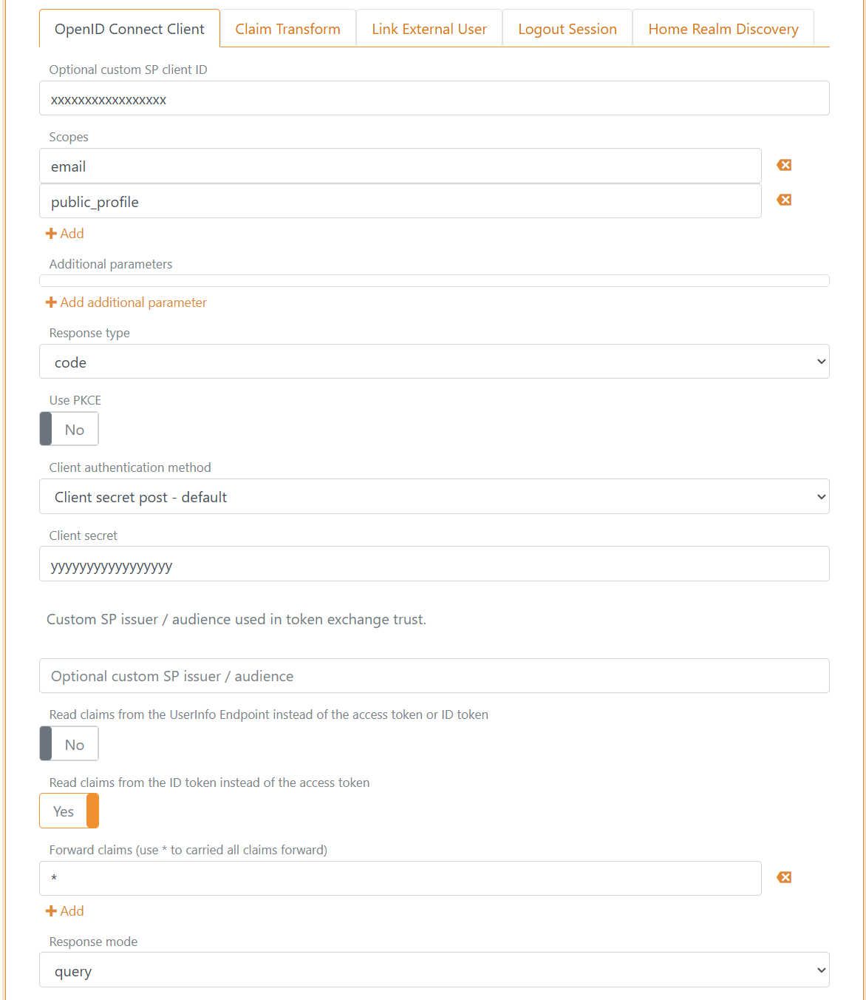

# Connect Facebook with OpenID Connect

FoxIDs can be connected to Facebook with OpenID Connect and authenticate users with Facebook login or Facebook Limited login.

> You can test the Facebook login with the [online web app sample](https://aspnetcoreoidcallupsample.itfoxtec.com) ([sample docs](samples.md#aspnetcoreoidcauthcodealluppartiessample)) by clicking `Log in` and then `Facebook`.  
> Take a look at the Facebook sample configuration in FoxIDs Control: [https://control.foxids.com/test-corp](https://control.foxids.com/test-corp)  
> Get read access with the user `reader@foxids.com` and password `TestAccess!` then select the `Production` environment and the `Authentication` tab.

## Configure Facebook

This chapter describes how to configure a connection with OpenID Connect Authorization Code flow and read the users claims from the ID token.

**1 - Start by creating an OpenID Connect authentication method in [FoxIDs Control Client](control.md#foxids-control-client)**

 1. Navigate to the **Authentication** tab
 2. Click **New authentication**
 3. Select **OpenID Provider**
 4. Add the **Name** e.g. Facebook
 5. Add the Facebook **Authority**, you can either select to use Facebook login with the `https://www.facebook.com/` authority or Facebook Limited login with the `https://limited.facebook.com/` authority
 

 6. Read the **Redirect URL** and save it for later

**2 - Then go to the [Facebook developer dashboard](https://developers.facebook.com/) and create the a new App**

 1. Navigate to **My Apps** in the top right corner
 2. Click **Create App**
 3. Select **Authenticate and request data from users with Facebook Login**
 4. Click **Next**
 

 5. Probably select **No, I'm not building a game**
 6. Click on **Next**
 7. Fill in the required details
 
 8. Click on **Create app**
 
 9. Enter your Facebook password and the app is created 
 10. Click **Customize adding a Facebook Login button**
 11. Click **Go to settings**
 12. Add the FoxIDs **Redirect URL** from before in the **Valid OAuth Redirect URIs** field
 
 13. Click **Save changes** in the bottom right corner
 
 14. In the Permissions section click **Add** next to **email** permission, which change the status to **Ready for testing**.
 
  
 15. Click **Go back** 

 16. In the left navigation bar, click **App settings** then select **Basic**
 17. Read the **App ID** and **App Secret** and save it for later
 18. Fill in the required details
 
 **3 - Go back to the FoxIDs authentication method in [FoxIDs Control Client](control.md#foxids-control-client)**

 1. Click **Show advanced** in the top right corner of this configuration section
 2. Disable the **Single logout** switch
 3. Add the **Optional custom SP client ID** from Facebook called **App ID**
 4. Add the two **scopes** `email` and `public_profile`
 5. Set the **Use PKCE** switch to **No**
 6. Add the **Client secret** from Facebook called **App Secret**
 7. Set the **Read claims from the ID token instead of the access token** switch to **Yes**
 8. As **Response mode** select **query**
 9. Disable the **Front channel logout** switch
 10. Disable the **Front channel logout session required** switch
 
 11. Click **Create**

That's it, you are done.
 
Your new Facebook authentication method can be selected as an allowed authentication method in an application registration.
