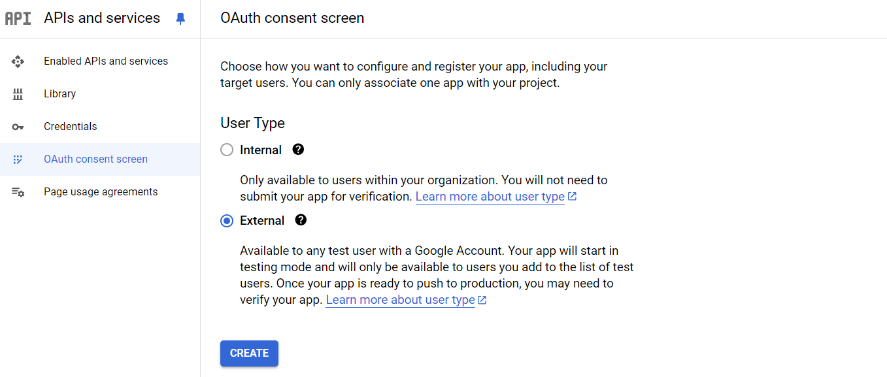

# Connect Google with OpenID Connect

FoxIDs can be connected to Google with OpenID Connect and authenticate users with Google login.

> You can test the Google login with the [online web app sample](https://aspnetoidcsample.itfoxtec.com) ([sample docs](samples.md#aspnetcoreoidcauthcodealluppartiessample)) by clicking `Log in` and then `Google`.  
> Take a look at the Google sample configuration in FoxIDs Control: [https://control.foxids.com/test-corp](https://control.foxids.com/test-corp)  
> Get read access with the user `reader@foxids.com` and password `TestAccess!` then select the `Production` environment and the `Authentication` tab.

## Configure Google

This chapter describes how to configure a connection with OpenID Connect Authorization Code flow + PKCE and read the users claims from the ID token.

**1 - Start by creating an OpenID Connect authentication method in [FoxIDs Control Client](control.md#foxids-control-client)**

 1. Navigate to the **Authentication** tab
 2. Click **New authentication**
 3. Select **OpenID Provider**
 4. Add the **Name** e.g. Google
 5. Add the Google authority `https://accounts.google.com/` in **Authority**
 
 6. Read the **Redirect URL** and save it for later

**2 - Then go to the [Google API & Services](https://console.cloud.google.com/apis)**

 1. A **Project** must exist first, you may have to create one. Once a project is selected, enter the [Dashboard](https://console.cloud.google.com/apis/dashboard).
 2. In the left navigation bar, click **OAuth consent screen**
 3. In **User Type** select **External**
 
 4. Click **CREATE**
 5. In the **App information dialog** step, fill in the information (app name, user support email, and developer contact information) 
 6. Click **SAVE AND CONTINUE**
 7. In the **Scopes** step, click **ADD OR REMOVE SCOPES**
 8. Select the `email`, `profile` and `openid` scopes
 
 9. Click **UPDATE**
 10. Click **SAVE AND CONTINUE**
 11. Step through the **Test users** step
 12. In the **OAuth consent screen** step, click **BACK TO DASHBORD**
 13. In the left navigation bar, click **Credentials**
 14. In the top click **CREATE CREDENTIALS** and click **OAuth client ID**
 15. As **Application type** select **Web application**
 16. Add the **Name** 
 17. In the **Authorized redirect URIs** section, click **ADD URI** and add the FoxIDs **Redirect URL** from before 
   
 18. Click **CREATE** 
 19. Read the **Client ID** and **Client Secret** and save it for later

 **3 - Go back to the FoxIDs authentication method in [FoxIDs Control Client](control.md#foxids-control-client)**

 1. Click the **Show advanced** in the top right corner of this configuration section
 2. Disable the **Single logout** switch
 3. Add the **Optional custom SP client ID** from Google called **Client ID**
 4. Add the two **scopes** `email` and `public`
 5. Add the **Client secret** from Google
 6. Set the **Read claims from the ID token instead of the access token** switch to **Yes**
 7. Disable the **Front channel logout** switch
 8. Disable the **Front channel logout session required** switch
 
 9. Click **Create**

That's it, you are done.
 
Your new Google authentication method can be selected as an allowed authentication method in an application registration.
