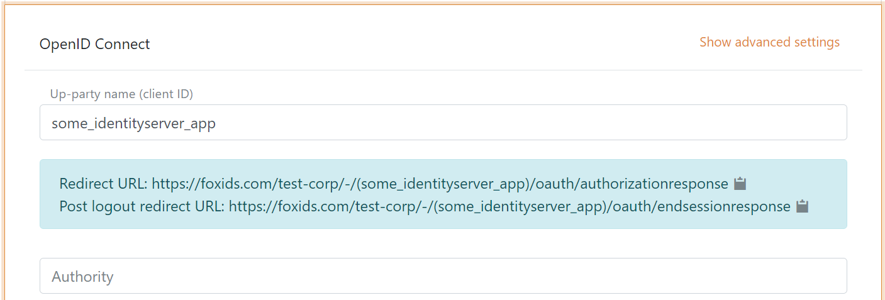

# Connect IdentityServer with OpenID Connect authentication method

FoxIDs can be connected to an IdentityServer with OpenID Connect and thereby authenticating end users in an IdentityServer.

It is possible to connect an [IdentityServer client](#configure-identityserver-client) and read claims from the ID token or select a more complex case where claims is [read form the access token](#read-claims-from-access-token).

> The [sample](samples.md) `IdentityServerOidcOpSample` is configured in the FoxIDs `test-corp` with the authentication method name `identityserver_oidc_op_sample`.  
> You can test login (username `alice` and password `alice`) using the `IdentityServerOidcOpSample` and the `AspNetCoreOidcAuthorizationCodeSample` [samples](samples.md). By clicking `OIDC IdentityServer Log in` in the `AspNetCoreOidcAuthorizationCodeSample` application.  
> The `IdentityServerOidcOpSample` sample is configured with Implicit Flow to enable local testing, please use Authorization Code Flow in production.

> Take a look at the IdentityServer sample configuration in FoxIDs Control: [https://control.foxids.com/test-corp](https://control.foxids.com/test-corp)  
> Get read access with the user `reader@foxids.com` and password `TestAccess!` then select the `Production` environment and the `Authentication methods` tab.

## Configure IdentityServer client

This chapter describes how to configure a connection with OpenID Connect Authorization Code flow and PKCE, which is the recommended OpenID Connect flow.

**1 - Start by creating an OpenID Connect authentication method client in [FoxIDs Control Client](control.md#foxids-control-client)**

 1. Add the name

It is now possible to read the `Redirect URL` and `Post logout redirect URL`.

**2 - Then go to the IdentityServer configuration and create the client**

    yield return new Client
    {
        ClientId = "some_identityserver_app",

        AllowedGrantTypes = GrantTypes.Code,
        RequirePkce = true,
        ClientSecrets =
        {
            new Secret("BpCbINKwxELM ... eVpMClM84Rr0".Sha256())
        },

        AlwaysIncludeUserClaimsInIdToken = true,

        RedirectUris = { "https://foxids.com/test-corp/-/(some_identityserver_app)/oauth/authorizationresponse" },
        PostLogoutRedirectUris = { "https://foxids.com/test-corp/-/(some_identityserver_app)/oauth/endsessionresponse" },                

        AllowedScopes = new List<string>
        {
            IdentityServerConstants.StandardScopes.OpenId,
            IdentityServerConstants.StandardScopes.Profile,
            IdentityServerConstants.StandardScopes.Email,
        }
    };

*Code from the `IdentityServerOidcOpSample` [sample configuration]( https://github.com/ITfoxtec/FoxIDs.Samples/blob/master/src/IdentityServerOidcOpSample/Config.cs).*

**3 - Go back to the FoxIDs authentication method client in [FoxIDs Control Client](control.md#foxids-control-client)**

 1. Add the IdentityServer's authority
 2. Add the profile and email scopes (possible other or more scopes)
 3. Add the IdentityServer client's client secret value as the client secret
 4. Select show advanced settings
 5. Select use claims from ID token
 6. Add the claims which will be transferred from the authentication method to the application registrations. E.g., email, email_verified, name, given_name, family_name, role and possible the access_token claim to transfer the IdentityServer access token 
 7. Click create

That's it, you are done. 

> The new authentication method can now be selected as an allowed authentication method in a application registration.  
> The application registration can read the claims from the authentication method. It is possible to add the access_token claim to include the IdentityServer access token as a claim in the issued access token.

## Read claims from access token

If you want to read claims from the access token you need to add an API resource and API scope. And let the client use the new scope.

**1 - In the IdentityServer configuration**

    public IEnumerable<ApiResource> GetApiResources()
    {
        yield return new ApiResource("some.api", "Some API")
        {
            UserClaims = new[] { "email", "email_verified", "family_name", "given_name", "name", "role" },

            Scopes = new List<string>
            {
                "some.api.access"
            }
        };
    }

    public IEnumerable<ApiScope> GetApiScopes()
    {
        yield return new ApiScope("some.api.access", "Some API scope");
    }

You can remove the `AlwaysIncludeUserClaimsInIdToken = true` from the client.

*Code from the `IdentityServerOidcOpSample` [sample configuration]( https://github.com/ITfoxtec/FoxIDs.Samples/blob/master/src/IdentityServerOidcOpSample/Config.cs).*

**2 - Then go to [FoxIDs Control Client](control.md#foxids-control-client)**

1. Add the API scope `some.api.access` as a scope in the FoxIDs authentication method client
2. Read claims from access token by not selecting to use claims from ID token

