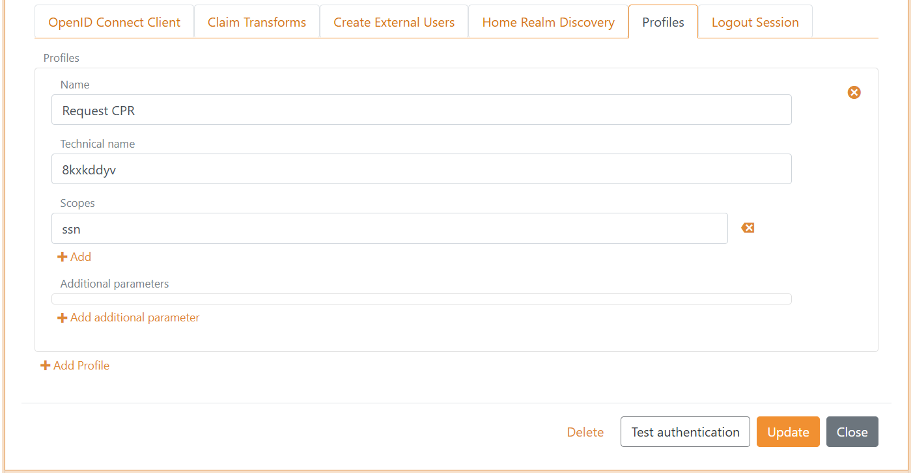
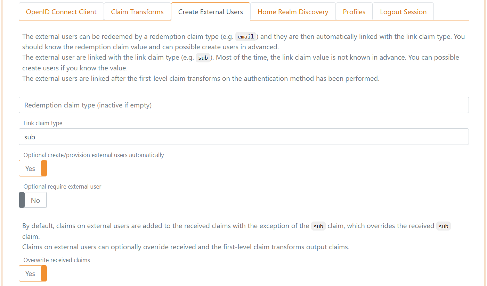
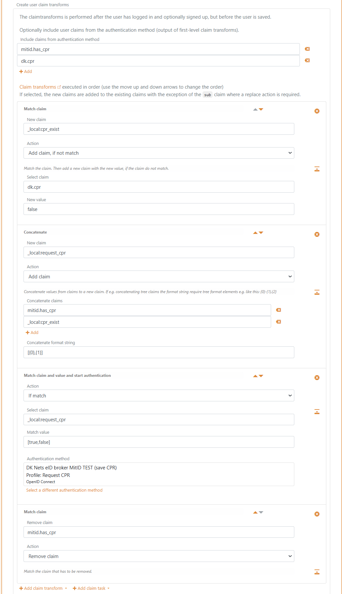

<!--
{
    "title":  "Connect to Nets eID Broker with OpenID Connect",
    "description":  "FoxIDs can be connected to Nets eID Broker with OpenID Connect and thereby authenticating end users with MitID and other credentials supported by Nets eID Broker.",
    "ogTitle":  "Connect to Nets eID Broker with OpenID Connect",
    "ogDescription":  "FoxIDs can be connected to Nets eID Broker with OpenID Connect and thereby authenticating end users with MitID and other credentials supported by Nets eID Broker.",
    "ogType":  "article",
    "ogImage":  "/images/foxids_logo.png",
    "twitterCard":  "summary_large_image",
    "additionalMeta":  {
                           "keywords":  "auth method howto oidc nets eid broker, FoxIDs docs"
                       }
}
-->

# Connect to Nets eID Broker with OpenID Connect

FoxIDs can be connected to Nets eID Broker with OpenID Connect and thereby authenticating end users with MitID and other credentials supported by Nets eID Broker.

How to configure Nets eID Broker in
- [test environment](#configuring-nets-eid-broker-test-as-openid-provider-op) using Nets eID Broker test
- [production environment](#configuring-nets-eid-broker-as-openid-provider-op) using Nets eID Broker admin portal

It is possible to [only request CPR number](#only-request-cpr-number-once) on the first login and not subsequently logins.

> You can test the Nets eID Broker test login with the [online web app sample](https://aspnetoidcsample.itfoxtec.com) ([sample docs](samples.md#aspnetcoreoidcauthcodealluppartiessample)) by clicking `Log in` and then `Nets eID Broker TEST`.  
> Take a look at the Nets eID Broker sample configuration in FoxIDs Control: [https://control.foxids.com/test-corp](https://control.foxids.com/test-corp)  
> Get read access with the user `reader@foxids.com` and password `gEh#V6kSw` then select the `Production` environment and the `Authentication` tab.

## Configuring Nets eID Broker test as OpenID Provider (OP)

This guide describes how to connect a FoxIDs authentication method to Nets eID Broker test in the test environment.  
All redirect URIs are accepted and therefor all clients can connect without prior registration.

This connection use OpenID Connect Authorization Code flow with PKCE, which is the recommended OpenID Connect flow.

**Create an OpenID Connect authentication method in [FoxIDs Control Client](control.md#foxids-control-client)**

1. Add the **Name**
2. Add the Nets eID Broker test authority `https://pp.netseidbroker.dk/op` in the **Authority** field
3. In the **Scopes** list add `mitid` to use MitID and optionally the `ssn` scope to request the CPR number (consider [only request CPR number once](#only-request-cpr-number-once))
4. Select **Show advanced**
5. Optionally add an **Additionally parameter** with the name `idp_values` and e.g. the value `mitid` to show the MitID IdP or e.g. the value `mitid_erhverv` to show the MitID Erhverv IdP.
6. Add the Nets eID Broker test secret `rnlguc7CM/wmGSti4KCgCkWBQnfslYr0lMDZeIFsCJweROTROy2ajEigEaPQFl76Py6AVWnhYofl/0oiSAgdtg==` in the **Client secret** field
7. Add the Nets eID Broker test client id `0a775a87-878c-4b83-abe3-ee29c720c3e7` in the **Optional customer SP client ID** field
8. Select to **Read claims from the UserInfo Endpoint instead of the access token or ID token**
9. Click **Create**

That's it, you are done. 

> The new authentication method can now be selected as an allowed authentication method in a application registration.  
> The application can read the claims from the authentication method. You can optionally add a `*` in the application registration Issue claims list to issue all the claims to your application. Or define a [scope to issue claims](#scope-and-claims).

## Configuring Nets eID Broker as OpenID Provider (OP)

This guide describes how to connect a FoxIDs authentication method to the Nets eID Broker in the production environment.

You are granted access to the [Nets eID Broker admin portal](https://netseidbroker.dk/admin) by Nets. The Nets eID Broker [documentation](https://broker.signaturgruppen.dk/).  

This connection use OpenID Connect Authorization Code flow with PKCE, which is the recommended OpenID Connect flow.

**1 - Start by creating an API client in [Nets eID Broker admin portal](https://netseidbroker.dk/admin)**

 1. Navigate to Services & Clients
 2. Select the Service Provider
 3. Create or select a Service
 4. Click Add new client
 5. Add a Client name
 6. Select Web
 7. Click Create
 8. Copy the Client ID
 9. Click Create new Client Secret
 10. Select Based on password
 11. Add a name for the new client secret
 12. Click Generate on server
 13. Copy the Secret
 14. Click the IDP tab
 15. Select MitID and click `Add to pre-selected login options`, optionally select others
 16. Click the Advanced tab
 17. Set PKCE to Active
  
**2 - Then create an OpenID Connect authentication method in [FoxIDs Control Client](control.md#foxids-control-client)**

1. Add the **Name**
2. Add the Nets eID Broker authority `https://netseidbroker.dk/op` in the **Authority** field
3. Copy the two URLs: `Redirect URL` and `Post logout redirect URL`
4. In the **Scopes** list add `mitid` to use MitID and optionally the `ssn` scope to request the CPR number (consider [only request CPR number once](#only-request-cpr-number-once))
5. Select **Show advanced**
6. Optionally add an **Additionally parameter** with the name `idp_values` and e.g. the value `mitid` to show the MitID IdP or e.g. the value `mitid_erhverv` to show the MitID Erhverv IdP.
7. Add the Nets eID Broker secret in the **Client secret** field
8. Add the Nets eID Broker client id in the **Optional customer SP client ID** field
9. Select to **Read claims from the UserInfo Endpoint instead of the access token or ID token**
10. Click **Create**

 **3 - Go back to [Nets eID Broker admin portal](https://netseidbroker.dk/admin)**

 1. Click the Endpoints tab
 2. Add the two URLs from the FoxIDs authentication method client: `Redirect URL` and `Post logout redirect URL` in the fields `Login redirects` and `Logout redirects`.

That's it, you are done. 

> The new authentication method can now be selected as an allowed authentication method in a application registration.  
> The application can read the claims from the authentication method. You can optionally add a `*` in the application registration Issue claims list to issue all the claims to your application. Or define a [scope to issue claims](#scope-and-claims).

## Only request CPR number once
It is possible to let FoxIDs save the uses CPR number in external users. Then the users are only requested for there CPR the first time they login. 

To make this happen we will configure the Nets eID Broker authentication method to login without requesting a CPR number and create a profile which do request the CPR number. 
On the first login FoxIDs subsequently initiate authentication with the profile to get the CPR number and save the users `sub` to CPR number relation in a claim on an external user.

In the Nets eID Broker authentication method.

*A) First create a profile*

 
1. Only include the `mitid` scope in the **Scopes** list
2. Select **Show advanced**
3. Select the **Profiles** tab
4. Click **Add Profile**
5. Add a **Name** e.g., `Request CPR`
6. Add `ssn` in the **Scopes** list 
7. Click **Update** - *Imported before you continue!*    

    
*b) Then start to create external users*

1. Select the **Create External Users** tab
2. Add `sub` in the **Link claim type** field
3. Select **Yes** in **Optional create/provision external users automatically**
4. Select **Yes** in **Overwrite received claims**

*c) Setup claim transforms*

1. In the **Create user claim transforms** section in the **Create External Users** tab
2. Add the claims `mitid.has_cpr` and `dk.cpr` in **Include claims from authentication method**
3. Click **Add claim transform** and click **Match claim**
    1. In the claim transformation 
    2. Add `_local:cpr_exist` in the **New claim** field
    3. Select **Add claim, if not match** in **Action** 
    4. Add `dk.cpr` in the **Select claim** field
    5. Add `false` in the **New value** field
4. Click **Add claim transform** and click **Concatenate**
    1. In the claim transformation 
    2. Add `_local:request_cpr` in the **New claim** field
    3. Select **Add claim** in **Action** 
    4. Add `mitid.has_cpr` and `_local:cpr_exist` in the **Concatenate claims** list
    5. Add `[{0},{1}]` in the **Concatenate format string** field
5. Click **Add claim task** and click **Match claim and value and start authentication**
    1. In the claim transformation 
    2. Select **If match** in **Action** 
    3. Add `_local:request_cpr` in the **Select claim** field
    4. Add `[true,false]` in the **Match value** field
    6. Select this authentication methods `Request CPR` profile in the **Authentication method**
6. Click **Add claim transform** and click **Match claim**
    1. In the claim transformation 
    2. Select **Remove claim** in **Action** 
    3. Add `mitid.has_cpr` in the **Remove claim** field
7. Click **Update**

## Scope and claims
You can optionally create a scope on the application registration with the Nets eID Broker claims as `Voluntary claims`. The scope can then be used by a OpenID Connect client or another FoxIDs authentication method acting as a OpenID Connect client.

The name of the scope can e.g, be `nets_eid_broker`

The most used Nets eID Broker claims:

- `idp`
- `idp_identity_id`
- `loa`
- `mitid.uuid`
- `mitid.has_cpr`
- `dk.cpr`
- `mitid.age`
- `mitid.date_of_birth`
- `mitid.identity_name`
- `mitid.transaction_id`

