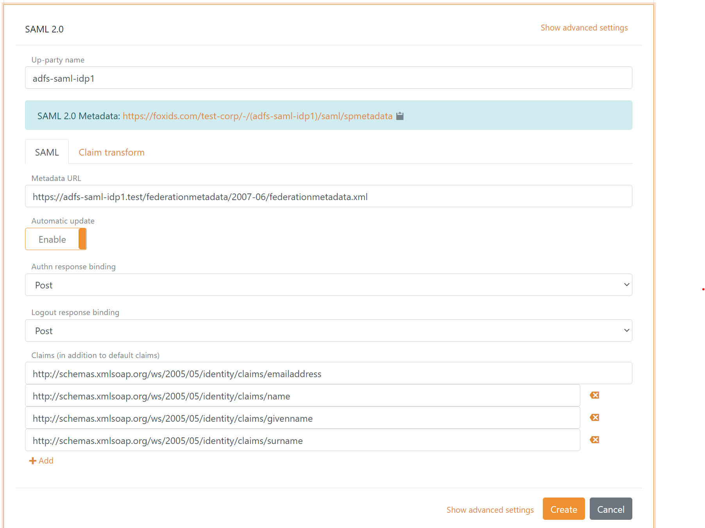

<!--
{
    "title":  "Connect to Microsoft AD FS with SAML 2.0",
    "description":  "FoxIDs can be connected to AD FS with a SAML 2.0 authentication method. Where AD FS is a SAML 2.0 Identity Provider (IdP) and FoxIDs is acting as an SAML 2.0 Relying Party (RP).",
    "ogTitle":  "Connect to Microsoft AD FS with SAML 2.0",
    "ogDescription":  "FoxIDs can be connected to AD FS with a SAML 2.0 authentication method. Where AD FS is a SAML 2.0 Identity Provider (IdP) and FoxIDs is acting as an SAML 2.0 Relying Party (RP).",
    "ogType":  "article",
    "ogImage":  "/images/foxids_logo.png",
    "twitterCard":  "summary_large_image",
    "additionalMeta":  {
                           "keywords":  "auth method howto saml 2.0 adfs, FoxIDs docs"
                       }
}
-->

# Connect to Microsoft AD FS with SAML 2.0

FoxIDs can be connected to AD FS with a [SAML 2.0 authentication method](auth-method-saml-2.0.md). Where AD FS is a SAML 2.0 Identity Provider (IdP) and FoxIDs is acting as an SAML 2.0 Relying Party (RP).
 
## Configuring AD FS as Identity Provider (IdP)

**1 - Start by creating an SAML 2.0 authentication method in [FoxIDs Control Client](control.md#foxids-control-client)**

The SAML 2.0 authentication method can either be configured by using the AD FS metadata `https://...adfs-domain.../federationmetadata/2007-06/federationmetadata.xml` or by manually adding the SAML 2.0 details.

Recommended SAML 2.0 bindings:
- Authn request and response binding: Post
- Logout request and response binding: Post

Remark; The authn request redirect binding can result in a long query string which can cause problems I some devices. Therefore post binding is preferable.

> Take a look at the AD FS sample configuration in FoxIDs Control: [https://control.foxids.com/test-corp](https://control.foxids.com/test-corp)  
> Get read access with the user `reader@foxids.com` and password `gEh#V6kSw` then select the `Production` environment and the `Authentication` tab.

The following screen shot show the basic FoxIDs SAML 2.0 authentication method configuration using AD FS metadata in [FoxIDs Control Client](control.md#foxids-control-client).

> The AD FS metadata endpoint need to be accessible online to do the SAML 2.0 configuration with AD FS metadata. If not, you need to do the configuration manually.

> More configuration options become available by clicking `Show advanced`.

**2 - Then go to the AD FS and create the Relying Party (RP)**

In this part of the configuration you need to use the SAML 2.0 authentication method metadata. It is possible to call a fictive SAML 2.0 authentication method metadata in FoxIDs and thereby if preferred performing step 2 as the first step.

> FoxIDs SAML 2.0 authentication method metadata `https://foxids.com/tenant-x/environment-y/(adfs-saml-idp1)/saml/spmetadata`  
> for `tenant-x` and `environment-y` with the authentication method name `adfs-saml-idp1`.

Configure the Relying Party (RP) on AD FS using the SAML 2.0 authentication method metadata.

Alternatively, the Relying Party (RP) can be configured manually on the AD FS with the following properties:

- The public FoxIDs environment ('tenant-x' and 'environment-y') certificate
- Hash algorithm, default SHA-256
- The FoxIDs environment identifier `https://foxids.com/tenant-x/environment-y/` or another identifier if configured
- Assertion consumer service endpoint `https://foxids.com/tenant-x/environment-y/(adfs-saml-idp1)/saml/acs`
- Single logout (logout) service endpoint `https://foxids.com/tenant-x/environment-y/(adfs-saml-idp1)/saml/singlelogout/`

**3 - Then go to the AD FS Relying Party (RP) issuances claims configuration**

It is recommended to add the NameID claim `http://schemas.xmlsoap.org/ws/2005/05/identity/claims/nameidentifier` (in AD FS called the NameIdentifier) to enable the SessionIndex. 

> Without the NamID claim AD FS do not add the SessionIndex to the SAML token and it will therefore not be possible to do logout or single logout.

FoxIDs require AD FS to issue the users identity in either the NameID or at least one of the following claims:

- NameID `http://schemas.xmlsoap.org/ws/2005/05/identity/claims/nameidentifier`
- UPN `http://schemas.xmlsoap.org/ws/2005/05/identity/claims/upn`
- Email `http://schemas.xmlsoap.org/ws/2005/05/identity/claims/emailaddress`
- Name `http://schemas.xmlsoap.org/ws/2005/05/identity/claims/name`

Other claims is optional and can be received and transformed in FoxIDs.

