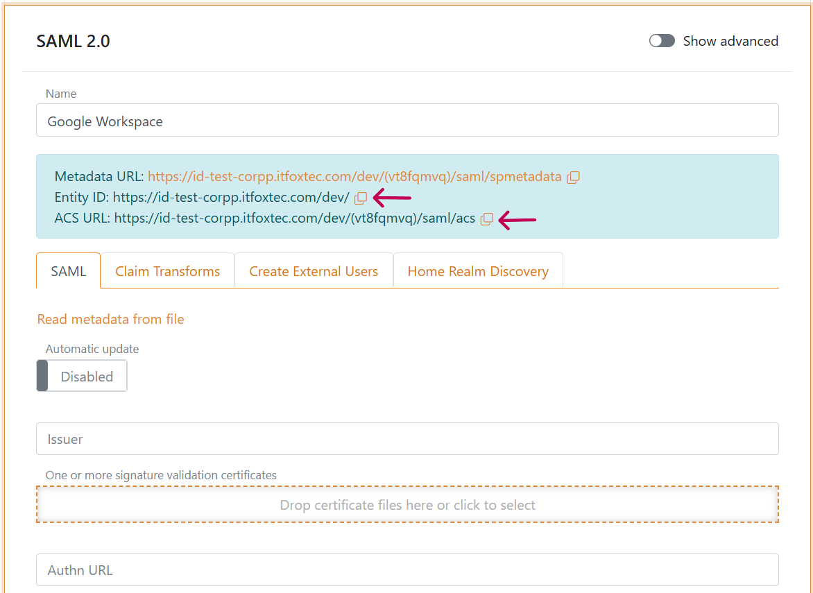
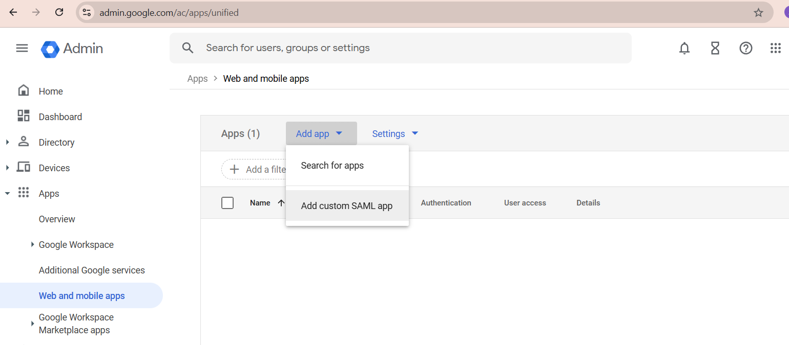
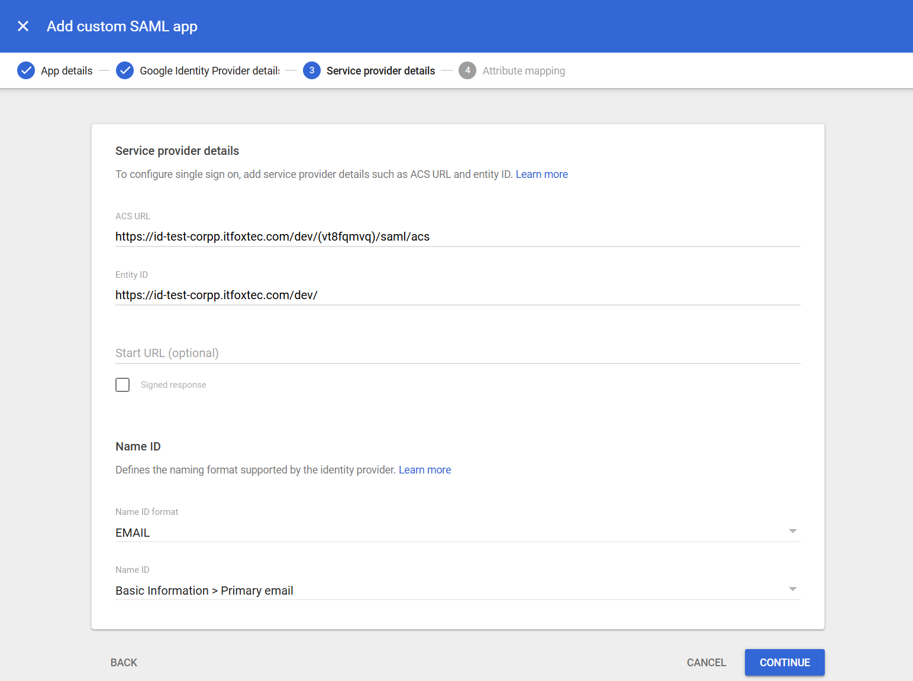
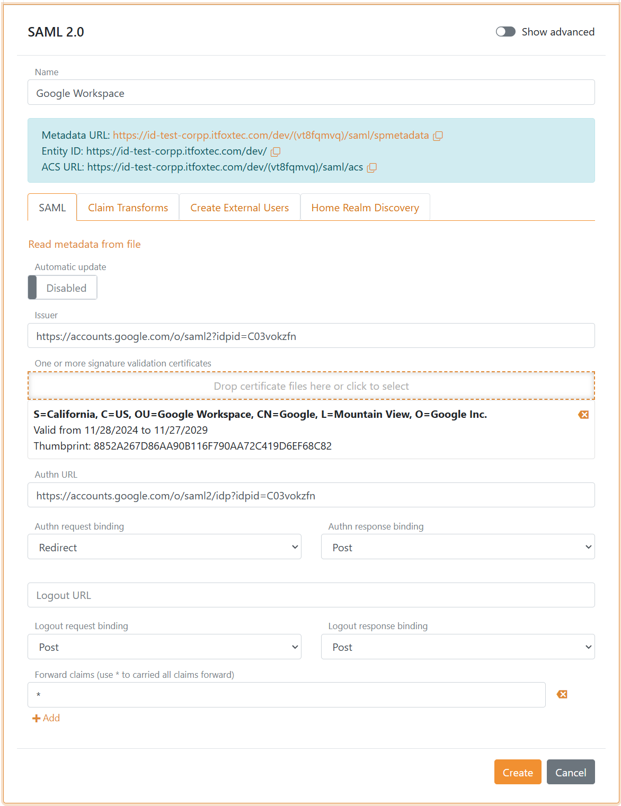

# Connect to Google Workspace with SAML 2.0

Connect Google Workspace to FoxIDs with an [SAML 2.0 authentication method](auth-method-saml-2.0.md). Google Workspace is a SAML 2.0 Identity Provider (IdP) and FoxIDs is acting as an SAML 2.0 Relying Party (RP).

By configuring an [SAML 2.0 authentication method](auth-method-saml-2.0.md) and a [OpenID Connect application](app-reg-oidc.md) FoxIDs become a [bridge](bridge.md) between SAML 2.0 and OpenID Connect and automatically convert SAML 2.0 claims to JWT (OAuth 2.0) claims.

> The Google Workspace OpenID Connect implementation is lacking, mostly because it does not support any custom claims or group claims. It is therefor recommended to use Google Workspace with SAML 2.0.

## Configuring Google Workspace
This guide describe how to setup Google Workspace as a SAML 2.0 Identity Provider.

**1 - Start by creating an SAML 2.0 authentication method in [FoxIDs Control Client](control.md#foxids-control-client)**

1. Select the **Authentication** tab
2. Click **New authentication** and then **Identity Provider (SAML 2.0)**
3. Add the **Name** e.g. `Google Workspace`
4. Disable **Automatic update**

5. Copy the **Entity ID** and **ACS URL** for later (marked with red arrows)

*Leave the browser window open, we'll continue shortly.*

**2 - Then create an app in [Google Workspace](https://admin.google.com/) ([Direct Google Workspace apps link](https://admin.google.com/ac/apps/unified))**

1. Select **Apps** and then **Web and mobile apps** 
2. Click **Add app** and then **Add custom SAML app**

3. Add the **App name** e.g. `FoxIDs app`
4. Click **CONTINUE**
5. Download the Google Workspace metadata by clicking **DOWNLOAD METADATA**
6. Click **CONTINUE**
7. Add the **ACS URL** and **Entity ID** from FoxIDs
8. In **Name ID format** select `EMAIL`

9. Click **CONTINUE**
10. Optionally add additional attributes / claims
11. Click **FINISH**
12. Click **User access**
13. Select **ON for everyone**
14. Click **SAVE** 

*Be patient, it may take a while before the Google app is ready.*

**3 - Then go back to the SAML 2.0 authentication method in [FoxIDs Control Client](control.md#foxids-control-client)**

1. Click **Read metadata from file** and select the Google Workspace metadata file  
   *The authentication method is configured*

2. Click **Create**
3. Click **Test authentication** to test the Google Workspace connection  
   *You can log in with your Google Workspace account and se how the SAML 2.0 claims is converted to JWT claims*

> Google Workspace do not support logout.