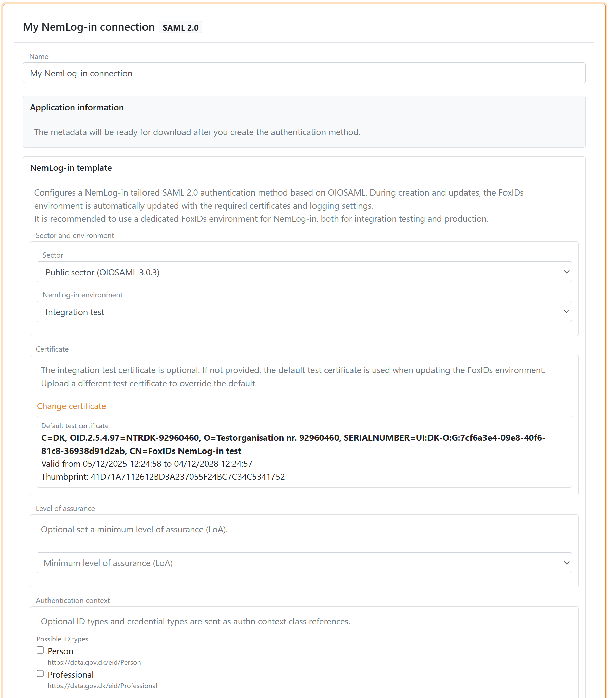
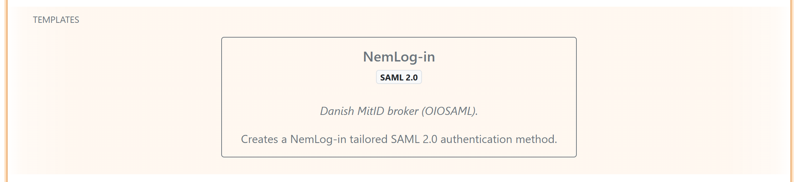
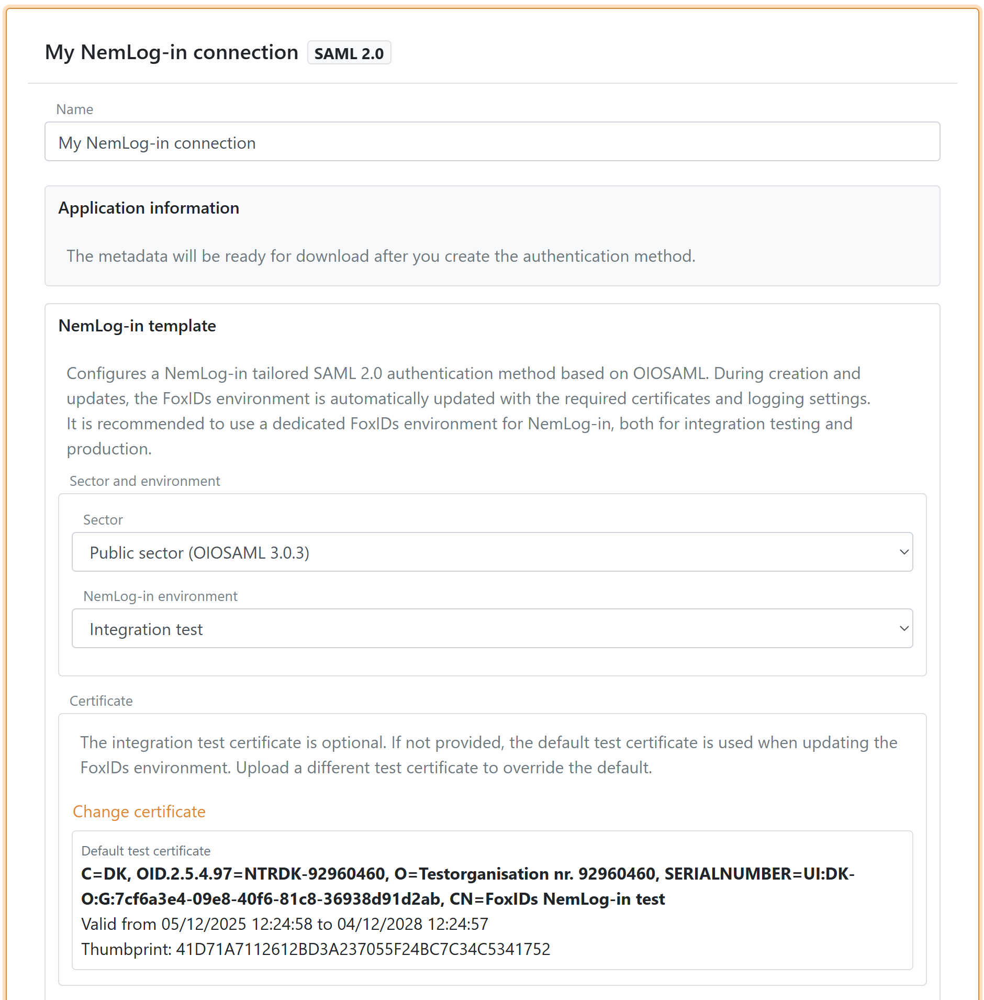
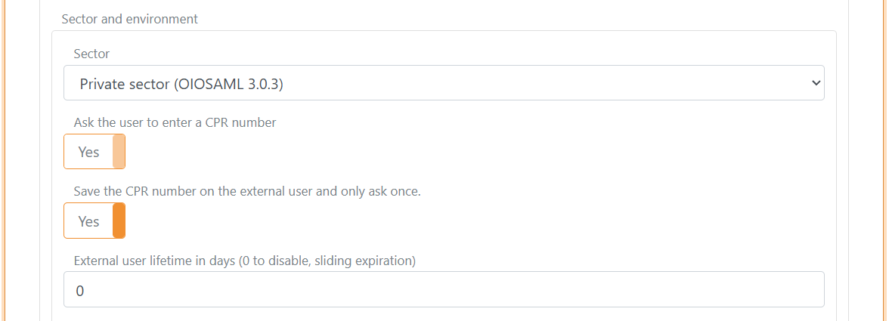
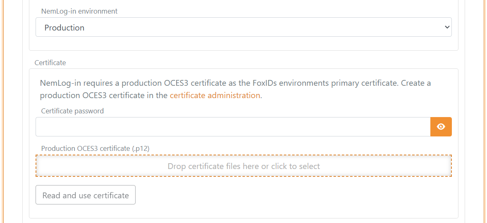
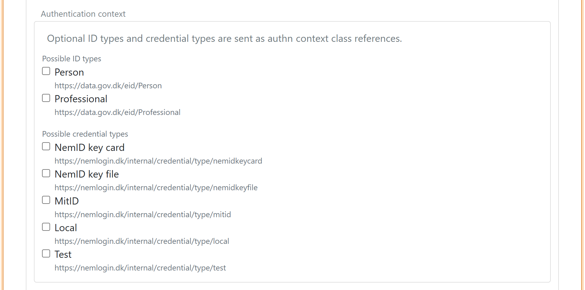
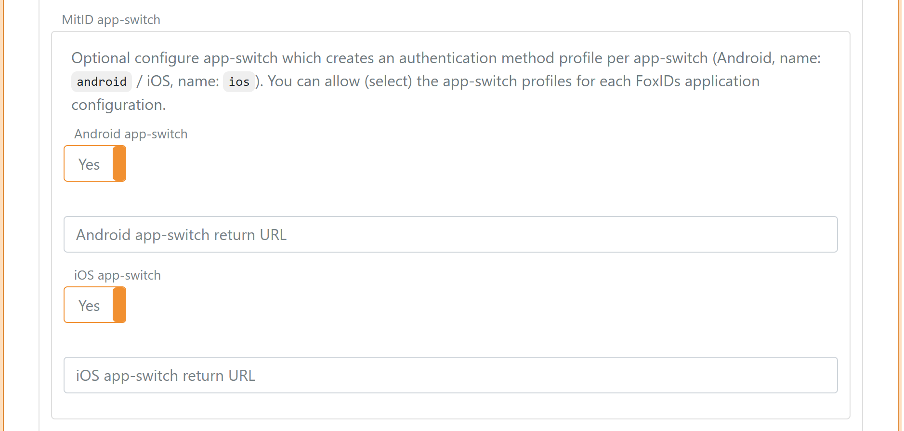
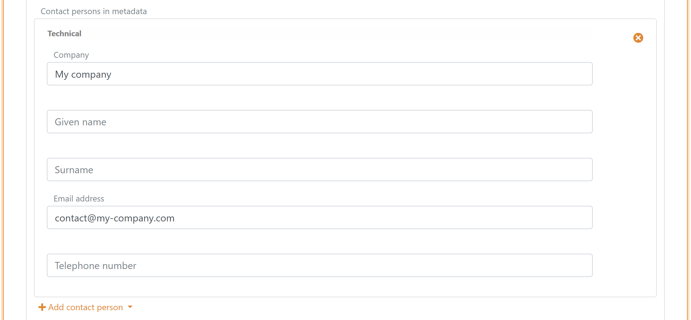
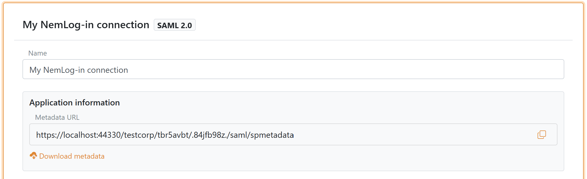
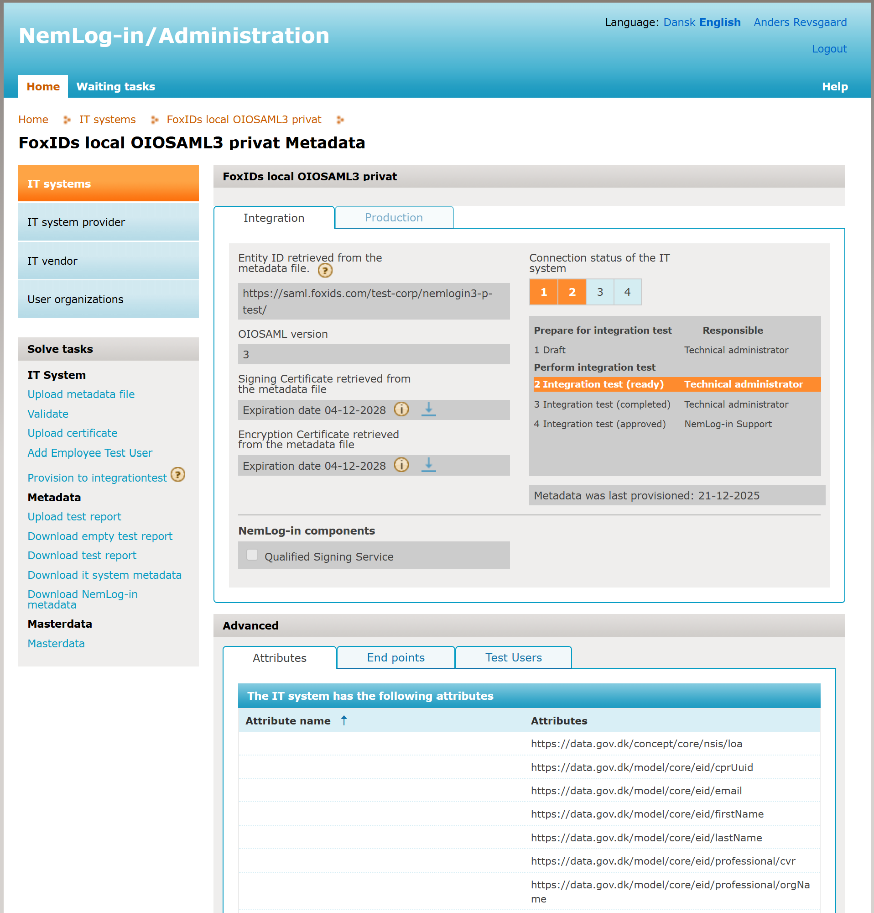

<!--
{
    "title":  "Connect to NemLog-in with SAML 2.0 (Template)",
    "description":  "Use the NemLog-in template to configure an OIOSAML 3.0.3 SAML 2.0 authentication method for public or private sector and upload metadata to NemLog-in.",
    "ogTitle":  "Connect to NemLog-in with SAML 2.0 (Template)",
    "ogDescription":  "Use the NemLog-in template to configure an OIOSAML 3.0.3 SAML 2.0 authentication method for public or private sector and upload metadata to NemLog-in.",
    "ogType":  "article",
    "ogImage":  "/images/foxids_logo.png",
    "twitterCard":  "summary_large_image",
    "additionalMeta":  {
                           "keywords":  "auth method howto saml 2.0 nemlogin, FoxIDs docs"
                       }
}
-->

# Connect to NemLog-in with SAML 2.0 (Template)

Use the NemLog-in template to configure a SAML 2.0 authentication method with OIOSAML 3.0.3 defaults. The template guides you through the public or private sector setup and generates the metadata you upload to NemLog-in.

This guide covers [OIOSAML 3.0.3](https://digst.dk/media/1gxag1pn/oiosaml-web-sso-profile-303.pdf) only. [OIOSAML 4.0.0](https://digst.dk/media/o2qcga0n/oiosaml-websso-profile-400.pdf) is not covered at this time.

By configuring a [SAML 2.0 authentication method](auth-method-saml-2.0.md) and an [OpenID Connect application registration](app-reg-oidc.md) FoxIDs becomes a [bridge](bridge.md) between SAML 2.0 and OpenID Connect. FoxIDs then handles the SAML 2.0 connection as a Relying Party (RP) / Service Provider (SP) and you only need to care about OpenID Connect in your application.

## Get started with NemLog-in

Before you can create IT systems for NemLog-in, your organization must be connected. This is only necessary once per organization.

1. Follow the NemLog-in onboarding steps at https://tu.nemlog-in.dk/tilslutning/ (one-time per organization)
2. Once the organization is connected, create IT systems in the [NemLog-in administration portal](https://administration.nemlog-in.dk/). Each IT system integration test or production tab corresponds to a FoxIDs authentication method.

Other useful resources:
- The [NemLog-in development portal](https://tu.nemlog-in.dk/oprettelse-og-administration-af-it-systemer/) with documentation for test and production environments
- Test user creation in the [MitID emulator](https://pp.mitid.dk/test-tool/frontend/#/create-identity) and [MitID simulator](https://mitidsimulator.test-nemlog-in.dk/Home/Create)

## Consider a separate environment

NemLog-in requires an OCES3 certificate and extended logging. The template updates the environment configuration accordingly, so consider creating a separate environment dedicated to NemLog-in.

You can connect two environments in the same tenant with an [Environment Link](howto-environmentlink-foxids.md).

## Create the NemLog-in authentication method (template)

> Start by configuring a NemLog-in integration test connection and then the production connection.

**1) Start in FoxIDs Control Client**

1. Go to the Authentication tab
2. Click New authentication
3. Select **NemLog-in - SAML 2.0**

**2) Configure the template**

1. Enter a name for the authentication method
2. Select sector:
   - Public sector (OIOSAML 3.0.3)
   - Private sector (OIOSAML 3.0.3)
3. Select environment:
   - Integration test
   - Production

**3) Private sector CPR flow**

If you select the private sector, you can enable (default enabled):

- **Request CPR** to ask the user for a CPR number during login
- **Save CPR on external users** to store CPR on the external user so the user only needs to enter CPR once or you can set a lifetime for the saved CPR on the external user 

The template configures the CPR match UI flow automatically.

**4) Configure certificate**

NemLog-in requires an OCES3 certificate.

- Integration test: the template can use a default test certificate, which you can replace if needed
- Production: upload your own OCES3 certificate. You can create a production OCES3 certificate in the [certificate administration](https://erhvervsadministration.nemlog-in.dk/certificates)

An OCES3 certificate is valid for 3 years. Update the NemLog-in template before the certificate expires and update the certificate in NemLog-in.

**5) Metadata URL and IdP metadata**

The template pre-fills the NemLog-in IdP metadata URL for the selected environment.

When NemLog-in changes certificate, the change is provisioned automatically. The NemLog-in template uses NemLog-in metadata exposed via the FoxIDs website, which we keep updated, and the template automatically loads the new metadata.

**6) Level of assurance (optional)**

You can optionally set a minimum level of assurance (LoA) (OIOSAML 3.0.3):

- Low `https://data.gov.dk/concept/core/nsis/loa/Low`
- Substantial `https://data.gov.dk/concept/core/nsis/loa/Substantial`
- High `https://data.gov.dk/concept/core/nsis/loa/High`

**7) Authentication context (optional)**

You can optionally set authentication context requirements.

You can specify ID type:
- `https://data.gov.dk/eid/Person`
- `https://data.gov.dk/eid/Professional`

And possible credential types:
- `https://nemlogin.dk/internal/credential/type/nemidkeycard`
- `https://nemlogin.dk/internal/credential/type/nemidkeyfile`
- `https://nemlogin.dk/internal/credential/type/mitid`
- `https://nemlogin.dk/internal/credential/type/local`
- `https://nemlogin.dk/internal/credential/type/test`

**8) App-switch**

Optionally configure app-switch which creates an authentication method profile per app-switch (Android, name: `android` / iOS, name: `ios`). You can allow (select) the app-switch profiles for each FoxIDs application configuration.

**9) Add contact person**

Add at least one technical or administrative contact person in metadata.

**10) Create and download SP metadata**

Click Create or Update. After the authentication method is created, the Application information section shows the metadata URL and a download button (in the top of the NemLog-in template).

If you change attributes or authentication context later, you must upload the metadata again in NemLog-in.

## Configure the NemLog-in IT system

When you create an IT system in NemLog-in it has two tabs: integration test and production.

1. Create a FoxIDs NemLog-in connection for integration test with the template
2. In the [NemLog-in administration portal](https://administration.nemlog-in.dk/), upload the SP metadata to the integration test tab and provision to integration test
3. Upload the test report:
   - [Integration test report for public sector](https://cms.nemlog-in.dk/media/ozgd4sgz/nemlog-in-integrationstestrapport-til-offentlige-it-systemer.pdf)
   - [Integration test report for private sector](https://cms.nemlog-in.dk/media/liplqxki/nemlog-in-integrationstestrapport-til-private-tjenester.pdf)
4. After approval, the production tab opens
5. Create a FoxIDs NemLog-in connection for production with the template
6. Upload the SP metadata to the production tab and provision to production
7. You are now in production with MitID

## Legacy

If you need the legacy guide for configuring NemLog-in with the standard SAML 2.0 settings, see [Connect to NemLog-in with SAML 2.0 (Legacy standard configuration)](auth-method-howto-saml-2.0-nemlogin-oiosaml3-std.md).
