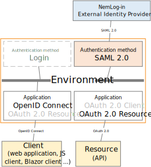

# Connect NemLog-in with SAML 2.0

You can connect FoxIDs to NemLog-in (Danish IdP) with a [SAML 2.0 authentication method](auth-method-saml-2.0.md) and let the users authenticate with MitID. NemLog-in is connected as a SAML 2.0 Identity Provider (IdP).

By configuring an [SAML 2.0 authentication method](auth-method-saml-2.0.md) and a [OpenID Connect application registration](app-reg-oidc.md) FoxIDs become a [bridge](bridge.md) between SAML 2.0 and OpenID Connect. 
FoxIDs will then handle the SAML 2.0 connection as a Relying Party (RP) / Service Provider (SP) and you only need to care about OpenID Connect in your application. If needed, you can possibly select multiple login option (authentication methods) from the same OpenID Connect application registration.



FoxIDs support NemLog-in and the SAML 2.0 based OIOSAML3 including single logout (SLO), logging, issuer naming, required OCES3 (RSASSA-PSS) certificates and it is possible to support NSIS.

> You can test the NemLog-in login with the [online web app sample](https://aspnetcoreoidcallupsample.itfoxtec.com) ([sample docs](samples.md#aspnetcoreoidcauthcodealluppartiessample)) by clicking `Log in` and then `Danish NemLog-in TEST` for the test environment or `Danish NemLog-in` for production.  
> Take a look at the NemLog-in sample configuration in FoxIDs Control: [https://control.foxids.com/test-corp](https://control.foxids.com/test-corp)  
> Get read access with the user `reader@foxids.com` and password `TestAccess!` then select the `nemlogin` or `nemlogin-test` environment.  
> *The sample is configured with a separate environment for the NemLog-in SAML 2.0 integration.*

NemLog-in documentation:
- The [NemLog-in development portal](https://tu.nemlog-in.dk/oprettelse-og-administration-af-tjenester/) with documentation
  - [test](https://tu.nemlog-in.dk/oprettelse-og-administration-af-tjenester/log-in/dokumentation-og-guides/integrationstestmiljo/), where you can find the NemLog-in IdP-metadata for test and get OCES3 test certificates
  - [production](https://tu.nemlog-in.dk/oprettelse-og-administration-af-tjenester/log-in/dokumentation-og-guides/produktionsmiljo/), where you can find the NemLog-in IdP-metadata for production
- Create OCES3 production certificate in the [certificate administration](https://erhvervsadministration.nemlog-in.dk/certificates) 
- The [NemLog-in administration portal](https://administration.nemlog-in.dk/) where you configure IT-systems
- Test environment
  - Create citizens test users in [MitID emulator](https://pp.mitid.dk/test-tool/frontend/#/create-identity) 
  - Create citizens and employee test users in [MitID simulator](https://mitidsimulator.test-nemlog-in.dk/Home/Create) (login with username and password)

> Transform the [DK privilege XML claim](claim-transform-dk-privilege.md) to a JSON claim.

## Consider separate environment

NemLog-in requires the Relying Party (RP) to use a OSES3 certificate and [extensive logging](#logging). Therefore, consider connecting NemLog-in in a separate environment where the OCES3 certificate and log level can be configured without affecting anything else.

    

You can connect two environments in the same tenant with a [Environment Link](howto-environmentlink-foxids.md).

## Certificate

NemLog-in requires all requests (authn and logout) from the Relying Party (RP) to be signed. Furthermore, NemLog-in requires the RP to sign with a OCES3 certificate. It is not possible to use a certificate issued by another certificate authority, a self-signed certificate or a certificate issued by FoxIDs.

OCES3 test certificates are use in the test environment and OCES3 production certificates are used in production. An OCES3 certificate is valid for three years. After that, it must be updated manually.  
You will need separate FoxIDs environments to handle the test and production environments respectively. The environments can optionally be combined in an app environment with [environment links](howto-environmentlink-foxids.md).

Add the `.P12` OCES3 certificate in [FoxIDs Control Client](control.md#foxids-control-client):
1. Select (or create) the environment to be used for NemLog-in
2. Select the Certificates tab
3. Click the arrow down on the Swap certificate button and then in the Contained certificates section click Change container type


4. Then click on the primary certificate, then write the password and upload the `.P12`  OCES3 certificate 


It is subsequently possible to add a secondary certificate and to swap between the primary and secondary certificates.

## Configuring NemLog-in 3 as Identity Provider (IdP)

> You need to [configure the OCES3 certificate](#certificate) before following this guide.

**1) - Start by creating an SAML 2.0 authentication method in [FoxIDs Control Client](control.md#foxids-control-client)**

1. Select the Authentication tab
2. Click New authentication and then SAML 2.0
3. Add the name
4. Select show advanced
5. Select the dot URL binding pattern
6. Set the session lifetime to 1800 (30 minutes) in the Logout session tab
7. Go back to the SAML tab


8. Disable automatic update
9. Click Read metadata from file and select the NemLog-in IdP-metadata


10. Configure a custom SP issuer, the issuer can optionally start with `https://saml.`
    - The issuer in this example is `https://saml.foxids.com/test-corp/nemlogin-test/`
11. Optionally remove the `*` and configure claims, the following claims is most often used:
    - `https://data.gov.dk/concept/core/nsis/loa`
    - `https://data.gov.dk/model/core/eid/cprNumber`
    - `https://data.gov.dk/model/core/eid/cprUuid`
    - `https://data.gov.dk/model/core/eid/email`
    - `https://data.gov.dk/model/core/eid/firstName`
    - `https://data.gov.dk/model/core/eid/lastName`
    - `https://data.gov.dk/model/core/eid/professional/cvr`
    - `https://data.gov.dk/model/core/eid/professional/orgName`
    - `https://data.gov.dk/model/core/eid/professional/uuid/persistent`
    - `https://data.gov.dk/model/core/specVersion`
    - optionally include the privilege claim, see step 3)


 12. Set Login hint in Authn request in Subject NameID to Disabled
 13. In production only! optionally the Certificate validation mode to `Chain trust` if the OCES3 root certificate is trusted on your platform. The OCES3 root certificate is NOT trusted in Azure  
     Set the Certificate revocation mode to `Online`
 14. Select to include the encryption certificate in metadata
 15. Set the NameID format in metadata to `urn:oasis:names:tc:SAML:2.0:nameid-format:persistent`

 

 16. Add an attribute consuming service in metadata and add the service name.
 17. Add all the claims configured in step 11 as requested attributes with the format `urn:oasis:names:tc:SAML:2.0:attrname-format:uri`. Optionally set each attribute as required.


 18. Add at least one technical contact person
 


 19. Click create
 20. Go to the top of the SAML 2.0 authentication method
 21. Download the SAML 2.0 authentication method SP-metadata, in this case https://foxids.com/test-corp/nemlogin-test/.nemlogin./saml/spmetadata. 
 22. The SP-metadata file is used to configure the NemLog-in IT system.
 
 **2) - Then go to the [NemLog-in adminstration protal](https://administration.nemlog-in.dk/)**

First you need to create an NemLog-in IT-system or have someone else creating an NemLog-in IT-system and assign you access.

1. Select the IT-system
2. Click upload metadata file and upload the SAML 2.0 authentication method SP-metadata file
3. Go back to the IT-system
4. Click the button Save the technical details
5. Click Provision to integrationtest and then click Apply for integration test

> To configure production you need to upload a test report, have it approved and then repeat the FoxIDs and NemLog-in configuration.

 **3) - Optionally - Configure MitID app-switch to mobile app in [FoxIDs Control Client](control.md#foxids-control-client)**

 *Optionally, configure MitID app-switch if you are using NemLog-in / MitID in a mobile app.*

- You can find more information in [NemLog-in Integration with NemLog-in3](https://cms.nemlog-in.dk/media/jhmbnulm/integration-with-nemlog-in.pdf) chapter 9.6 and 9.7.

NemLog-in support mobile app-switch using either Universal Links on iOS or App Links on Android, based on a return URL which is handed to NemLog-in in a SAML 2.0 extension as part of the authn (login) request.

The return URL is the URL for your mobile app and the return URL is used to app-switch back to your mobile app from the MitID app after authentication.

The return URL is configured as XML, if the return URL for your Android app is `https://myapp.page.link/zyx`  
The SAML 2.0 authn request extension XML is:

```XML
<nl:AppSwitch xmlns:nl="https://data.gov.dk/eid/saml/extensions">
  <nl:Platform>Android</nl:Platform>
  <nl:ReturnURL>https://myapp.page.link/zyx</nl:ReturnURL>
</nl:AppSwitch>
```

Select show advanced settings and add the extension XML in **Authn request extensions XML** and click **Update**  


You can configure authn request extensions XML in profiles on the authentication method. And then support multiple mobile platforms in profiles.

> As of now iOS do not require a return URL to do app-switch. But this can change over time!  
> Therefor, you currently only need two authentication methods; one for your web site and iOS app without a redirect URL and one for your Android app with a redirect URL.

 **4) - Optionally - add privilege claim transformation in [FoxIDs Control Client](control.md#foxids-control-client)**

*Optionally, if you are using the privilege claim.*

FoxIDs can transform the [DK privilege XML claim](claim-transform-dk-privilege.md) to a JSON claim. It is recommended to add the transformation in order to obtain smaller claims and tokens. 
Furthermore, it makes the tokens readable.

1. Add the DK privilege claim transformer. 
2. Remove the original privilege claim from the claims pipeline.


FoxIDs internally converts SAML 2.0 claims to JWT claims. The mapping between SAML 2.0 and JWT claims is automatically created by default. You can find and change the mapping in the **Settings** tab.

The SAML 2.0 authentication method can now be used as an authentication method for application registrations in the environment.

## Logging

NemLog-in requires requests and responses to be logged including the signature proof and stored for half a year (180 days). It is also required to log which identity has login and logout of which session, at what time and the IP address.  
[FoxIDs default log](logging.md) errors and events including the time and the IP address.

> With an Enterprise plan on [FoxIDs.com](https://www.foxids.com) log data is stored for 180 days.
> If you are using a Free or Pro plan, you can send logs to your own Application Insights with a [log stream](logging.md#log-stream) and thereby save the logs for 180 days.

It can be configured which logs should be logged to the Application Insights which is part of the FoxIDs installation or to an external repository with a [log stream](logging.md#log-stream).

The log level NemLog-in require is configured in the FoxIDs log settings:

 1. Enable `log info trace`
 2. Enable `log claims trace`
 3. Enable `log message trace`
 4. Click update


## Request authentication context

You can request a desired NSIS assurance level as an authn context class reference.


Possible NSIS assurance levels:
 - `https://data.gov.dk/concept/core/nsis/loa/Low`
 - `https://data.gov.dk/concept/core/nsis/loa/Substantial`
 - `https://data.gov.dk/concept/core/nsis/loa/High`

You can likewise specify ID type as an authn context class reference.


Possible ID types:
 - `https://data.gov.dk/eid/Person`
 - `https://data.gov.dk/eid/Professional`

And possible credential types:
 - `https://nemlogin.dk/internal/credential/type/nemidkeycard`
 - `https://nemlogin.dk/internal/credential/type/nemidkeyfile`
 - `https://nemlogin.dk/internal/credential/type/mitid`
 - `https://nemlogin.dk/internal/credential/type/local`
 - `https://nemlogin.dk/internal/credential/type/test`


You can configure authn context class references in profiles on the authentication method. In the case you need to provide different sets of authn context class references.  
E.g., if you need to support step-up authentication. Then you would create one profile with authn context class reference `https://data.gov.dk/concept/core/nsis/loa/Substantial` and another profile with authn context class reference `https://data.gov.dk/concept/core/nsis/loa/High`.