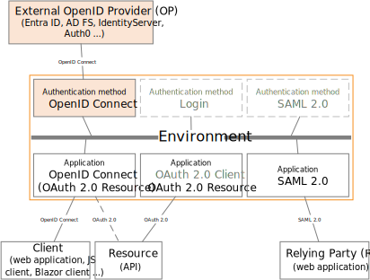

# OpenID Connect authentication method

FoxIDs [OpenID Connect](https://openid.net/specs/openid-connect-core-1_0.html) authentication method which trust an external OpenID Provider (OP) / Identity Provider (IdP).

It is possible to configure multiple OpenID Connect authentication methods which then can be selected by [application registrations](connections.md#application-registration).

How to guides:

- Connect [IdentityServer](auth-method-howto-oidc-identityserver.md)
- Connect [Microsoft Entra ID (Azure AD)](auth-method-howto-oidc-microsoft-entra-id.md) 
- Connect [Azure AD B2C](auth-method-howto-oidc-azure-ad-b2c.md) 
- Connect [Amazon Cognito](auth-method-howto-oidc-amazon-cognito.md)
- Connect [Google](auth-method-howto-oidc-google.md)
- Connect [Facebook](auth-method-howto-oidc-facebook.md)
- Connect [Signicat](auth-method-howto-oidc-signicat.md)
- Connect [Nets eID Broker](auth-method-howto-oidc-nets-eid-broker.md)
- Connect two FoxIDs environments in the same or different tenants with [OpenID Connect](howto-oidc-foxids.md)
- Connect two FoxIDs environments in the same tenant with a [Environment Link](howto-environmentlink-foxids.md)

> It is recommended to use OpenID Connect Authorization Code flow with PKCE, because it is considered a secure flow.

## Configuration
How to configure external OpenID Provider (OP) as an authority.

The following screen shot show the basic FoxIDs OpenID Connect authentication method configuration available in [FoxIDs Control Client](control.md#foxids-control-client).

> More configuration options become available by clicking `Show advanced`.

FoxIDs automatically calls the OpenID Configuration endpoint (`.well-known/openid-configuration`) on create. You can see the added configuration by opening the authentication method again.

FoxIDs automatically read future updates. If the endpoint become unavailable for a period of time FoxIDs will stop the automated update process. It can be restarted by doing an authentication method update in [FoxIDs Control Client](control.md#foxids-control-client) or [API](control.md#foxids-control-api).

> FoxIDs Control Client only support creating automatic updated authentication methods using the OpenID Configuration endpoint. [FoxIDs Control API](control.md#foxids-control-api) support both automatic and manually updated authentication methods. In manual you can specify all values and the OpenID Configuration endpoint (`.well-known/openid-configuration`) will not be called.

Default the authentication method is configured for Authorization Code Flow, to use PKCE and read claim from the external access token. These settings can be changed.

The default client authentication method is `client secret post` and can be changed to `client secret basic` or `private key JWT`. Client authentication method none is supported with PKCE.

The scopes the FoxIDs authentication method should send in the request to the external OP can be configured. E.g, `profile` or `email`.

The authentication method only forwards default claims and claims added in the `Forward claims` list to the application registrations. All claims is forwarded if you add `*` (default) to the `Forward claims` list.

Default transferred claims are `sub`, `sid`, `acr` and `amr`.

> You can change the claims and do claim tasks with [claim transforms and claim tasks](claim-transform-task.md).

FoxIDs default use the brackets connection pattern `.../(auth-method)/...`. If not supported by the external OP (e.g., like Microsoft Entra ID), the pattern can be changed to the tildes connection pattern `.../~auth-method~/...` or dot connection pattern `.../.auth-method./...`.

If necessary, a custom client ID can be configured, otherwise the authentication method name is used as the client ID.

Optionally the issuer can be changed. Otherwise read from the OpenID Configuration endpoint. Furthermore, multiple issuers can be configured to trust tokens form multiple issuers signed with the same key (often used with Microsoft Entra ID).
