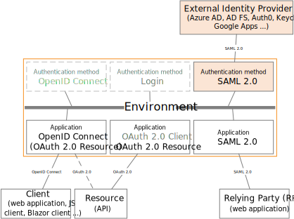
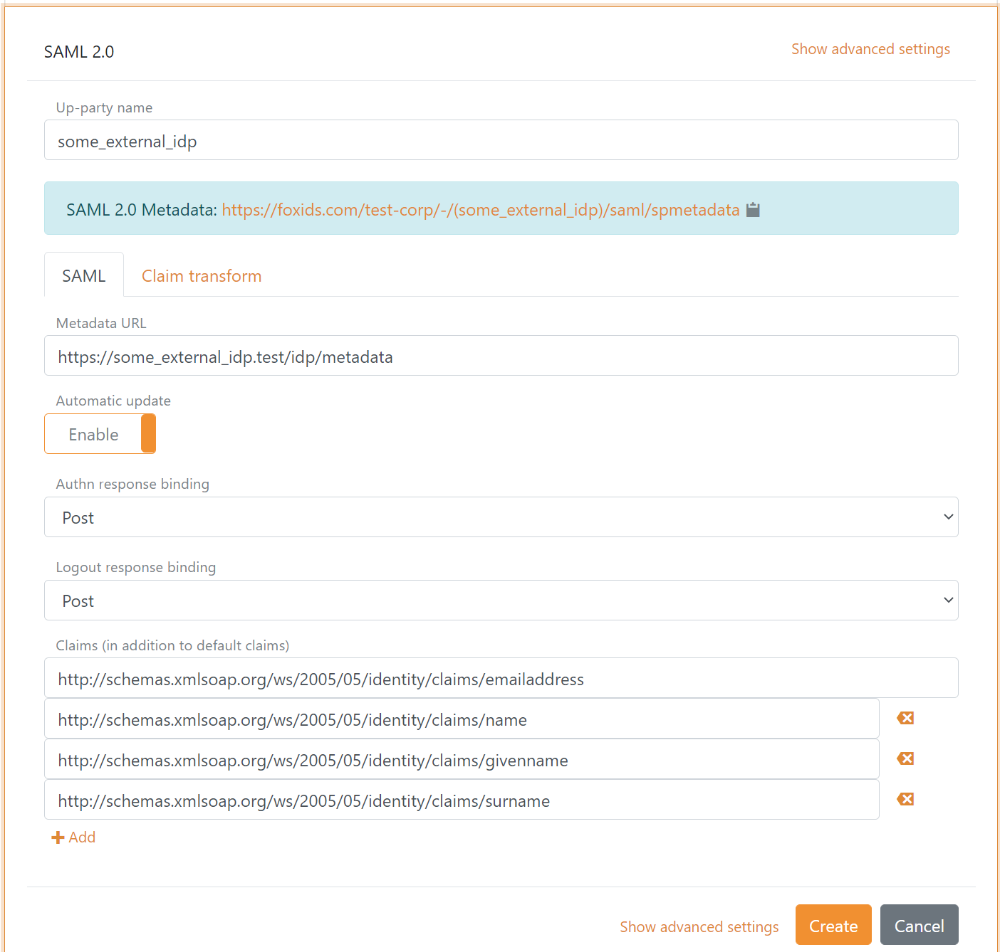
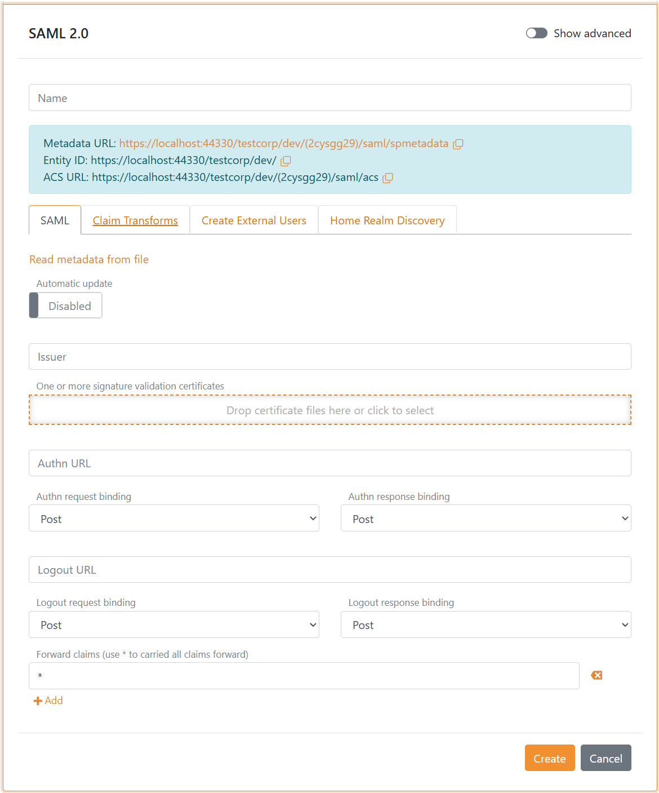

# SAML 2.0 authentication method

Foxids [SAML 2.0](https://docs.oasis-open.org/security/saml/v2.0/saml-core-2.0-os.pdf) authentication method which trust an external SAML 2.0 Identity Provider (IdP).

By configuring an SAML 2.0 authentication method and a [OpenID Connect application registration](app-reg-oidc.md) Foxids become a [bridge](bridge.md) between SAML 2.0 and OpenID Connect. 
Foxids will then handle the SAML 2.0 connection as a Relying Party (RP) / Service Provider (SP) and you only need to care about OpenID Connect in your application.

It is possible to configure multiple SAML 2.0 authentication methods which can then be selected by [OpenID Connect application registrations](app-reg-oidc.md) and [SAML 2.0 application registrations](app-reg-saml-2.0.md).

Foxids support [SAMl 2.0 redirect and post bindings](https://docs.oasis-open.org/security/saml/v2.0/saml-bindings-2.0-os.pdf). Both the login, logout and single logout [SAML 2.0 profiles](https://docs.oasis-open.org/security/saml/v2.0/saml-profiles-2.0-os.pdf) are supported. The Artifact profile is not supported.

A authentication method expose [SAML 2.0 metadata](https://docs.oasis-open.org/security/saml/v2.0/saml-metadata-2.0-os.pdf) and can be configured with SAML 2.0 metadata or by manually adding the configuration details.

> The Foxids SAML 2.0 metadata do only include logout and single logout information if logout is configured in the SAML 2.0 authentication method.

How to guides:

- Connect [AD FS](auth-method-howto-saml-2.0-adfs.md)
- Connect [PingIdentity / PingOne](auth-method-howto-saml-2.0-pingone.md)
- Connect [NemLog-in (Danish IdP)](auth-method-howto-saml-2.0-nemlogin.md)
- Connect [Context Handler (Danish IdP)](howto-saml-2.0-context-handler.md#authentication-method---connect-to-context-handler)

## Configuration
How to configure an external SAML 2.0 Identity Provider (IdP).

> The Foxids SAML 2.0 authentication method metadata endpoint is `https://foxids.com/tenant-x/environment-y/(some_external_idp)/saml/spmetadata`  
> if the IdP is configured in tenant `tenant-x` and environment `environment-y` with the authentication method name `some_external_idp`  

The following screen shot show the basic Foxids SAML 2.0 authentication method configuration available in [Foxids Control Client](control.md#foxids-control-client).
Where the configuration is created with the external IdP metadata.

> More configuration options become available by clicking `Show advanced settings`.

Manual configuration become available by disabling `Automatic update`.

> Change the issued SAML 2.0 claim collection with [claim transforms](claim-transform.md).