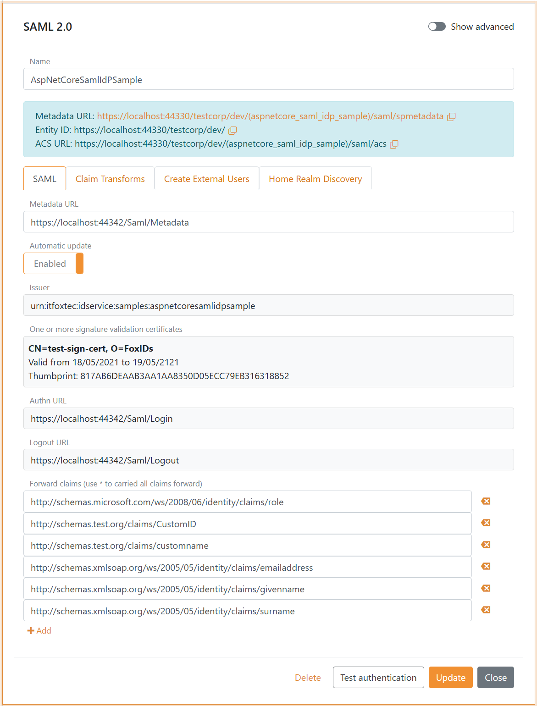

# SAML 2.0 authentication method

FoxIDs SAML 2.0 authentication method which trust an external SAML 2.0 Identity Provider (IdP).

[SAML (Security Assertion Markup Language) 2.0](https://docs.oasis-open.org/security/saml/v2.0/saml-core-2.0-os.pdf) is an open standard for exchanging authentication and authorization data between
an Identity Provider (IdP) and a Service Provider (SP). It enables Single Sign-On (SSO), allowing users to log in once and gain access to multiple applications without needing to authenticate again.  
The two SAML 2.0 flows are supported. The SP-Initiated Login flow, which is the default, most common and recommended flow, and the [IdP-initiated Login](#idp-initiated-login) flow.

SAML 2.0 is widely used in enterprise environments, enabling secure identity federation across different organizations and applications.


By configuring an SAML 2.0 authentication method and a [OpenID Connect application registration](app-reg-oidc.md) FoxIDs become a [bridge](bridge.md) between SAML 2.0 and OpenID Connect. 
FoxIDs will then handle the SAML 2.0 connection as a Relying Party (RP) / Service Provider (SP) and you only need to care about OpenID Connect in your application.

It is possible to configure multiple SAML 2.0 authentication methods which can then be selected by [OpenID Connect application registrations](app-reg-oidc.md) and [SAML 2.0 application registrations](app-reg-saml-2.0.md).

> Configure [IdP-Initiated Login](#idp-initiated-login) and forward the login to SAML 2.0 and OpenID Connect applications.

FoxIDs support [SAMl 2.0 redirect and post bindings](https://docs.oasis-open.org/security/saml/v2.0/saml-bindings-2.0-os.pdf). Both the login, logout and single logout [SAML 2.0 profiles](https://docs.oasis-open.org/security/saml/v2.0/saml-profiles-2.0-os.pdf) are supported. The Artifact profile is not supported.

An authentication method expose [SAML 2.0 metadata](https://docs.oasis-open.org/security/saml/v2.0/saml-metadata-2.0-os.pdf) and can be configured with SAML 2.0 metadata or by manually adding the configuration details.

> The FoxIDs generated SAML 2.0 metadata only contain logout and single logout information if logout is configured in the SAML 2.0 authentication method.

FoxIDs support all SAML 2.0 identity providers (IdPs) and has been tested against a wide range of IdPs. 

How to guides:

- Connect [PingIdentity / PingOne](auth-method-howto-saml-2.0-pingone.md)
- Connect [Google Workspace](auth-method-howto-saml-2.0-google-workspace.md)
- Connect [Microsoft AD FS](auth-method-howto-saml-2.0-adfs.md)
- Connect [NemLog-in (Danish IdP)](auth-method-howto-saml-2.0-nemlogin.md)
- Connect [Context Handler (Danish identity broker)](howto-saml-2.0-context-handler.md)
- Connect two FoxIDs environments in the same tenant with a [Environment Link](howto-environmentlink-foxids.md)

## Configuration
How to configure an external SAML 2.0 Identity Provider (IdP).

> The FoxIDs SAML 2.0 authentication method metadata endpoint is `https://foxids.com/tenant-x/environment-y/(some_external_idp)/saml/spmetadata`. 
> If the IdP is configured in tenant `tenant-x` and environment `environment-y` with the authentication method name `some_external_idp`.

The following screenshot shows the configuration of a SAML 2.0 authentication method in [FoxIDs Control Client](control.md#foxids-control-client).
Here the configuration is created with the external IdPs metadata. The forwarded claims is limited to the configured set of claims, default all claims is forwarded with the `*` notation.

> More configuration options become available by clicking **Show advanced**.



> You can change the claims and do claim tasks with [claim transforms and claim tasks](claim-transform-task.md).

Manual configuration become available by disabling **Automatic update**. This way the IdP do not need to expose or send a metadata file, you can configure it all manually.


If you are creating a new claim, add the claim or `*` (default) to the `Forward claims` list to forward the claim to the application registration.

## IdP-Initiated Login
SAML 2.0 IdP-Initiated Login is a Single Sign-On (SSO) authentication flow where the process starts at the Identity Provider (IdP) instead of the Service Provider (SP). 
This method is commonly used in enterprise environments to allow users to access multiple applications with a single authentication.

Unlike SP-Initiated Login, the SP does not request authentication from the IdP. The IdP sends the an unsolicited SAML assertion on its own initiative. 
This key different makes the IdP-Initiated Login flow less secure then the SP-Initiated Login flow, and for this reason IdP-Initiated Login is disabled by default in FoxIDs.

Enable IdP-Initiated Login.

1. Open the SAML 2.0 authentication method in [FoxIDs Control Client](control.md#foxids-control-client)
2. Click **Show advanced**
3. Scroll to the bottom of the configuration section
4. Enable **IdP-Initiated login**
5. Click **Update**


The configure the SAML 2.0 authentication method to trust the IdP in the same way as if you were to use SP-initiated login.

### IdP Relay State

The external IdP must send a relay status that specifies the application to which the authentication should be forwarded. 
The relay status must always contain the application name `app_name` and application type `app_type` and in some cases must contain an application redirect URL `app_redirect`.

The elements has each a name and a value and they are decided by `&`. The redirect URL values must be URL encoded. The application type value can either be `saml2` or `oidc`.

> The SAML 2.0 identity provider (IdP) .NET sample [AspNetCoreSamlIdPSample](https://localhost:44333/docs/samples#aspnetcoresamlidpsample) show how to create a IdP-Initiated Login with a relay state.

#### SAML 2.0 application

If you want to foreword the authentication to the SAML 2.0 application named `my-saml2-app`, the relay state is:
```url
app_name=my-saml2-app&app_type=saml2
```
This will foreword the authentication call to the first Assertion Consumer Service (ACS) endpoint configured for the application.

If you want to foreword the authentication to another configured ACS endpoint `https://my-domain.com/auth/acs2`, the relay state is:
```url
app_name=my-saml2-app&app_type=saml2&app_redirect=https%3A%2F%2Fmy-domain.com%2Fauth%2Facs2
```

The authentication call is foreword to the SAML 2.0 application as an IdP-Initiated Login with an unsolicited SAML 2.0 authn response.

#### OpenID Connect application

OpenID Connect does not support IdP-Initiated Login. Therefor, the IdP-Initiated Login is revived in the authentication method and forwarded to the OpenID Connect application by 
calling the application's redirect URL `app_redirect` which should start the login flow.  
You need a page in the OpenID Connect application that requires the user to be authenticated and therefore starts the login flow when called.
The OpenID Connect application can make a general login request with an `*`, FoxIDs know where to route the login request.

then the OpenID Connect application calls FoxIDs, which in turn call the external IdP with an SP-Initiated Login flow. The external IdP uses the Single Sign-On (SSO) context and replies to FoxIDs, 
which translates to OpenID Connect and forewords the authentication to the OpenID Connect application.

If you want to foreword the authentication to the OpenID Connect application named `my-oidc-app` with the login initiating URL `https://my-domain.com/secure-page`, 
the relay state is: 
```url
app_name=my-oidc-app&app_type=oidc&app_redirect=https%3A%2F%2Fmy-domain.com%2Fsecure-page
```

The application redirect URL must be a valid/configured URL for the OpenID Connect application.