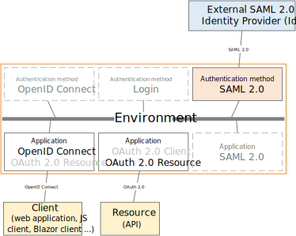
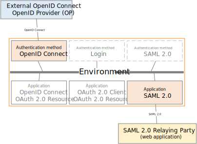

# SAML 2.0 / OpenID Connect bridge

By default, FoxIDs is a bridge between [SAML 2.0](saml-2.0.md) and [OpenID Connect](oidc.md) / [OAuth 2.0](oauth-2.0.md) without any additional configuration. 

If you configure a [SAML 2.0 authentication method](auth-method-saml-2.0.md) to an external Identity Provider (IdP) and connect your app as a [OpenID Connect application registration](app-reg-oidc.md) where you select the SAML 2.0 authentication method. 
A log in request from your app is routed as an external SAML 2.0 log in requests. The SAML 2.0 log in response is subsequently mapped to an OpenID Connect response for your app.

The opposite is likewise possible starting the log in request from a [SAML 2.0 application registration](app-reg-saml-2.0.md) app and routing to an external OpenID Provider (OP) configured as a [OpenID Connect authentication method](auth-method-oidc.md).
Subsequently, the response is converted to a SAML 2.0 response.

FoxIDs support to bridge both log in, logout and single logout between SMAL 2.0 and OpenID Connect.

## One environment - one Identity Provider
All bridge functionality can be combined in the same environment. Enables an OpenID Connect app to support log in via both a SAML 2.0 or OpenID Connect authentication method at the same time. 
The OpenID Connect app can either select the authentication method grammatically or let the user select on a [home realm discovery (HRD)](login.md#home-realm-discovery-hrd) page.

It is recommended to have an application infrastructure with [OpenID Connect](app-reg-oidc.md) enabled clients and [OAuth 2.0](app-reg-oauth-2.0.md) enable APIs. Where all applications (clients and APIs) trust the same Identity Provider (IdP) - one IdP is equal to one environment FoxIDs.
By utilized the bridge functionality in FoxIDs SAML 2.0 tokens is mapped to ID tokens and access tokens which can be used to authenticate OpenID Connect apps and to call existing APIs.

## Token exchange
If a user is granted access to a SAML 2.0 app after successful log in with an external SAML 2.0 Identity Provider (IdP). The user is granted access to the SAML 2.0 app in the context of the user it self. 
With zero trust (never trust, always verify) you would require to call your APIs in the context of the user. This is possible using [token exchange](token-exchange.md#saml-20-to-access-token-by-trust) where the SAML 2.0 token can be exchanged to an access token with the end users identity. 
Subsequently, your OAuth 2.0 enable API can be called in the context of the user.

## Claim mappings
FoxIDs use JWT claims inside and [maps SAML 2.0 claims](saml-2.0.md#claim-mappings) to JWT claims. Default, a set of standard JWT to SAML 2.0 claims is mapped like; `sub` to `http://schemas.xmlsoap.org/ws/2005/05/identity/claims/nameidentifier`, `email` to `http://schemas.xmlsoap.org/ws/2005/05/identity/claims/emailaddress` etc.
You can possible add additional JWT to SAML 2.0 claim mappings.  
If no claim mapping exists for a particular claim. The long SAML 2.0 claim name is kept from claims revived in a SAML 2.0 token instead of a shorter equivalent JWT claim name. The same goes in the opposite direction.
