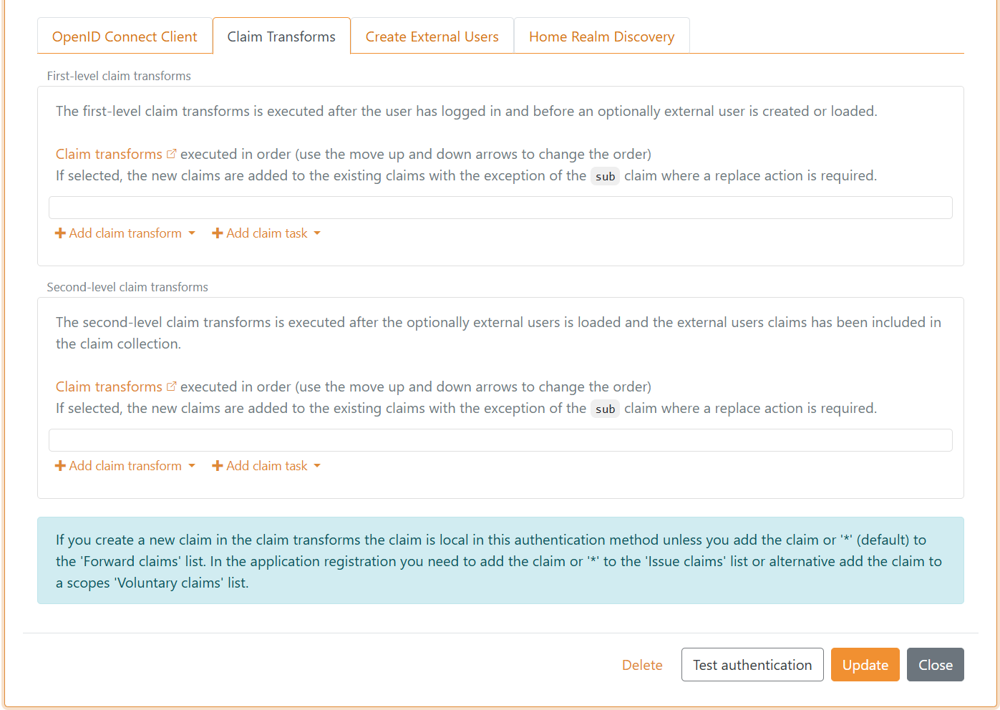

# Claim transforms and claim tasks

Each FoxIDs authentication method and application registration handle [claims](claim.md) and they support claim transformations and claim tasks. 
This means that multiple sets of claim transforms and claim tasks can be executed on each user authentication. 
First executing claim transforms and claim tasks on the authentication method and then claim transforms and claim tasks on the application registration. 

Additional subsets of claim transforms and claim tasks can be performed if a user or an external user is created.


> If you create a new claim with a claim transform or claim tasks, the claim is local in the authentication method or application registration.  
> In an authentication method the claim is forwarded by adding the claim or `*` (default) is in the `Forward claims` list.  
> In a application registration you need to add the claim or `*`to the `Issue claims` list or alternative for OpenID Connect add the claim to a scopes `Voluntary claims` list and request the scope from your application.

Please see the [claim transform examples](#claim-transform-examples)

> Enable `Log claim trace` in the [log settings](logging.md#log-settings) to see the claims before and after transformation in the [logs](logging.md). 

Claim transforms can be configured in a login authentication method.


And claim tasks.


Similarly, claim transforms and claim tasks can be configured as first and second level in a OpenID Connect application registration.



> Claims are by default represented as JWT claims. If the authentication method is SAML 2.0 the claims in the first-level is represented as SAML 2.0 claims.
If the application registration is SAML 2.0 the claims is represented as SAML 2.0 claims.

A claim transform and claim task will do one of op to seven different actions depending on the particular claim transform or claim task type.

Claim transform and claim task actions:

- `Add claim` - add a new claim
- `Add claim, if not match` - do the add action if the condition does not match
- `Replace claim` - add a new claim and remove existing claims if one or mere exist
- `Replace claim, if not match` - do the replace action if the condition does not match
- `Remove claim` - remove the claims if one or mere exist
- `If match` - do the action if the condition match
- `If not match` - do the action if the condition does not match

The claim transforms and claim tasks is executed in order and the actions is therefore executed in order. This means that it is possible to create a local variable by adding a claim and later in the sequence take decisions based on the claim. 
A claim is local in the claim transforms and claim tasks set if it start with `_local:`

With the `Add claim, if not match` actions it is possible to add a claim (local variable) if another claim or a claim with a value do not exist.

Claim transform types that support all actions:

- `Match claim` - do the action if the claim type match
- `Match claim and value` - do the action if the claim type and claim value match
- `Regex match` - do the action if the claim type match and claim value match the regular expression

Claim transform types that support `Add claim` and `Replace claim` and `Add claim, if new claim do not exist` actions:

- `Map` - do the action if the claim type match, then map the claim value to a new claim
- `Regex map` - do the action if the claim type match and claim value match the regular expression group, then map the group value to a new claim

Claim transform types that support `Add claim` and `Replace claim` actions:

- `Constant` - always do the action (add/replace a claim with a constant value)
- `Concatenate` - do the action if one or more of the claim types match, then concatenate the claim values to a new claim
- `External claims API` - Call an [external API](#external-claims---api) with the selected claims to add/replace claims with external claims
- `DK XML privilege to JSON` - Converting the [DK privilege to JSON](claim-transform-dk-privilege). 

Claim task types that support `Add claim` and `Replace claim` actions:

- `Query internal user` - Match the claim and find exactly one internal user based on the value of the claim. The request will fail if more than one user is found. Then add/replace the users' claims.
- `Query external user` - Match the claim and find exactly one external user based on the value of the claim. The request will fail if more than one user is found. Then add/replace the users' claims.

Claim task types that support `If match` and `If not match` actions:

- `Match claim and return error` - Return an error if the claim type match/not match.
- `Match claim and value and return error` - Return an error if the claim type and value match/not match.
- `Regex match and return error` - Return an error if the claim type and claim value match/not match the regular expression.
- `Match claim and start authentication` - Start a new login flow by initiating a authentication method if the claim type match/not match.
- `Match claim and value and start authentication` - Start a new login flow by initiating a authentication method if the claim type and value match/not match.
- `Regex match and start authentication` - Start a new login flow by initiating a authentication method if the claim type and claim value match/not match the regular expression.

> The start authentication claim tasks can be used to do step-up if the user is logged in with one-factor and another factor is required. Or if additional information (claims) is required.

## External claims - API
You can [call your own API](#implement-api) from FoxIDs with a claim transformation. The API is called with claims and the claims returned form the API can be added with a add or replace action. 
The API is only called if at least one selected claim exists. You can use `*` to select and send all claims to your API.

Use case sceneries
- Call your API from an authentication method each time a user is authenticated either in FoxIDs or with an external identity provider. 
  You can then find the user in your database and return a user ID and maybe a customer ID or basically anything of relevance. For example, you can also create the user in your database.
- Call your API from an application registration with the user ID (`sub`) and query the users' roles in your database. You API would then either return an empty list or a list of role claims or maybe a more complex rights structurer. 

### Implement API

You need to implement a simple API that FoxIDs calls when the claim transformation is executed.  
Please have a look at the [sample code](#api-sample).

The API has a base URL and the functionality is divided into folders. Currently, only the `claims` folder (functionality) for requesting a list of claims is support.  

If the base URL for the API is `https://somewhere.org/myclaimsstore` the URL for the `claims` folder will be `https://somewhere.org/myclaimsstore/claims`.

> FoxIDs Cloud calls your API from the IP address `57.128.60.142`.  
  *The outgoing IP address can be changed and more can be added over time.*

#### Request
The API call is secured with [HTTP Basic authentication scheme](https://datatracker.ietf.org/doc/html/rfc6749#section-2.3.1) where FoxIDs sends the ID `external_claims` as the username and the configured secret as the password.

The API is called with HTTP POST and a JSON body.

This is a request JSON body with two input claims:
```JSON
{
 "claims": [
        {
            "type": "sub",
            "value": "1b1ac05e-5937-4939-a49c-0e84a89662df"
        },
        {
            "type": "email",
            "value": "some@test.org"
        }
    ]
}
```

#### Response - Success
On success the API should return HTTP code 200 and a list of `claims` (the list can be empty).

For example, the user's sub (user ID / username), customer ID and roles:
```JSON
{
    "claims": [
        {
            "type": "sub",
            "value": "somewhere/external-some@test.org"
        },
        {
            "type": "customer_id",
            "value": "1234abcd"
        },
        {
            "type": "role",
            "value": "admin_access"
        },
        {
            "type": "role",
            "value": "read_access"
        },
        {
            "type": "role",
            "value": "write_access"
        }
    ]
}
```

#### Response - Error 
The API must return HTTP code 401 (Unauthorized) and an `error` (required) if the Basic authentication is rejected. Optionally add an error description in `ErrorMessage`.
```JSON
{
    "error": "invalid_api_id_secret",
    "ErrorMessage": "Invalid API ID or secret"
}
```

If other errors occur, the API should return HTTP code 500 or another appropriate error code. 
It is recommended to add a technical error message in to the return body. The error message can then later be found in the FoxIDs logs.  

> Error messages returned from the API is NOT displayed for the user only logged.

### API Sample
The sample [ExternalClaimsApiSample](https://github.com/ITfoxtec/FoxIDs.Samples/tree/main/src/ExternalClaimsApiSample) show how to implement the API in ASP.NET Core 8.

You can user this [Postman collection](https://github.com/ITfoxtec/FoxIDs.Samples/tree/main/src/ExternalClaimsApiSample/external-claims-api.postman_collection.json) to call and test the sample with [Postman](https://www.postman.com/downloads/).

### Configure 
Configure to call your API in a claims transformation in [FoxIDs Control Client](control.md#foxids-control-client).

 1. Navigate to the **Claim Transform** section
 2. Click **Add claim transform**
 3. Click **External claims API**
 4. Select **Add claim** or **Replace claim**
 5. Add the selected claims e.g. `sub` in **Select claims**
 6. Add the base API URL without the `claims` folder in **API URL**
 7. Add the **API secret**
    
 8. Click **Update**

## Claim transform examples

### Split the `name` claim into the two claims `given_name` and `family_name`

The transformation will split the value in the `name` claim at the first occurring space and respectively add the `given_name` and `family_name` claims, if they do not already exist.  
If there are more than one space in the `name` claim value. New `given_name` and `family_name` claims will not be added because they already exist.

Use two `Regex map` claim transformations.


- Find the `family_name` claim value with regex `^\S+\s(?<map>\S+)$`
- Find the `given_name` claim value with regex `^(?<map>\S+)\s\S+$`


### Remove the default added authentication method name from `sub`

The authentication method name is default added to the `sub` claim value as a post name divided by a pipe e.g., `some-auth-method|my-external-user-id`.

You can do a replace claim on the `sub` claim to remove the default added post value.

The transformation will split the value in the `sub` claim and replace the claim with a new `sub` only containing the original ID.

Use a `Regex map` claim transformation and select the `Replace claim` action.


Find the ID without the default added post authentication method name with regex `^(nemlogin\|)(?<map>.+)$`

> You can do the same in a SAML 2.0 authentication method using the `http://schemas.xmlsoap.org/ws/2005/05/identity/claims/nameidentifier` claim instead of the `sub` claim.