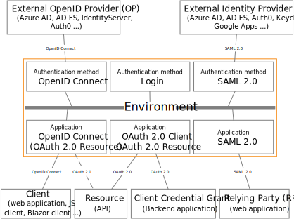

<!--
{
    "title":  "Connections",
    "description":  "Learn how authentication methods and application registrations connect users, apps, and APIs to FoxIDs across login, OpenID Connect, OAuth 2.0, and SAML 2.0.",
    "ogTitle":  "Connections",
    "ogDescription":  "Learn how authentication methods and application registrations connect users, apps, and APIs to FoxIDs across login, OpenID Connect, OAuth 2.0, and SAML 2.0.",
    "ogType":  "article",
    "ogImage":  "/images/foxids_logo.png",
    "twitterCard":  "summary_large_image",
    "additionalMeta":  {
                           "keywords":  "connections, FoxIDs docs"
                       }
}
-->

# Connections

FoxIDs is configured with authentication methods and application registrations. Authentication methods sign in users directly or by trusting an external Identity Provider (IdP). Applications and APIs connect to FoxIDs through application registrations.

There are four different connection types:

- [Login](login.md)
- [OpenID Connect](oidc.md)
- [OAuth 2.0](oauth-2.0.md)
- [SAML 2.0](saml-2.0.md)

## Authentication method

FoxIDs supports three authentication method types:

- [Login authentication method](login.md)
- [OpenID Connect authentication method](auth-method-oidc.md)
- [SAML 2.0 authentication method](auth-method-saml-2.0.md)

### Authentication method session
Each authentication method creates its own session when a user is authenticated. There are two session types:

- Login authentication methods create a [user session](login.md#configure-user-session).
- OpenID Connect and SAML 2.0 authentication methods create an authentication method session that only stores limited the details and what is required to perform logout.

Both session types support configuring lifetime, absolute lifetime, and persistence (whether the session survives the browser closing).

## Application registration

FoxIDs supports three application registration types:

- [OpenID Connect application registration](app-reg-oidc.md)
- [OAuth 2.0 application registration](app-reg-oauth-2.0.md)
- [SAML 2.0 application registration](app-reg-saml-2.0.md)

## JWT and SAML
OpenID Connect, OAuth 2.0, JWT, and JWT claims are first-class citizens in FoxIDs. Internally, claims are always represented as JWT claims, and request/response properties use OAuth 2.0 and OpenID Connect attributes.

FoxIDs converts between standards by normalizing attributes into that internal representation. Therefore, SAML 2.0 claims are converted to JWT claims between the authentication method and the application registration.

