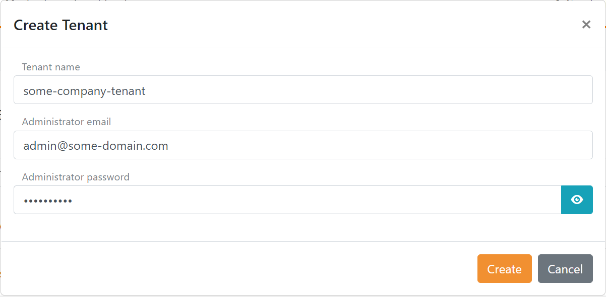
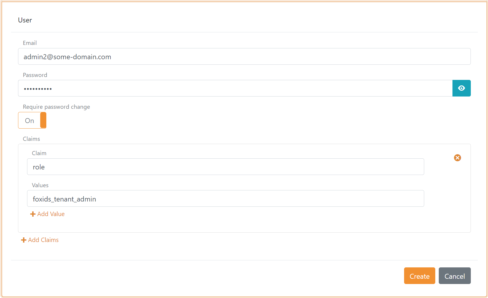
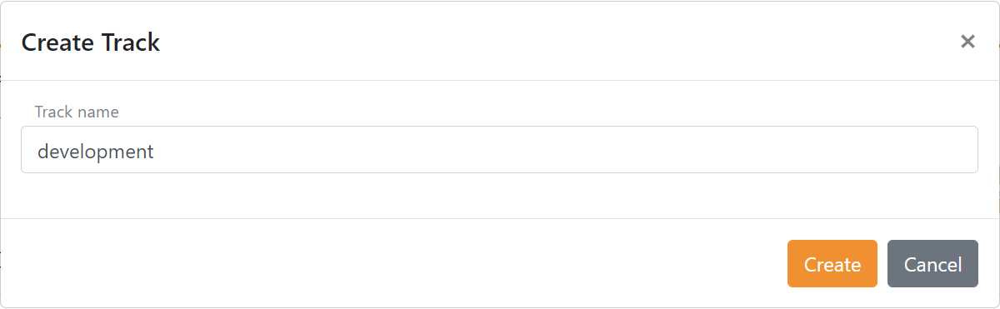
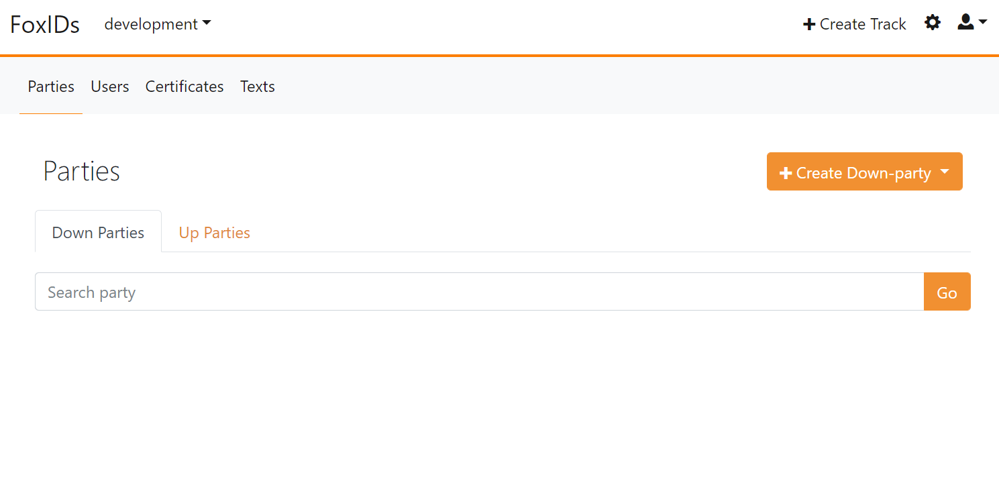
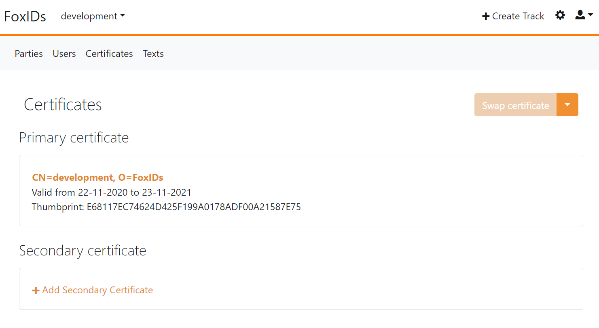
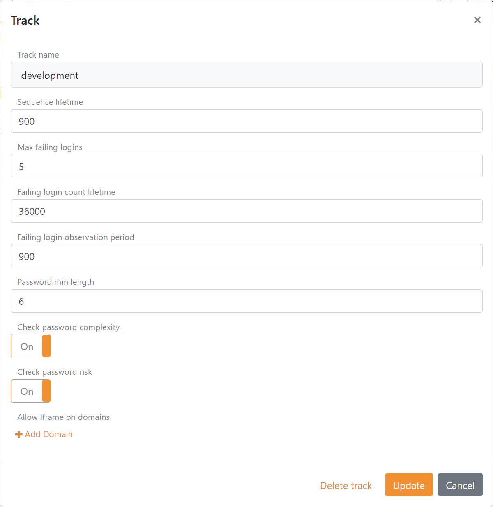
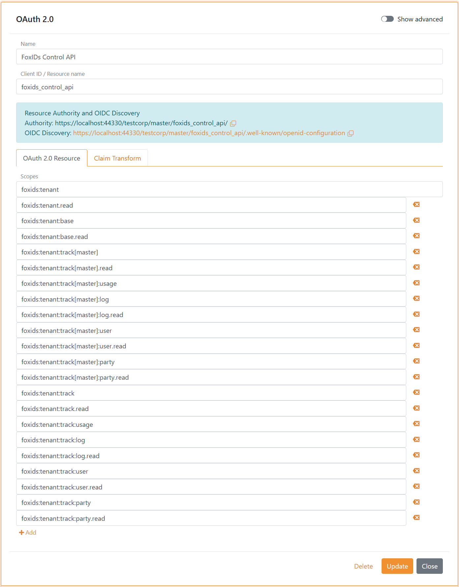

# FoxIDs Control
FoxIDs is configured with FoxIDs Control which consists of [FoxIDs Control Client](#foxids-control-client) and [FoxIDs Control API](#foxids-control-api). FoxIDs Control Client and API is secured by FoxIDs and FoxIDs Control Client relay on FoxIDs Control API. 

FoxIDs Control API contain all the configuration functionality. Therefore, it is possible to automate the configuration by integrating with FoxIDs Control API.

## FoxIDs Control Client
FoxIDs Control Client is a Blazor WebAssembly (WASM) app.

> Open your [FoxIDs Control Client on FoxIDs.com](https://www.foxids.com/action/login). 

### Tenant and master track
If you use FoxIDs at [FoxIDs.com](https://foxids.com). Your one tenant will be pre created on registration.

Otherwise if FoxIDs is [deployed](development.md) in your one Azure tenant you get access to the master tenant. In this case you firstly need to create a tenant which will contain your entire security configuration. You probably only need one, but it is possible to configure an unlimited number of tenants.  

A tenant contains a master track, from where the entire tenant is configured. The master track contains a user repository and on creation only one administrator user.

Normally you should not change the master track configuration or add new up-parties or down-parties, but it is possible. You can e.g., by adding an up-party gain single sign-on (SSO) to the master track. 

### Create administrator user(s)

It is possible to create more administrator users in the `master` track. A user become an administrator by adding the administrator role `foxids:tenant.admin` like shown below.

Create a user:

1. Open the master track
2. Select the Users tab
3. Click Create User
4. Add the user information and click Create.

### Tracks
Configure a number of tracks, one for each of your environments e.g. dev, qa and prod.

> Create one or more tracks, do not place configuration in the master track.

Each track contains a user repository and a default created [login](login.md) up-party.

You can add [OpenID Connect](oidc.md), [OAuth 2.0](oauth-2.0.md) and [SAML 2.0](saml-2.0.md) down-parties and up-parties in the Parties tab. 

A track contains a primary certificate and possible a secondary certificate in the Certificates tab. It is possible to swap between the primary and secondary certificate if both is configured, depending on the [certificate](certificates.md) container type.

The track properties can be configured by clicking the top right setting icon. 

- Sequence lifetime is the max lifetime of a user's login flow from start to end.
- FoxIDs protect against password guess. Configured in max failing logins, failing login count lifetime and observation period.
- Password requirements are configured regarding length, complexity and [password risk](https://haveibeenpwned.com/Passwords).
- It is possible to host FoxIDs in an iframe from allowed domains.
- You can sent emails with you one SendGrid tenant by adding a custom email address and SendGrid key.

## FoxIDs Control API
FoxIDs Control API is a REST API and has a Swagger (OpenApi) interface description.

FoxIDs Control API require that the client calling the API is granted the `foxids:master` scope to access master tenant data or the `foxids:tenant` scope to access tenant data in a particular tenant. Normally only tenant data is accessed.

 - The API can be accessed with a OAuth 2.0 client. Where the client is granted the administrator role `foxids:tenant.admin` acting as the client itself using client credentials grant.  
 It is probably helpful to take a look at how the [sample seed tool](samples.md#configure-the-sample-seed-tool) client is granted access.
 - Or the API can be accessed with a OpenID Connect client with an authenticated master track user. Where the user is granted the administrator role `foxids:tenant.admin`.  
 *As an advanced option the mater user can also be granted access via a trust.*

This shows the FoxIDs Control API configuration in a tenants master track with a scope that grants access to tenant data.

FoxIDs Control API is called with an access token as described in the [OAuth 2.0 Bearer Token (RFC 6750)](https://datatracker.ietf.org/doc/html/rfc6750) standard.

The Swagger (OpenApi) interface document is exposed on `.../api/swagger/v1/swagger.json`.  

> FoxIDs.com Swagger (OpenApi) [https://control.foxids.com/api/swagger/v1/swagger.json](https://control.foxids.com/api/swagger/v1/swagger.json)

The FoxIDs Control API URL contains the tenant name and track name on winch you want to operate `.../[tenant_name]/[track_name]/...`. 
To call the API you replace the `[tenant_name]` element with your tenant name and the `[track_name]` element with the track name of the track you want to call.

If you e.g. want read a OpenID Connect down-party on FoxIDs.com with the name `some_oidc_app` you do a HTTP GET call to `https://control.foxids.com/api/[tenant_name]/[track_name]/!oidcdownparty?name=some_oidc_app` - replaced with your tenant and track names.

### API access rights
Access to FoxIDs Control API is limited by scopes and roles. There are two sets of scopes based on `foxids:master` which grant access to the master tenant data and `foxids:tenant` which grant access to tenant data.  
The Control API resource `foxids_control_api` is defined in each tenant's master track and the configured set of scopes grant access the tenants data in the Control API.

A scopes access is limited by adding more elements separated with semicolon and dot. The dot notation limits or grant a sub role, the notation is both used in scopes and roles. 
To be granted access the caller is required to possess one or more matching scope(s) and role(s).

Each access right is both defined as a scope and a role. This makes it possible to limit or grant access on both client and user level. The access rights are a hierarchy and the client and user do not need to be granted matching scopes and roles. 

The administrator role `foxids:tenant.admin` grants access to all data in a tenant and the master tenant data, it is the same as having the role `foxids:tenant` and `foxids:master`.

#### Tenant access rights
The tenant access rights is at the same time both scopes and roles.

The `:track[xxxx]` specifies a tenant e.g., the `dev` tenant is `:track[dev]`.

<table>
    <tr>
        <th>Scope / role</th>
        <th>Access</th>
    </tr>
    <tr>
        <td colspan=2><i>Access to everything in the tenant, not master tenant data.</i></td>
    </tr>
    <tr>
        <td><code>foxids:tenant</code></td>
        <td>read, create, update, delete</td>
    </tr>
    <tr>
        <td><code>foxids:tenant.read</code></td>
        <td>read</td>
    </tr>
    <tr>
        <td><code>foxids:tenant.create</code></td>
        <td>create</td>
    </tr>
    <tr>
        <td><code>foxids:tenant.update</code></td>
        <td>update</td>
    </tr>
    <tr>
        <td><code>foxids:tenant.delete</code></td>
        <td>delete</td>
    </tr>
    <tr>
        <td colspan=2><i>Access to basic tenant elements: 
        <lu>
            <li>My profile used in the Control Client.</li>
            <li>Call the ReadCertificate API to get a JWT with certificate information from a X509 Certificate.</li>
        </lu>
        </i></td>
    </tr>
    <tr>
        <td><code>foxids:tenant:basic</code></td>
        <td>read, create, update, delete</td>
    </tr>
    <tr>
        <td><code>foxids:tenant:basic.read</code></td>
        <td>read</td>
    </tr>
    <tr>
        <td><code>foxids:tenant:basic.create</code></td>
        <td>create</td>
    </tr>
    <tr>
        <td><code>foxids:tenant:basic.update</code></td>
        <td>update</td>
    </tr>
    <tr>
        <td><code>foxids:tenant:basic.delete</code></td>
        <td>delete</td>
    </tr>
    <tr>
        <td colspan=2><i>Access to everything in all tracks in a tenant, not including the master track.</i></td>
    </tr>
    <tr>
        <td><code>foxids:tenant:track</code></td>
        <td>read, create, update, delete</td>
    </tr>
    <tr>
        <td><code>foxids:tenant:track.read</code></td>
        <td>read</td>
    </tr>
    <tr>
        <td><code>foxids:tenant:track.create</code></td>
        <td>create</td>
    </tr>
    <tr>
        <td><code>foxids:tenant:track.update</code></td>
        <td>update</td>
    </tr>
    <tr>
        <td><code>foxids:tenant:track.delete</code></td>
        <td>delete</td>
    </tr>
    <tr>
        <td colspan=2><i>Access to everything in a specific track in a tenant.</i></td>
    </tr>
    <tr>
        <td><code>foxids:tenant:track[xxxx]</code></td>
        <td>read, create, update, delete</td>
    </tr>
    <tr>
        <td><code>foxids:tenant:track[xxxx].read</code></td>
        <td>read</td>
    </tr>
    <tr>
        <td><code>foxids:tenant:track[xxxx].create</code></td>
        <td>create</td>
    </tr>
    <tr>
        <td><code>foxids:tenant:track[xxxx].update</code></td>
        <td>update</td>
    </tr>
    <tr>
        <td><code>foxids:tenant:track[xxxx].delete</code></td>
        <td>delete</td>
    </tr>
    <tr>
        <td colspan=2><i>All usage logs in all tracks in a tenant, not including the master track. Not applicable in the master tenant.</i></td>
    </tr>
    <tr>
        <td><code>foxids:tenant:track:usage</code></td>
        <td>read</td>
    </tr>
    <tr>
        <td colspan=2><i>Usage logs in a specific track in a tenant. Not applicable in the master tenant.</i></td>
    </tr>
    <tr>
        <td><code>foxids:tenant:track[xxxx]:usage</code></td>
        <td>read</td>
    </tr>
    <tr>
        <td colspan=2><i>All logs in all tracks in a tenant, not including the master track. </i></td>
    </tr>
    <tr>
        <td><code>foxids:tenant:track:log</code></td>
        <td>read, create, update, delete</td>
    </tr>
    <tr>
        <td><code>foxids:tenant:track:log.read</code></td>
        <td>read</td>
    </tr>
    <tr>
        <td><code>foxids:tenant:track:log.create</code></td>
        <td>create</td>
    </tr>
    <tr>
        <td><code>foxids:tenant:track:log.update</code></td>
        <td>update</td>
    </tr>
    <tr>
        <td><code>foxids:tenant:track:log.delete</code></td>
        <td>delete</td>
    </tr>
    <tr>
        <td colspan=2><i>Logs in a specific tenant.</i></td>
    </tr>
    <tr>
        <td><code>foxids:tenant:track[xxxx]:log</code></td>
        <td>read, create, update, delete</td>
    </tr>
    <tr>
        <td><code>foxids:tenant:track[xxxx]:log.read</code></td>
        <td>read</td>
    </tr>
    <tr>
        <td><code>foxids:tenant:track[xxxx]:log.create</code></td>
        <td>create</td>
    </tr>
    <tr>
        <td><code>foxids:tenant:track[xxxx]:log.update</code></td>
        <td>update</td>
    </tr>
    <tr>
        <td><code>foxids:tenant:track[xxxx]:log.delete</code></td>
        <td>delete</td>
    </tr>
    <tr>
        <td colspan=2><i>All users in all tracks in a tenant, not including the master track.</i></td>
    </tr>
    <tr>
        <td><code>foxids:tenant:track:user</code></td>
        <td>read, create, update, delete</td>
    </tr>
    <tr>
        <td><code>foxids:tenant:track:user.read</code></td>
        <td>read</td>
    </tr>
    <tr>
        <td><code>foxids:tenant:track:user.create</code></td>
        <td>create</td>
    </tr>
    <tr>
        <td><code>foxids:tenant:track:user.update</code></td>
        <td>update</td>
    </tr>
    <tr>
        <td><code>foxids:tenant:track:user.delete</code></td>
        <td>delete</td>
    </tr>
    <tr>
        <td colspan=2><i>All users in a specific track in a tenant. </i></td>
    </tr>
    <tr>
        <td><code>foxids:tenant:track[xxxx]:user</code></td>
        <td>read, create, update, delete</td>
    </tr>
    <tr>
        <td><code>foxids:tenant:track[xxxx]:user.read</code></td>
        <td>read</td>
    </tr>
    <tr>
        <td><code>foxids:tenant:track[xxxx]:user.create</code></td>
        <td>create</td>
    </tr>
    <tr>
        <td><code>foxids:tenant:track[xxxx]:user.update</code></td>
        <td>update</td>
    </tr>
    <tr>
        <td><code>foxids:tenant:track[xxxx]:user.delete</code></td>
        <td>delete</td>
    </tr>
    <tr>
        <td colspan=2><i>All down-parties and up-parties in all tracks in a tenant, not including the master track.</i></td>
    </tr>
    <tr>
        <td><code>foxids:tenant:track:party</code></td>
        <td>read, create, update, delete</td>
    </tr>
    <tr>
        <td><code>foxids:tenant:track:party.read</code></td>
        <td>read</td>
    </tr>
    <tr>
        <td><code>foxids:tenant:track:party.create</code></td>
        <td>create</td>
    </tr>
    <tr>
        <td><code>foxids:tenant:track:party.update</code></td>
        <td>update</td>
    </tr>
    <tr>
        <td><code>foxids:tenant:track:party.delete</code></td>
        <td>delete</td>
    </tr>
    <tr>
        <td colspan=2><i>All down-parties and up-parties in a specific track in a tenant.</i></td>
    </tr>
    <tr>
        <td><code>foxids:tenant:track[xxxx]:party</code></td>
        <td>read, create, update, delete</td>
    </tr>
    <tr>
        <td><code>foxids:tenant:track[xxxx]:party.read</code></td>
        <td>read</td>
    </tr>
    <tr>
        <td><code>foxids:tenant:track[xxxx]:party.create</code></td>
        <td>create</td>
    </tr>
    <tr>
        <td><code>foxids:tenant:track[xxxx]:party.update</code></td>
        <td>update</td>
    </tr>
    <tr>
        <td><code>foxids:tenant:track[xxxx]:party.delete</code></td>
        <td>delete</td>
    </tr>
</table>

#### Master tenant access rights
The master tenant access rights is at the same time both scopes and roles.

<table>
    <tr>
        <td colspan=2><i>Access to the master tenant data 
            Can list, create and delete tenants but not look into other tenants.
        </i></td>
    </tr>
    <tr>
        <td><code>foxids:master</code></td>
        <td>read, create, update, delete</td>
    </tr>
    <tr>
        <td><code>foxids:master.read</code></td>
        <td>read</td>
    </tr>
    <tr>
        <td><code>foxids:master.create</code></td>
        <td>create</td>
    </tr>
    <tr>
        <td><code>foxids:master.update</code></td>
        <td>update</td>
    </tr>
    <tr>
        <td><code>foxids:master.delete</code></td>
        <td>delete</td>
    </tr>
    <tr>
        <td colspan=2><i>Usage log in the master tenant.</i></td>
    </tr>
    <tr>
        <td><code>foxids:master:usage</code></td>
        <td>read</td>
    </tr>
</table>

If the scope you need is not defined on the Control API `foxids_control_api` you can add the scope. The same goes for roles which has to be defined on the user or the calling client.