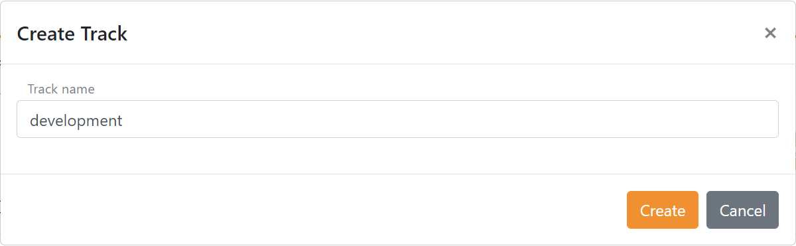
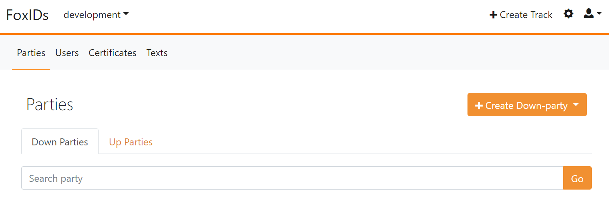
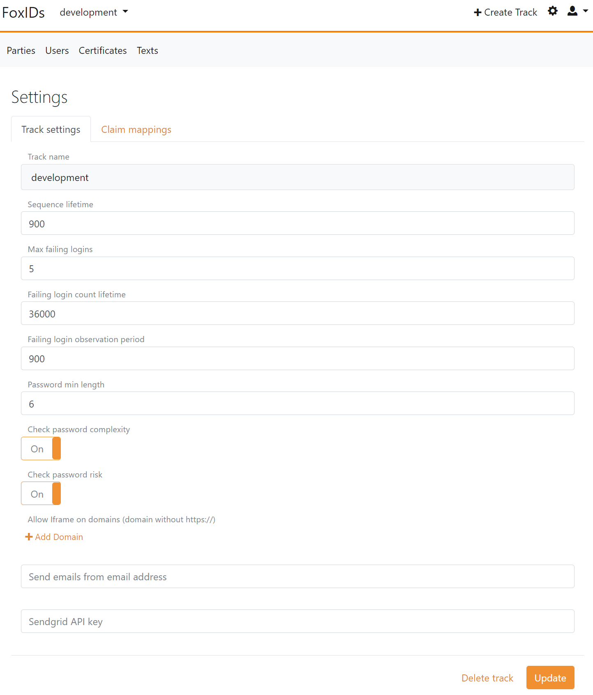

<!--
{
    "title":  "FoxIDs Control",
    "description":  "FoxIDs is configured through FoxIDs Control which consists of Control Client and Control API. Control Client and API is secured by FoxIDs and Control Client use Control API.",
    "ogTitle":  "FoxIDs Control",
    "ogDescription":  "FoxIDs is configured through FoxIDs Control which consists of Control Client and Control API. Control Client and API is secured by FoxIDs and Control Client use Control API.",
    "ogType":  "article",
    "ogImage":  "/images/foxids_logo.png",
    "twitterCard":  "summary_large_image",
    "additionalMeta":  {
                           "keywords":  "control, FoxIDs docs"
                       }
}
-->

# FoxIDs Control
FoxIDs is configured through FoxIDs Control which consists of [Control Client](#foxids-control-client) and [Control API](#foxids-control-api). Control Client and API are secured by FoxIDs, and Control Client uses Control API. 

Control API contains all the configuration functionality. Therefore, it is possible to automate the configuration by integrating with Control API.

## FoxIDs Control Client
Control Client is a Blazor WebAssembly (WASM) app.

> Open your [Control Client on FoxIDs.com](https://www.foxids.com/action/login). 

### Tenant and master environment
If you use [FoxIDs.com](https://foxids.com), your tenant is created during registration.

If you [deploy](development.md) FoxIDs (self-hosted) you get access to the master tenant. First create a tenant to contain your security configuration. Most installations only need one, but you can configure an unlimited number of tenants.  


A tenant contains a master environment, from where the entire tenant is configured. The master environment contains a user repository and on creation only one administrator user.

Normally you should not change the master environment configuration or add new authentication methods or application registrations, but it is possible. You can e.g., by adding an authentication method gain single sign-on (SSO) to the master environment. 

### Create administrator user(s)

It is possible to create more administrator users in the `master` environment. A user becomes an administrator by adding the administrator role `foxids:tenant.admin` like shown below.

Create a user:

1. Open the master environment
2. Select the Users tab
3. Click Create User
4. Add the user information and click Create.


### Grant access to user
Access is granted with roles. Scopes are only needed when a client requests a token for Control API; Control Client already requests the required scope on `foxids_control_api`, so you typically only assign roles to the user in the master environment.

To let a person sign in to Control Client and see configuration data:

1. Create or open the user in the `master` environment (Users tab).
2. Add the baseline role `foxids:tenant:basic.read` (required for Control Client to load profile and helper tools).
3. Decide what the user is allowed to see:
   - To limit visibility to one environment, add `foxids:tenant:track[vh2csjt4].read` (replace `vh2csjt4` with the technical environment name).
   - To allow all environments, add `foxids:tenant.read`.
4. Add the operation roles the user needs in each environment. Examples: `foxids:tenant:track[vh2csjt4]:user` to manage users, `foxids:tenant:track[vh2csjt4]:party` to manage applications and authentication methods.

Control Client vs API-only:
- Control Client (interactive UI) reads profile data and environment lists in addition to the specific API you want to manage. It therefore needs `foxids:tenant:basic.read` plus an environment read role (`foxids:tenant:track[main].read` or `foxids:tenant.read`) alongside your action roles.
- API-only callers can be narrower. If a backend service only calls the user API for the `vh2csjt4` environment, role `foxids:tenant:track[vh2csjt4]:user` (and requesting the matching scope when using client credentials) is sufficient; the extra read roles are not required because no UI data needs to be loaded.

### Environments
Configure a number of environments, one for each of your environments e.g. dev, qa and prod.

> Create one or more environments, do not place configuration in the master environment.



Each environment contains a user repository and a default [login](login.md) authentication method.

You can add [OpenID Connect](oidc.md), [OAuth 2.0](oauth-2.0.md) and [SAML 2.0](saml-2.0.md) application registrations and authentication methods. 



An environment contains a primary certificate and possibly a secondary certificate in the Certificates tab. It is possible to swap between the primary and secondary certificate if both are configured, depending on the [certificate](certificates.md) container type.


The environment properties can be configured by clicking the top right settings icon. 

- Sequence lifetime is the max lifetime of a user's login flow from start to end.
- FoxIDs protects against password guessing via max failing logins, failing login count lifetime and observation period.
- Password requirements are configured regarding length, complexity and [password risk](https://haveibeenpwned.com/Passwords).
- It is possible to host FoxIDs in an iframe from allowed domains.
- You can send emails with your own SendGrid tenant by adding a custom email address and SendGrid key.



## FoxIDs Control API
Control API is a REST API with an online [Swagger (OpenAPI)](https://control.foxids.com/api/swagger/v2/swagger.json) interface description and [Swagger UI](https://control.foxids.com/api/swagger).

If you self-host FoxIDs, the Swagger (OpenAPI) document is exposed in FoxIDs Control on `.../api/swagger/v2/swagger.json` and the Swagger UI on `.../api/swagger`.  

> Control API naming:
> - An environment is called a `track`
> - An application registration is called `downparty`
> - An authentication method is called `upparty`

The Control API URL contains variables for the tenant name and track name (environment name) you want to operate on: `.../{tenant_name}/{track_name}/...`. 
Replace `{tenant_name}` with your tenant name and `{track_name}` with the environments technical name. If you generate a proxy from the [Swagger (OpenAPI)](https://control.foxids.com/api/swagger/v2/swagger.json) document, those variables are supplied as input parameters.

For example, to read an OpenID Connect application registration on FoxIDs Cloud with the technical name `some_oidc_app`, call (HTTP GET) `https://control.foxids.com/api/{tenant_name}/{track_name}/!oidcdownparty?name=some_oidc_app` (replace the variables with your tenant name and environment technical name).

You can call Control API either as a service/daemon using an OAuth 2.0 client (client credentials) or in the context of a user via an OpenID Connect client. 

The steps below create an OAuth 2.0 client and grant it admin-level [access rights](#api-access-rights) via scopes and roles.

Create an OAuth 2.0 client in the [FoxIDs Control Client](control.md#foxids-control-client):

1. Select the **master** environment (in the header).
2. Select the **Applications** tab.
3. Click **New Application**.
4. Click **Backend Application**.
    a. Add a **Name** e.g., `My API Client`.
    b. Click **Register**.
    c. Copy the **Client ID** and **Client secret**.
    d. Click **Close**.
5. Click your client registration in the list to open it.
6. In the **Resource and scopes** section - *grants the client access to your tenant*:
    a. Click **Add Resource and scope** and add the resource `foxids_control_api`.
    b. Click **Add Scope** and add the scope `foxids:tenant`. 
7. Select **Show advanced**.
8. In the **Issue claims** section - *grants the client the tenant administrator role*:
    a. Click **Add Claim** and add the claim `role`.
    b. Click **Add Value** and add the claim value `foxids:tenant.admin`.
9. Click **Update**.

Then perform an OAuth 2.0 Client Credentials Grant request to obtain an access token for Control API.

*Replace `{tenant_name}`, `{track_name}`, `{client_id}` and `{client_secret}`. Change the domain if you are self-hosting.*

**Postman sample**  
This Postman collection authenticates with the OAuth 2.0 client `My API Client` and returns the users for the configured environment (track).

Create a Postman collection JSON file, e.g., `foxids_control_api.postman_collection.json`, with the content below. *Replace `{tenant_name}`, `{track_name}`, `{client_id}` and `{client_secret}`. Change the domains (`foxids.com` and `control.foxids.com`) if you are self-hosting.*
```json
{
  "info": {
    "name": "FoxIDs API",
    "schema": "https://schema.getpostman.com/json/collection/v2.1.0/collection.json",
  },
  "item": [
    {
      "name": "GET users",
      "request": {
        "auth": {
          "type": "oauth2",
          "oauth2": [
            {
              "key": "accessTokenUrl",
              "value": "https://foxids.com/{tenant_name}/master/{client_id}/(*)/oauth/token",
              "type": "string"
            },
            {
              "key": "clientSecret",
              "value": "{client_secret}",
              "type": "string"
            },
            {
              "key": "clientId",
              "value": "{client_id}",
              "type": "string"
            },
            {
              "key": "tokenName",
              "value": "api_access_token",
              "type": "string"
            },
            {
              "key": "client_authentication",
              "value": "body",
              "type": "string"
            },
            {
              "key": "scope",
              "value": "foxids_control_api:foxids:tenant",
              "type": "string"
            },
            {
              "key": "grant_type",
              "value": "client_credentials",
              "type": "string"
            },
            {
              "key": "addTokenTo",
              "value": "header",
              "type": "string"
            }
          ]
        },
        "method": "GET",
        "header": [],
        "url": {
          "protocol": "https",
          "host": [
            "control.foxids.com"
          ],
          "port": "443",
          "path": [
            "api",
            "{tenant_name}",
            "{track_name}",
            "!users"
          ]
        }
      }
    }
  ]
}
```

**HTTP request sample**  
This HTTP sample authenticates as the OAuth 2.0 client `My API Client` with the client credentials grant.

```plaintext 
POST https://foxids.com/{tenant_name}/{track_name}/{client_id}(*)/oauth/token HTTP/1.1
Host: foxids.com
Content-Type: application/x-www-form-urlencoded

client_id={client_id}
&client_secret={client_secret}
&grant_type=client_credentials
&scope=foxids_control_api%3Afoxids%3Atenant
```

Token JSON response:

```plaintext
HTTP/1.1 200 OK
Content-Type: application/json
Cache-Control: no-cache, no-store

{
    "access_token":"eyJhGfjlc...nNjH3iIWvMdCM",
    "token_type":"Bearer",
    "expires_in":3600
}
```

The `access_token` is used to call the Control API.

**C# code sample**  
This C# sample authenticates as the OAuth 2.0 client `My API Client` with the client credentials grant.

```C#
// NuGet package: ITfoxtec.Identity
using ITfoxtec.Identity.Helpers

var oidcDiscoveryUrl = "https://foxids.com/{tenant_name}/{track_name}/{client_id}(*)/.well-known/openid-configuration";
// Inject IHttpClientFactory httpClientFactory
var oidcDiscovery = new OidcDiscoveryHandler(httpClientFactory, oidcDiscoveryUrl);

// Inject IHttpClientFactory httpClientFactory
var tokenHelper = new TokenHelper(httpClientFactory, oidcDiscovery);

var clientId = "{client_id}";
var clientSecret = "{client_secret}";
var scope = "foxids_control_api:foxids:tenant";
(var accessToken, var expiresIn) = await tokenHelper.GetAccessTokenWithClientCredentialGrantAsync(clientId, clientSecret, scope);

```

Then call the Control API with the access token as an Authorization Bearer header, as defined in the [OAuth 2.0 Bearer Token (RFC 6750)](https://datatracker.ietf.org/doc/html/rfc6750) standard.

**C# code sample**  
This C# sample shows how to add the access token to the `HttpClient` and read the OpenID Connect application registration `some_oidc_app` (technical name).

```C#
// NuGet package: ITfoxtec.Identity
using ITfoxtec.Identity

// Inject IHttpClientFactory httpClientFactory
var httpClient = httpClientFactory.CreateClient();
// Add the access token
httpClient.SetAuthorizationHeaderBearer(accessToken);

// Call Control API using the httpClient
// E.g. read a OpenID Connect application registration
using var response = await client.GetAsync("https://control.foxids.com/api/{tenant_name}/{track_name}/!oidcdownparty?name=some_oidc_app");
```

### API access rights
This shows the Control API configuration in a tenant's master environment with the default set of scopes that grant access to tenant data.


You can add more scopes to extend Control API access rights per environment to achieve least-privilege configurations.

Access to Control API is limited by scopes and roles. There are two scope families: `foxids:master` grants access to master-tenant data and `foxids:tenant` grants access to tenant data.  
The Control API resource `foxids_control_api` is defined in each tenant's master environment, and the configured scopes grant access to that tenant's data through Control API.

A scope's access can be narrowed by adding more elements separated with semicolons and dots. Dot notation limits to a specific sub-role and is used in both scopes and roles. Callers must present one or more matching scope(s) and role(s).

Each access right is defined as both a scope and a role. This lets you grant or limit access at both client and user level. Access rights are hierarchical, and the client and user do not need matching scopes and roles. 

The administrator role `foxids:tenant.admin` grants access to all data in a tenant and the master tenant data; it is equivalent to having the roles `foxids:tenant` and `foxids:master`.

A client requests a scope by specifying the resource and scope separated by a semicolon. For example, to request the `foxids:tenant:track:party.create` scope the client requests `foxids_control_api:foxids:tenant:track:party.create`.

> If a request is denied due to insufficient access rights, a trace item is logged with the possible authorising scopes and roles along with the user's actual scopes and roles.

#### Tenant access rights
The tenant access rights are both scopes and roles.

> If the scope you need is not defined on the Control API `foxids_control_api` you can add the scope.

The `:track[xxxx]` specifies an environment by the technical name. e.g., a `Test` environment with the technical name `hsgm7je5` is `:track[hsgm7je5]` 
and a `Production` environment with the technical name `-` is `:track[-]`.

<table>
    <tr>
        <th>Scope / role</th>
        <th>Access</th>
    </tr>
    <tr>
        <td colspan=2><i>Access to everything in the tenant, not master tenant data.</i></td>
    </tr>
    <tr>
        <td><code>foxids:tenant</code></td>
        <td>read, create, update, delete</td>
    </tr>
    <tr>
        <td><code>foxids:tenant.read</code></td>
        <td>read</td>
    </tr>
    <tr>
        <td><code>foxids:tenant.create</code></td>
        <td>create</td>
    </tr>
    <tr>
        <td><code>foxids:tenant.update</code></td>
        <td>update</td>
    </tr>
    <tr>
        <td><code>foxids:tenant.delete</code></td>
        <td>delete</td>
    </tr>
    <tr>
        <td colspan=2><i>Access to basic tenant elements: 
        <lu>
            <li>My profile used in the Control Client.</li>
            <li>Call the ReadCertificate API to get a JWT with certificate information from a X509 Certificate.</li>
        </lu>
        </i></td>
    </tr>
    <tr>
        <td><code>foxids:tenant:basic</code></td>
        <td>read, create, update, delete</td>
    </tr>
    <tr>
        <td><code>foxids:tenant:basic.read</code></td>
        <td>read</td>
    </tr>
    <tr>
        <td><code>foxids:tenant:basic.create</code></td>
        <td>create</td>
    </tr>
    <tr>
        <td><code>foxids:tenant:basic.update</code></td>
        <td>update</td>
    </tr>
    <tr>
        <td><code>foxids:tenant:basic.delete</code></td>
        <td>delete</td>
    </tr>
    <tr>
        <td colspan=2><i>Access to everything in all environments in a tenant, not including the master environment.</i></td>
    </tr>
    <tr>
        <td><code>foxids:tenant:track</code></td>
        <td>read, create, update, delete</td>
    </tr>
    <tr>
        <td><code>foxids:tenant:track.read</code></td>
        <td>read</td>
    </tr>
    <tr>
        <td><code>foxids:tenant:track.create</code></td>
        <td>create</td>
    </tr>
    <tr>
        <td><code>foxids:tenant:track.update</code></td>
        <td>update</td>
    </tr>
    <tr>
        <td><code>foxids:tenant:track.delete</code></td>
        <td>delete</td>
    </tr>
    <tr>
        <td colspan=2><i>Access to everything in a specific environment in a tenant. `xxxx` is the environments technical name.</i></td>
    </tr>
    <tr>
        <td><code>foxids:tenant:track[xxxx]</code></td>
        <td>read, create, update, delete</td>
    </tr>
    <tr>
        <td><code>foxids:tenant:track[xxxx].read</code></td>
        <td>read</td>
    </tr>
    <tr>
        <td><code>foxids:tenant:track[xxxx].create</code></td>
        <td>create</td>
    </tr>
    <tr>
        <td><code>foxids:tenant:track[xxxx].update</code></td>
        <td>update</td>
    </tr>
    <tr>
        <td><code>foxids:tenant:track[xxxx].delete</code></td>
        <td>delete</td>
    </tr>
    <tr>
        <td colspan=2><i>All usage logs in all environments in a tenant, not including the master environment. Not applicable in the master tenant.</i></td>
    </tr>
    <tr>
        <td><code>foxids:tenant:track:usage</code></td>
        <td>read</td>
    </tr>
    <tr>
        <td colspan=2><i>Usage logs in a specific environment in a tenant. Not applicable in the master tenant.</i></td>
    </tr>
    <tr>
        <td><code>foxids:tenant:track[xxxx]:usage</code></td>
        <td>read</td>
    </tr>
    <tr>
        <td colspan=2><i>All audit logs in all environments in a tenant, not including the master environment.</i></td>
    </tr>
    <tr>
        <td><code>foxids:tenant:track:audit</code></td>
        <td>read</td>
    </tr>
    <tr>
        <td colspan=2><i>Audit logs in a specific environment in a tenant.</i></td>
    </tr>
    <tr>
        <td><code>foxids:tenant:track[xxxx]:audit</code></td>
        <td>read</td>
    </tr>    
    <tr>
        <td colspan=2><i>All logs in all environments in a tenant, not including the master environment.</i></td>
    </tr>
    <tr>
        <td><code>foxids:tenant:track:log</code></td>
        <td>read, create, update, delete</td>
    </tr>
    <tr>
        <td><code>foxids:tenant:track:log.read</code></td>
        <td>read</td>
    </tr>
    <tr>
        <td><code>foxids:tenant:track:log.create</code></td>
        <td>create</td>
    </tr>
    <tr>
        <td><code>foxids:tenant:track:log.update</code></td>
        <td>update</td>
    </tr>
    <tr>
        <td><code>foxids:tenant:track:log.delete</code></td>
        <td>delete</td>
    </tr>
    <tr>
        <td colspan=2><i>Logs in a specific tenant.</i></td>
    </tr>
    <tr>
        <td><code>foxids:tenant:track[xxxx]:log</code></td>
        <td>read, create, update, delete</td>
    </tr>
    <tr>
        <td><code>foxids:tenant:track[xxxx]:log.read</code></td>
        <td>read</td>
    </tr>
    <tr>
        <td><code>foxids:tenant:track[xxxx]:log.create</code></td>
        <td>create</td>
    </tr>
    <tr>
        <td><code>foxids:tenant:track[xxxx]:log.update</code></td>
        <td>update</td>
    </tr>
    <tr>
        <td><code>foxids:tenant:track[xxxx]:log.delete</code></td>
        <td>delete</td>
    </tr>
    <tr>
        <td colspan=2><i>All users in all environments in a tenant, not including the master environment.</i></td>
    </tr>
    <tr>
        <td><code>foxids:tenant:track:user</code></td>
        <td>read, create, update, delete</td>
    </tr>
    <tr>
        <td><code>foxids:tenant:track:user.read</code></td>
        <td>read</td>
    </tr>
    <tr>
        <td><code>foxids:tenant:track:user.create</code></td>
        <td>create</td>
    </tr>
    <tr>
        <td><code>foxids:tenant:track:user.update</code></td>
        <td>update</td>
    </tr>
    <tr>
        <td><code>foxids:tenant:track:user.delete</code></td>
        <td>delete</td>
    </tr>
    <tr>
        <td colspan=2><i>All users in a specific environment in a tenant. </i></td>
    </tr>
    <tr>
        <td><code>foxids:tenant:track[xxxx]:user</code></td>
        <td>read, create, update, delete</td>
    </tr>
    <tr>
        <td><code>foxids:tenant:track[xxxx]:user.read</code></td>
        <td>read</td>
    </tr>
    <tr>
        <td><code>foxids:tenant:track[xxxx]:user.create</code></td>
        <td>create</td>
    </tr>
    <tr>
        <td><code>foxids:tenant:track[xxxx]:user.update</code></td>
        <td>update</td>
    </tr>
    <tr>
        <td><code>foxids:tenant:track[xxxx]:user.delete</code></td>
        <td>delete</td>
    </tr>
    <tr>
        <td colspan=2><i>All application registrations and authentication methods in all environments in a tenant, not including the master environment.</i></td>
    </tr>
    <tr>
        <td><code>foxids:tenant:track:party</code></td>
        <td>read, create, update, delete</td>
    </tr>
    <tr>
        <td><code>foxids:tenant:track:party.read</code></td>
        <td>read</td>
    </tr>
    <tr>
        <td><code>foxids:tenant:track:party.create</code></td>
        <td>create</td>
    </tr>
    <tr>
        <td><code>foxids:tenant:track:party.update</code></td>
        <td>update</td>
    </tr>
    <tr>
        <td><code>foxids:tenant:track:party.delete</code></td>
        <td>delete</td>
    </tr>
    <tr>
        <td colspan=2><i>All application registrations and authentication methods in a specific environment in a tenant.</i></td>
    </tr>
    <tr>
        <td><code>foxids:tenant:track[xxxx]:party</code></td>
        <td>read, create, update, delete</td>
    </tr>
    <tr>
        <td><code>foxids:tenant:track[xxxx]:party.read</code></td>
        <td>read</td>
    </tr>
    <tr>
        <td><code>foxids:tenant:track[xxxx]:party.create</code></td>
        <td>create</td>
    </tr>
    <tr>
        <td><code>foxids:tenant:track[xxxx]:party.update</code></td>
        <td>update</td>
    </tr>
    <tr>
        <td><code>foxids:tenant:track[xxxx]:party.delete</code></td>
        <td>delete</td>
    </tr>
</table>

#### Master tenant access rights
The master tenant access rights are both scopes and roles.

<table>
    <tr>
        <th>Scope / role</th>
        <th>Access</th>
    </tr>
    <tr>
        <td colspan=2><i>Access to the master tenant data<br />
            Can list, create and delete tenants but not look into other tenants.
        </i></td>
    </tr>
    <tr>
        <td><code>foxids:master</code></td>
        <td>read, create, update, delete</td>
    </tr>
    <tr>
        <td><code>foxids:master.read</code></td>
        <td>read</td>
    </tr>
    <tr>
        <td><code>foxids:master.create</code></td>
        <td>create</td>
    </tr>
    <tr>
        <td><code>foxids:master.update</code></td>
        <td>update</td>
    </tr>
    <tr>
        <td><code>foxids:master.delete</code></td>
        <td>delete</td>
    </tr>
    <tr>
        <td colspan=2><i>Audit log in the master tenant.</i></td>
    </tr>
    <tr>
        <td><code>foxids:master:audit</code></td>
        <td>read</td>
    </tr>
    <tr>
        <td colspan=2><i>Usage log in the master tenant.</i></td>
    </tr>
    <tr>
        <td><code>foxids:master:usage</code></td>
        <td>read</td>
    </tr>
</table>

