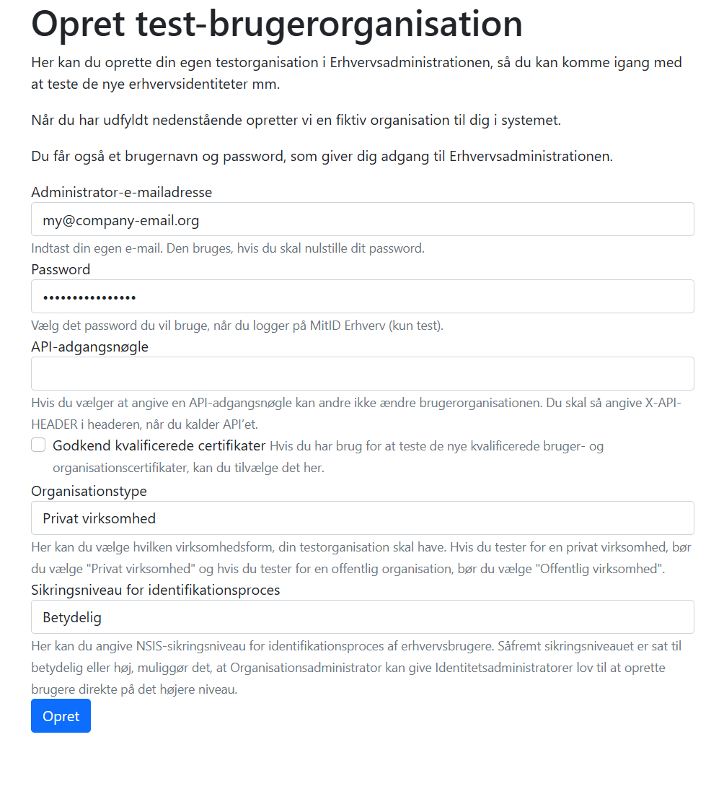
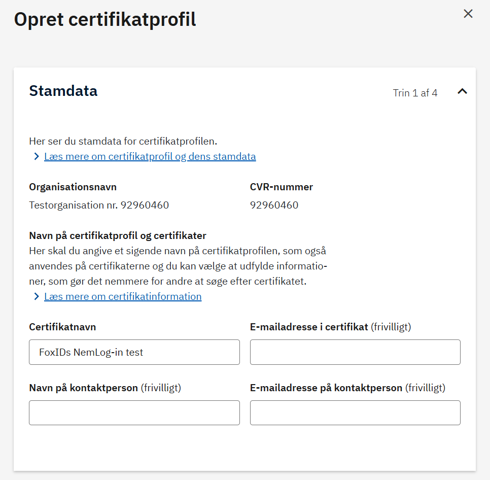
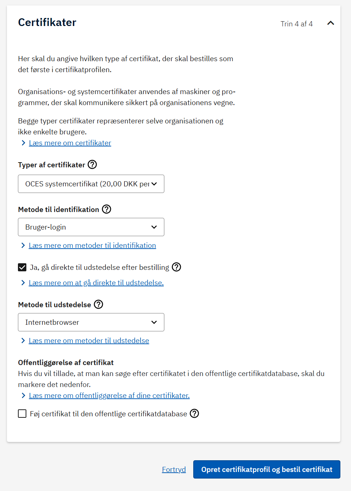

<!--
{
    "title":  "Create an OCES3 test certificate",
    "description":  "Step-by-step guide to issue an OCES3 system certificate in the NemLog-in test environment for use with FoxIDs SAML 2.0 connections.",
    "ogTitle":  "Create an OCES3 test certificate",
    "ogDescription":  "Step-by-step guide to issue an OCES3 system certificate in the NemLog-in test environment for use with FoxIDs SAML 2.0 connections.",
    "ogType":  "article",
    "ogImage":  "/images/foxids_logo.png",
    "twitterCard":  "summary_large_image",
    "additionalMeta":  {
                           "keywords":  "create oces3 test certificate, FoxIDs docs"
                       }
}
-->

# Create an OCES3 test certificate

This guide explains how to create an OCES3 test certificate in the NemLog-in test environment. It condenses the Danish guide and uses the Danish screenshots.

OCES3 test certificates are system certificates used for NemLog-in test integrations like [FoxIDs SAML 2.0 connections](auth-method-howto-saml-2.0-nemlogin.md). Production certificates follow the same flow in the [production portal](https://erhvervsadministration.nemlog-in.dk/certificates) and but must be ordered separately.

## 1) Create a test user organisation
1. Go to the NemLog-in test portal: [https://testportal.test-devtest4-nemlog-in.dk/BO](https://testportal.test-devtest4-nemlog-in.dk/BO).
2. Fill out the form:
   - Administrator email and a password you choose for the test admin login.
   - Set organisation type and identification security level to `Betydelig`.
3. Click **Opret** to create the organisation and note the confirmation receipt - you will get a username (brugernavn in Danish) and password.

## 2) Sign in to the test administration portal
1. Go to [https://erhvervsadministration.devtest4-nemlog-in.dk/](https://erhvervsadministration.devtest4-nemlog-in.dk/).
2. Choose the tab **Test login** and sign in with the username (User ID) and password from the receipt.
3. Select **Certifikater** and choose to create a new certificate profile **Opret certifikatprofil**.

## 3) Create the certificate profile
1. Enter a descriptive certificate profile name **Certifikatnavn**; this is also used on issued certificates.
2. Optionally add contact names and email addresses.

Continue through the next steps (system rights and signing defaults) with the recommended defaults unless you have specific requirements.

## 4) Choose certificate options and order
On the final step, configure the certificate details:
- Select the type **Typer af certifikater**: `OCES systemcertifikat`.
- Identification method **Metode til identifikation**: `Bruger-login`.
- Enable **Ja, g&aring; direkte til udstedelse efter bestilling** (issue immediately after ordering).
- Issuance method **Metode til udstedelse**: `Internetbrowser`.

Then click **Opret certifikatprofil og bestil certifikat** to place the order (there are no costs in the test environment, even though it is stated).

## 5) Issue and download the certificate
1. Open the new certificate profile, go to **Certifikater**, and choose **Bestil nyt certifikat** if it was not issued automatically.
2. Select **Udsted** on the pending certificate.
3. Accept the terms, copy and store the generated password, and download the `.p12` file.

## Reference
- MitID Erhverv [test setup guide](https://cms.nemlog-in.dk/media/w0soirtb/mitid-erhverv-i-pre-produktionsmilj%C3%B8.pdf) (Danish PDF)
