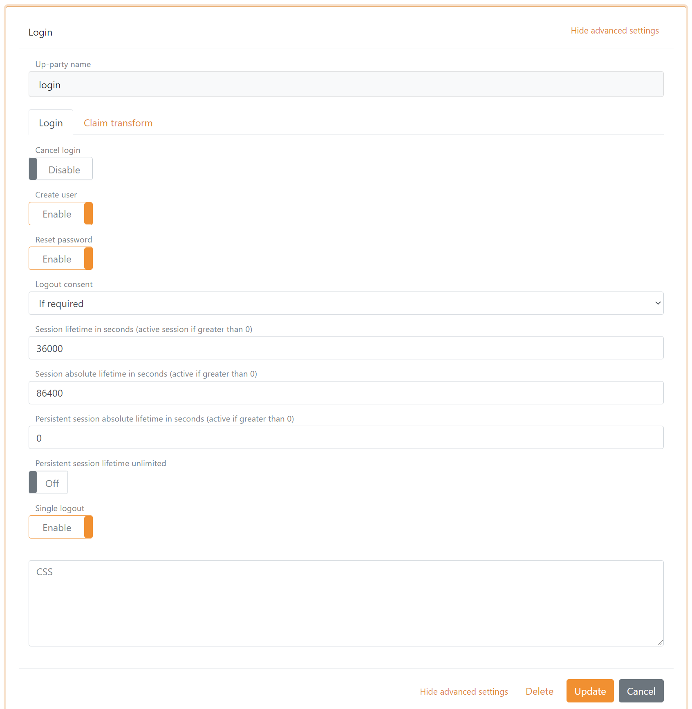

# CSS

The FoxIDs user interface can be customized per [up-party login](login). This means that a single FoxIDs track can support multiple user interface designs with different CSS.

## Configue CSS

Find the up-party login in [FoxIDs Control Client](control.md#foxids-control-client) that you want to configure.

 1. Select show advanced settings
 2. Add the CSS to the CSS field, if necessary drag the field bigger
 3. Click Update

 After update the CSS is instantly active.

 

