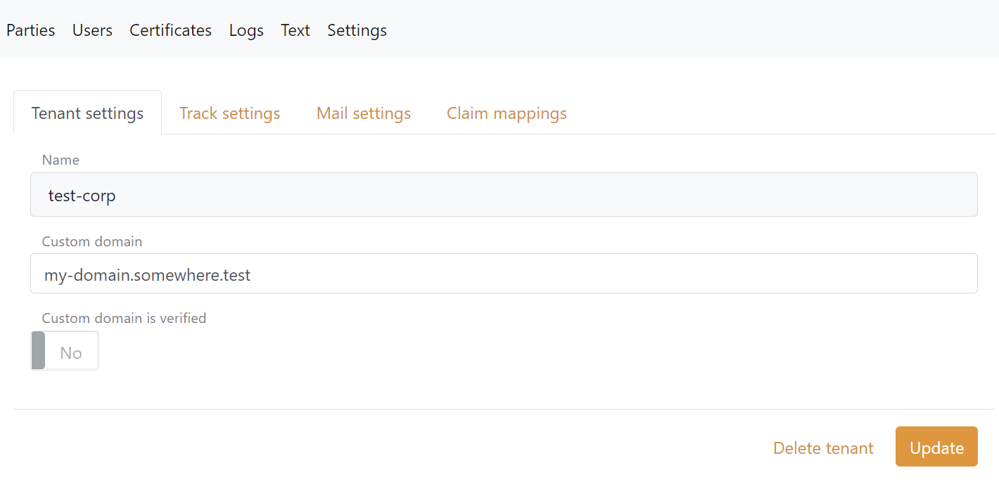
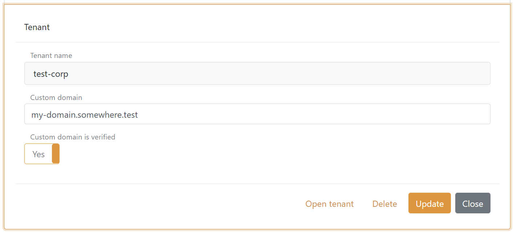

# Custom domain

Each FoxIDs tenant can be configured with a custom domain. The custom domain can be configured with [Control Client](control.md#foxids-control-client) and [Control API](control.md#foxids-control-api) 
in your tenants master track under Settings --> Tenant settings. 

When a new custom domain is added it needs to be verified.

## FoxIDs.com
Configuring a custom domain in a FoxIDs.com tenant:

 1. In your DNS, add a CNAME with your custom domain and the target `custom-domains.foxids.com`.
 2. Configure your custom domain in your FoxIDs tenants master track.
 3. Write an email to [FoxIDs support (support@foxids.com)](mailto:support@foxids.com) and ask for a custom domain verification.
 4. FoxIDs support will ask you to add one or two TXT records to your DNS for verification.
 5. After successfully verification your domain become active.

## Your own private FoxIDs
A domain is marked as verified in the master tenants master track and is thereafter accepted by FoxIDs.

All custom domains on all tenants can be configured with [Control Client](control.md#foxids-control-client) and [Control API](control.md#foxids-control-api) in the master tenants master track. 
Where also the domain can be marked as verified at the same time. 

