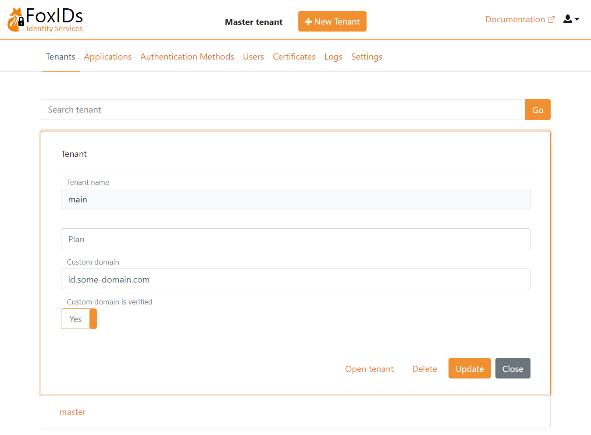

# Custom domain

Each FoxIDs tenant can be configured with a custom domain. A tenant connected to a custom domain does not include the tenant name in the URL like a tenant without a custom domain.

- A default tenant e.g., `main` without a custom domain would on FoxIDs.com result in a URL like this `https://foxids.com/main/some-environment/...`.
- If the same tenant is connected to a custom domain e.g., `my-domain.com` the URL on FoxIDs.com would be `https://my-domain.com/some-environment/...` without the tenant element.

The custom domain can be configured with [Control Client](control.md#foxids-control-client) in your tenants master environment under the Settings tab and the Tenant settings sub tab. 

> When a new custom domain is added it needs to be verified. 
> After verification the domain is enabled in all environments in the tenant.

Custom domains is not supported in the master tenant and master environments.

## Service (SaaS) on FoxIDs.com
Configuring a custom domain in your FoxIDs.com tenant.

> Only sub domains is supported as custom domains, like e.g., `id.some-domain.com`, `auth.some-domain.com`, `login.some-domain.com` or `id.zyx.some-domain.com`

Steps:

 1. In your DNS, add a CNAME with your custom domain and the target `custom-domains.foxids.com`    
 2. Configure your custom domain in your FoxIDs tenants master environment.
 3. Write an email to [FoxIDs support (support@foxids.com)](mailto:support@foxids.com) and ask for a custom domain verification.
 4. FoxIDs support will ask you to add one or two TXT records to your DNS for verification.
 5. After successfully verification your domain become active.

## Your own private cloud
Custom domains can be configured on tenants in the master tenant using the [Control Client](control.md#foxids-control-client) and [Control API](control.md#foxids-control-api). 
Where also the domain can be marked as verified at the same time. 

