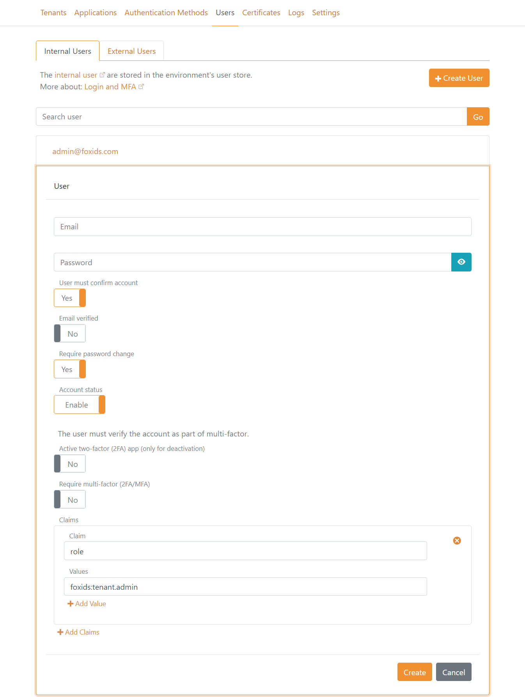

# Azure Container

Deploy FoxIDs in your Azure tenant as your own private cloud.  
FoxIDs is deployed in the resource group `FoxIDs` where you need to be `Owner` or `Contributor` and `User Access Administrator` on either subscription level or resource group level.

The Azure container deployment include:

- Two App Services one for the FoxIDs site and one for the FoxIDs Control site (Client and API). Both App Services is hosted in the same Linux App Service plan. 
- FoxIDs is deployed with Docker containers from [Docker Hub](https://hub.docker.com/u/foxids) and both App Services is configured with continuous deployment.
- Key Vault. Certificates and secrets are saved and handled in Key Vault.
- Cosmos DB. Contain all data including tenants, environments and users. Cosmos DB is a NoSQL database and data is saved in JSON documents.
- Redis cache. Holds sequences (e.g., login and logout sequences), data cache to improve performance and handle counters to secure against various attacks.
- Application Insights and Log Analytics workspace. Logs are send to Application Insights and queried in Log Analytics workspace.
- VLAN with subnets.
  - Subnet for App services, Cosmos DB and Key Vault. 
  - Subnet with Private Link to Redis.

### Send emails with Sendgrid or SMTP
FoxIDs supports sending emails with SendGrid and SMTP as [email provider](email.md).

### First login and admin users
After successfully deployment open [FoxIDs Control Client](control.md#foxids-control-client) on `https://foxidscontrolxxxxxxxxxx.azurewebsites.net` (the app service starting with foxidscontrol...) which brings you to the master tenant.

The default admin user is `admin@foxids.com` with password `FirstAccess!` (you are required to change the password on first login)  

Optionally navigate to the `Users` tab and create more admin users with a valid email addresses and grant the users the admin `role` with the value `foxids:tenant.admin`.

> You should generally not change the application registrations and authentication methods configuration in the master tenant, unless you are sure about what you are doing.

## Create main tenant
Create a `main` tenant for your environments.

> Consider [custom domains](#custom-domains) before creating the `main` tenant.

Click `New Tenant` and create the `main` tenant.

Log in to the `main` tenant where you can start to configure your [applications and authentication methods](connections.md).

## Custom domains

Custom domains is configured with custom primary domains and a custom domain on main tenant.

### Custom primary domains

The FoxIDs and FoxIDs Control sites primary domains can be customized. The new primary custom domains can be configured on the App Services or by using a [reverse proxy](reverse-proxy.md)

> Important: change the primary domain before adding tenants.

Domains:

- The FoxIDs sites default domain is `https://foxidsxxxx.azurewebsites.net` which can be changed to a custom primary domain like e.g., `https://somedomain.com` or `https://id.somedomain.com`  
- The FoxIDs Control sites default domain is `https://foxidscontrolxxxx.azurewebsites.net` which can be changed to a custom primary domain like e.g., `https://control.somedomain.com`

The FoxIDs site support one primary domain and multiple [custom domains](custom-domain.md) which are connected to tenants other then the master tenant. The FoxIDs Control site only support one primary domain.

Configure new primary custom domains:

1) Login to [FoxIDs Control Client](control.md#foxids-control-client) using the default/old primary domain. Select the `Applications` tab then click `OpenID Connect - foxids_control_client` and click `Show advanced settings`.

   - Add the FoxIDs Control sites new primary custom domain URL to the `Allow CORS origins` list without a trailing slash.
   - Add the FoxIDs Control Client sites new primary custom domain login and logout redirect URIs to the `Redirect URIs` list including the trailing `/master/authentication/login_callback` and `/master/authentication/logout_callback`.

   > If you have added tenants before changing the primary domain, the `OpenID Connect - foxids_control_client` configuration must be carried out in each tenant.

2) The custom primary domains is configured on each App Service or by using a [reverse proxy](reverse-proxy.md). 
Depending on the reverse proxy your are using you might be required to also configure the domains on each App Service:

   - If configured on App Services: add the custom primary domains in Azure portal on the FoxIDs App Service and the FoxIDs Control App Service under the `Custom domains` tab by clicking the `Add custom domain` link.
   - If configured on reverse proxy: the custom primary domains are exposed through the [reverse proxy](reverse-proxy.md).

3) Then configure the FoxIDs service sites new primary custom domains in the FoxIDs App Service under the `Environment variables` tab: 

   - The setting `Settings__FoxIDsEndpoint` is changed to the FoxIDs sites new primary custom domain.

4) And configure the FoxIDs service and FoxIDs Control sites new primary custom domains in the FoxIDs Control App Service under the `Environment variables` tab: 

   - The setting `Settings__FoxIDsEndpoint` is changed to the FoxIDs sites new primary custom domain.
   - The setting `Settings__FoxIDsControlEndpoint` is changed to the FoxIDs Control sites new primary custom domain.

### Custom domain on main tenant
You can achieve a shorter and prettier URL where the tenant element is removed from the URL. By configuring the FoxIDs site custom primary domain on the [main tenant](#create-main-tenant) as a [custom domain](custom-domain.md).

Custom domains is supported if the FoxIDs site is behind a [reverse proxy](reverse-proxy.md) that can do domain rewrite.  
Or alternatively, FoxIDs support custom domains by reading the HTTP request domain and using the domain as a custom domain if the `Setting__RequestDomainAsCustomDomain` setting is set to `true`. 
The FoxIDs App Service need to be configured with the custom domain in this case.

The domain is configured on the `main` tenant and marked as verified in the master tenant.

## Reverse proxy
It is recommended to place both the FoxIDs Azure App service and the FoxIDs Control Azure App service behind a reverse proxy. 

### Azure Front Door
Azure Front Door can be configured as a reverse proxy. Azure Front Door rewrite domains by default. 

Optionally select an alternative [reverse proxy](reverse-proxy.md#reverse-proxies).

> Do NOT enable caching. The `Accept-Language` header is not forwarded if caching is enabled. The header is required by FoxIDs to support cultures.

Configuration:
- Add a Azure Front Door endpoint for both the FoxIDs App Service and the FoxIDs Control App Service
- In the Networking section of the App Services. Enable access restriction to only allow traffic from Azure Front Door
- Optionally add a Front Door endpoint for both the FoxIDs App Service and the FoxIDs Control App Service test slots
- Restrict access to the App Services test slots
- Add the `Settings:TrustProxyHeaders` setting with the value `true` and select Deployment slot setting in the FoxIDs App Service configuration to support [custom domains](custom-domain.md) (optionally also add the setting in the test slot)
- Disable Session affinity
- Optionally configure WAF policies

### Restrict access
Optionally restrict access if you are using another reverse proxy then Azure Front Door.

Both the FoxIDs and FoxIDs Control sites can restrict access based on the `X-FoxIDs-Secret` HTTP header.  
The access restriction is activated by adding a secret with the name `Settings--ProxySecret` in Key Vault.

1. Grant your IP address access through the Key Vault firewall

2. Grant your user List and Set permissions in Access policies.

3. Add the `Settings--ProxySecret` secret

4. After successfully configuration, remove you IP address and permissions.

> The sites needs to be restarted to read the secret.

After the reverse proxy secret has been configured in Key Vault the reverse proxy needs to add the `X-FoxIDs-Secret` HTTP header in all backed calls to FoxIDs to get access.

## Enable test slots for testing
Both the FoxIDs App Service and FoxIDs Control App service contains test slots used for [updating](#update) the sites without downtime.

It is possible to do preliminary test in the test slots against the production data or create a new dataset for testing. 

Configuration to enable test with production data:
- In Key Vault. Grant the FoxIDs App Service and FoxIDs Control App service test slots access to call Key Vault with the same rights as the FoxIDs App Service and FoxIDs Control App service existing rights.
- In Log Analytics workspace. Grant the FoxIDs App Service and FoxIDs Control App service test slots read access.
- You can optionally add the two test slots behind a [reverse proxy](reverse-proxy.md) or restrict access otherwise

## Specify default page

An alternative default page can be configured for the FoxIDs site using the `Settings:WebsiteUrl` setting. If configured a full URL is required like e.g., `https://www.foxidsxxxx.com`.

## Troubleshooting deployment errors

### Key Vault soft deleted
If you have deleted a previous deployment the Key Vault is only soft deleted and sill exist with the same name for some months. 
In this case you can experience getting a 'ConflictError' with the error message 'Exist soft deleted vault with the same name.'.

The solution is to delete (purge) the old Key Vault, which will release the name.
