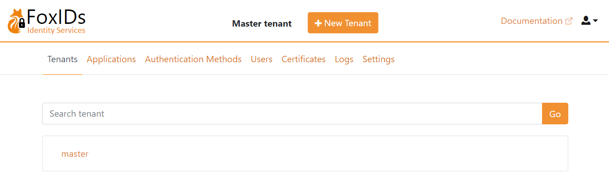
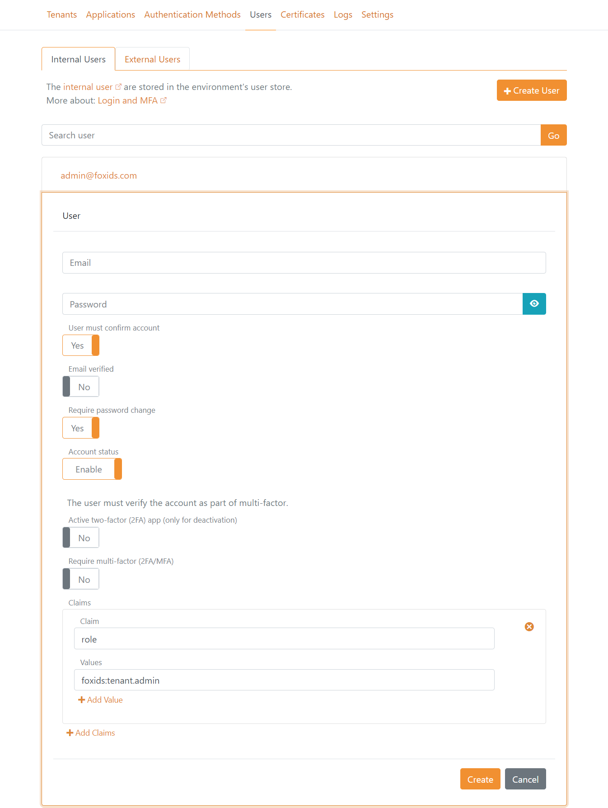
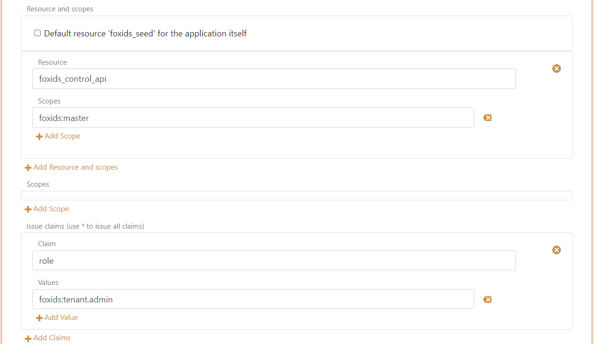

# Deployment

Deploy FoxIDs in your Azure tenant as your own private cloud.  
FoxIDs is deployed in a resource group e.g., named `FoxIDs` where you need to be `Owner` or `Contributor` and `User Access Administrator` on either subscription level or resource group level.

[](https://portal.azure.com/#create/Microsoft.Template/uri/https%3A%2F%2Fraw.githubusercontent.com%2FITfoxtec%2FFoxIDs%2Fmaster%2Fazuredeploy.json)

The Azure ARM deployment include:

- Two App Services one for FoxIDs and one for the FoxIDs Control (Client and API). Both App Services is hosted in the same App Service plan and the App Services has both a production and test slot. 
- FoxIDs is deployed to the two App Services test slots from the `master` branch with Kudu. [Updates](update) is initiated manually in the App Services test slots. Deployment updates is automatically promoted from the test slots to the production slots. It is possible to change the automatically promoted to manually initiated.
- Key Vault. Certificates and secrets are saved and handled in Key Vault.
- Cosmos DB. Contain all data including tenants, tracks and users. Cosmos DB is a NoSQL database and data is saved in JSON documents.
- Redis cache. Holds sequence (e.g., login and logout sequences) data, data cache to improve performance and handle counters to secure authentication against various attacks.
- Application Insights and Log Analytics workspace. Logs are send to Application Insights and queries in Log Analytics workspace.
- VLAN with subnets.
  - Subnet for App services, Cosmos DB and Key Vault. 
  - Subnet with Private Link to Redis.
  - Subnet with Azure Monitor Private Link Scope (AMPLS) to Application Insights and Log Analytics workspace. To see logs in the Azure Portal, change the setting to accept public networks.

> There is only Internet access to App services, every thing else is encapsulated.

### Send emails with Sendgrid or SMTP
FoxIDs supports sending emails with SendGrid and SMTP as [email provider](email).

### First login and admin users
After successfully deployment open [FoxIDs Control Client](control.md#foxids-control-client) on `https://foxidscontrolxxxxxxxxxx.azurewebsites.net` (the app service starting with foxidscontrol...) which brings you to the master tenant.

> The default admin user is: `admin@foxids.com` with password: `FirstAccess!` (you are required to change the password on first login)  
> *Please wait a few minutes before logging in after the deployment is complete to allow the initial seed to finish.*



Create more admin users with a valid email addresses and grant the users the admin `role` with the value `foxids:tenant.admin`.



> You should generally not change the parties configuration or add applications in the master tenant, unless you are sure about what you are doing.

### Troubleshooting deployent errors

**Key Vault soft deleted**
If you have deleted a previous deployment the Key Vault is only soft deleted and sill exist with the same name for some months. 
In this case you can experience getting a 'ConflictError' with the error message 'Exist soft deleted vault with the same name.'.

The solution is to delete (purge) the old Key Vault, which will release the name.

## Upload risk passwords

You can increment the password security level by uploading risk passwords. 

You can upload risk passwords with the FoxIDs seed tool console application. The seed tool code is [downloaded](https://github.com/ITfoxtec/FoxIDs/tree/master/tools/FoxIDs.SeedTool) and need to be compiled and [configured](#configure-the-seed-tool) to run.

Download the `SHA-1` pwned passwords in a single file from [haveibeenpwned.com/passwords](https://haveibeenpwned.com/Passwords) using the [PwnedPasswordsDownloader tool](https://github.com/HaveIBeenPwned/PwnedPasswordsDownloader).

> Be aware that it takes some time to upload all risk passwords. This step can be omitted and postponed to later.  

The risk passwords are uploaded as bulk which has a higher consumption. Please make sure to adjust the Cosmos DB provisioned throughput (e.g. to 4000 RU/s or higher) temporarily. 
The throughput can be adjusted in Azure Cosmos DB --> Data Explorer --> Scale & Settings.

You can read the number of risk passwords uploaded to FoxIDs in [FoxIDs Control Client](control.md#foxids-control-client) master tenant on the Risk Passwords tap. And you can test if a password is okay or has appeared in breaches.

### Configure the seed tool

The seed tool is configured in the `appsettings.json` file.

> Access to upload risk passwords is granted in the `master` tenant.

Create a seed tool OAuth 2.0 client in the [FoxIDs Control Client](control.md#foxids-control-client):

1. Login to the `master` track and select the Parties tab
2. Create a OAuth 2.0 down-party, click `OAuth 2.0 - Client Credentials Grant`.
3. Set the client id to `foxids_seed`.
4. Remember the client secret.
5. In the resource and scopes section. Grant the sample seed client access to the FoxIDs Control API resource `foxids_control_api` with the scope `foxids:master`.
6. Click show advanced settings. 
7. In the issue claims section. Add a claim with the name `role` and the value `foxids:tenant.admin`. This will grant the client the administrator role. 

The seed tool client is thereby granted access to update the master tenant.



Add the FoxIDs and FoxIDs Control API endpoints and client secret to the seed tool configuration. 

```json
"SeedSettings": {
    "FoxIDsEndpoint": "https://foxidsxxxx.azurewebsites.net",
    "FoxIDsControlEndpoint": "https://foxidscontrolxxxx.azurewebsites.net",
    "ClientSecret": "xxx",
    ...
}
```

### Run the seed tool

Run the seed tool executable SeedTool.exe or run the seed tool directly from Visual Studio. 

* Click 'p' to start uploading risk passwords  

The risk password upload will take a while.

## Add sample configuration to a track

It is possible to run the sample applications after they are configured in a FoxIDs track. The sample configuration can be added with the [sample seed tool](samples.md#configure-samples-in-foxids-track).

## Custom primary domains

The FoxIDs service and FoxIDs Control sites primary domains can be customized. The new primary custom domains can be configured on the App Services or by using a [reverse proxy](reverse-proxy.md)

> Important: change the primary domain before adding tenants.

- FoxIDs service default domain is `https://foxidsxxxx.azurewebsites.net` which can be changed to a custom primary domain like e.g., `https://somedomain.com` or `https://id.somedomain.com`  
- FoxIDs Control default domain is `https://foxidscontrolxxxx.azurewebsites.net` which can be changed to a custom primary domain like e.g., `https://control.somedomain.com` or `https://idcontrol.somedomain.com`

The FoxIDs site support one primary domain and multiple [custom domains](custom-domain.md) which are connected to tenants, where the FoxIDs Control site only support one primary domain.

Configure new primary custom domains:

1) Login to [FoxIDs Control Client](control.md#foxids-control-client) using the default/old primary domain. Select the `Parties` tab and `Down-parties` tap then click `OpenID Connect - foxids_control_client` and click `Show advanced settings`.

   - Add the FoxIDs Control sites new primary custom domain URL to the `Allow CORS origins` list without a trailing slash.
   - Add the FoxIDs Control Client sites new primary custom domain login and logout redirect URIs to the `Redirect URIs` list including the trailing `/master/authentication/login_callback` and `/master/authentication/logout_callback`.

   > If you have added tenants before changing the primary domain, the `OpenID Connect - foxids_control_client` configuration have to be done in each tenant.

2) The custom primary domains is configured on each App Service or by using a [reverse proxy](reverse-proxy.md). 
Depending on the reverse proxy your are using you might be required to also configure the domains on each App Service:

   - If configured on App Services: add the custom primary domains in Azure portal on the FoxIDs App Service and the FoxIDs Control App Service production slot under the `Custom domains` tab by clicking the `Add custom domain` link.
   - If configured on reverse proxy: the custom primary domains are exposed through the [reverse proxy](reverse-proxy.md).

3) Then configure the FoxIDs service sites new primary custom domains in the FoxIDs App Service under the `Configuration` tab and `Applications settings` sub tab: 

   - The setting `Settings:FoxIDsEndpoint` is changed to the FoxIDs service sites new primary custom domain.

4) And configure the FoxIDs service and FoxIDs Control sites new primary custom domains in the FoxIDs Control App Service under the `Configuration` tab and `Applications settings` sub tab: 

   - The setting `Settings:FoxIDsEndpoint` is changed to the FoxIDs service sites new primary custom domain.
   - The setting `Settings:FoxIDsControlEndpoint` is changed to the FoxIDs Control sites new primary custom domain.

> Yo can achieve a shorter and prettier URL where the tenant element is removed from the URL. By creating a `main` tenant where the custom primary domain used on the FoxIDs service is set 92452093
as a [custom domain](custom-domain.md).

## Reverse proxy
It is recommended to place both the FoxIDs Azure App service and the FoxIDs Control Azure App service behind a [reverse proxy](reverse-proxy.md). 

## Enable test slots for testing
Both the FoxIDs App Service and FoxIDs Control App service contain a test slots use for [updating](update.md) the sites without downtime.

It is possible to do preliminary test in the test slots against the production data or create a new dataset for testing. 

Configuration to enable test with production data:
- In Key Vault. Grant the FoxIDs App Service and FoxIDs Control App service test slots access to call Key Vault with the same rights as the FoxIDs App Service and FoxIDs Control App service existing rights.
- In Log Analytics workspace. Grant the FoxIDs App Service and FoxIDs Control App service test slots read access.
- You can optionally add the two test slots behind a [reverse proxy](reverse-proxy.md) or restrict access otherwise

## Specify default page

An alternative default page can be configured for the FoxIDs site using the `Settings:WebsiteUrl` setting. If configured a full URL is required like e.g., `https://www.foxidsxxxx.com`.
