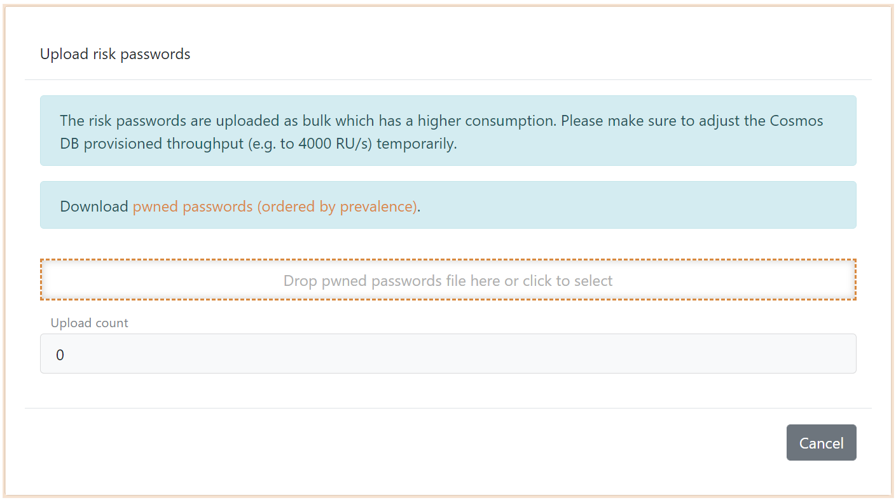

# Deployment

Deploy FoxIDs in your Azure tenant. 

- Two App Services one for FoxIDs and one for the FoxIDs Control (Client and API). Both App Services is hosted in the same App Service plan. 
- FoxIDs is deployed to the two App Services from the `master` branch with Kudu. Thereafter, it is possible to manually initiate the Kudu update.
- Key vault. Secrets are placed in Key vault.
- Document DB.
- Redis cache.
- SendGrid.
- Application Insights.

After successfully deployment open FoxIDs Control Client `https://foxidscontrolxxxxxxxxxx.azurewebsites.net` (the app service starting with foxidscontrol) which brings you to the master tenant.  
The default admin user is: admin<i>@</i>foxids.com with password: FirstAccess!

### Troubleshooting deployent errors

> **Sendgrid terms.** If you have not already accepted the Sendgrid legal terms for the selected plan in the subscription you will get the error 
> *"User failed validation to purchase resources. Error message: 'Legal terms have not been accepted for this item on this subscription: 'XXXXXXXX-XXXX-XXXX-XXXX-XXXXXXXXXXXX'. To accept legal terms using PowerShell, please use Get-AzureRmMarketplaceTerms and Set-AzureRmMarketplaceTerms API(https://go.microsoft.com/fwlink/?linkid=862451) or deploy via the Azure portal to accept the terms'"* 
>
> You need to accept the terms either by deploying a Sendgrid instance in [Azure portal](https://portal.azure.com) or with PowerShell. 
> The following PowerShell commands accept the Sendgrid terms for the free plan:
>
>     Connect-AzureRmAccount
>     $terms = Get-AzureRmMarketplaceTerms -Publisher 'SendGrid' -Product 'sendgrid_azure' -Name 'free'
>     Set-AzureRmMarketplaceTerms -Publisher 'SendGrid' -Product 'sendgrid_azure' -Name 'free' -Terms $terms -Accept
>
> Then delete the falling resource groups and redeploy.

## Seed

### Upload risk passwords

You can upload risk passwrods in FoxIDs Control Client master tenant on the Rrisk Passwords tap. 

Download the `SHA-1` pwned passwords `ordered by hash` from [haveibeenpwned.com/passwords](https://haveibeenpwned.com/Passwords).

> Be aware that it takes some time to upload all risk passwords. This step can be omitted and postponed to later.  
> The risk passwords are uploaded as bulk which has a higher consumption. Please make sure to adjust the Cosmos DB provisioned throughput (e.g. to 4000 RU/s) temporarily.

### Add sample configuration to a track

It is possible to run the sample applications after they are configured in a FoxIDs track. The sample configuration can be added with the [sample seed tool](samples.md#configure-samples-in-foxids-track).

## Customize domains

The FoxIDs and FoxIDs Control domain can be customized.  
//TODO – how to customize domains
