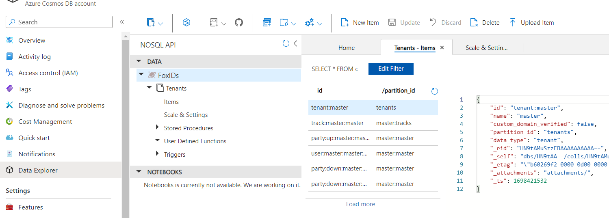
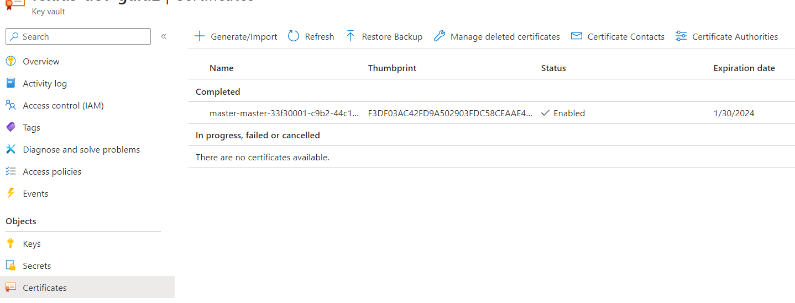

# Development

You can rune FoxIDs locally in Visual Studio on your development machine. 

If you like, you can clone the [FoxIDs GitHub repository](https://github.com/ITfoxtec/FoxIDs) and possibly do pull requests.
 
Solution description:

- **FoxIDs** is the FoxIDs ASP.NET application  
  Local endpoint `https://localhost:44330`
- **FoxIDs.Control** is the FoxIDs Control ASP.NET API and host of the FoxIDs Control Client Blazor WebAssembly  
  Local endpoint `https://localhost:44331`  
  Local API endpoint `https://localhost:44331/api/` and API Swagger (OpenApi) endpoint `https://localhost:44331/api/swagger/v1/swagger.json`
- **FoxIDs.ControlClient** is the FoxIDs Control Client Blazor WebAssembly  
- **FoxIDs.ControlShared** is a library shared between the FoxIDs Control API backend and FoxIDs Control Client Blazor WebAssembly frontend
- **FoxIDs.Shared** is a library shared between the FoxIDs ASP.NET application and FoxIDs Control ASP.NET API
- **FoxIDs.SharedBase** is a library shared by all

## Azure resources

FoxIDs depends on Azure resources to run locally. They need to be created in Azure and configured in the solution.  
The following guide is based on [Azure Portal](https://portal.azure.com/).

### Create a Resource Group

- Search Resource groups
- Click Create
- Enter a name and select a region
- Click Review + create and Create

### Add a dev client app

- Search App registrations
- Click New registration
- Add a name in the user-facing display name
- Click Register
- In the Overview section, find the Directory (tenant) ID and add it to both the FoxIDs and FoxIDs.Control `appsettings.json` in `Settings.ServerClientCredential.TenantId`
- In the Overview section, find the Application (client) ID and add it to both the FoxIDs and FoxIDs.Control `appsettings.json` in `Settings.ServerClientCredential.ClientId`
- Click Certificates & Secrets
- Click New client secret
- Select 730 days
- Click Add
- Add the secret value to both the FoxIDs and FoxIDs.Control `appsettings.json` in `Settings.ServerClientCredential.ClientSecret`

### Create a Key Vault

- Navigate to your resource group
- Search Key Vault and click Create on the found Key Vault element
- Enter a name and select a region
- Click next
- Select Vault access policy
- Select your own user
- Click Review + create and Create
- Navigate to the Key Vault resource
- In the Overview section, find the Vault URI and add it to both the FoxIDs and FoxIDs.Control `appsettings.json` in `Settings.KeyVault.EndpointUri`
- Click Access policies
- Click Create
- In Key Permissions select: Get, List, Decrypt and Sign
- In Secret Permissions select: Get, List, Set and Delete
- In Certificate Permissions select: Get, List, Update, Create, Import and Delete
- Click Next
- Search your dev client app by name
- Select the dev client app item 
- Click Next and Click Next and Click Create

### Create a Cosmos DB

- Navigate to your resource group
- Search Cosmos DB and click Create on the found Azure Cosmos DB element
- Click create in the Azure Cosmos DB for NoSQL element 
- Enter an account name and select a region
- Click Review + create and Create
- Navigate to the Cosmos DB resource
- Click Keys
- Add the URI to both the FoxIDs and FoxIDs.Control `appsettings.json` in `Settings.CosmosDb.EndpointUri`
- Add the Primary Key to both the FoxIDs and FoxIDs.Control `appsettings.json` in `Settings.CosmosDb.PrimaryKey`

### Create a Redis Cache

- Navigate to your resource group
- Search Redis Cache and click Create on the found Azure cache for Redis element
- Enter a DNS name and select a region
- In Cache type, select C0 Basic or C0 Standard
- Click Review + create and Create
- Navigate to the Redis Cache resource
- Click Access keys
- Add the Primary connection string to both the FoxIDs and FoxIDs.Control `appsettings.json` in `Settings.RedisCache.ConnectionString`

### Create an Application Insights and Log Analytics workspace

- Navigate to your resource group
- Search Application Insights and click Create on the found Application Insights element
- Enter a name and select a region
- Click Review + create and Create
- Navigate to the Application Insights resource
- In the Overview section, find the Connection String and add it to both the FoxIDs and FoxIDs.Control `appsettings.json` in `ApplicationInsights.ConnectionString`
- In the Overview section, click on the Workspace link
- In the Overview section, find the Workspace ID and add it to the FoxIDs.Control `appsettings.json` in `Settings.ApplicationInsights.WorkspaceId`

## Run and debug 

After the Azure resources is in place you are nearly ready to run and debug the solution. Please do the following endpoint settings.

- Add the FoxIDs local endpoint `https://localhost:44330` to the FoxIDs.Control `appsettings.json` in `Settings.FoxIDsEndpoint`
- Add the FoxIDs Control local endpoint `https://localhost:44331` to the FoxIDs.Control `appsettings.json` in `Settings.FoxIDsControlEndpoint`
- Configure Visual studio to start both the FoxIDs project and FoxIDs.Control project
- In the FoxIDs project navigate to Dependencies and npm, right click and click Restore packages
- Hit run
- The FoxIDs Control site should open on `https://localhost:44331` 
- First time you run the solution Cosmos DB and Key Vault is pre seeded, you therefore need to refresh the browser to reload after pre seed
- Login with the default admin user `admin@foxids.com` with password `FirstAccess!` - you are required to change the password on first login

The pre seeded database

and Key vault

> If the pre seed fails e.g., because of missing settings. You can re-initiate the pre seed process by deleting the FoxIDs database in Cosmos DB.

After successfully login you have access to the master tenant. You should then create a dev tenant where you can add applications (down-party), APIs (down-party), user login (up-party) and external trust (up-party).  
After having your dev tenant created you can follow the [get started guide](get-started.md#2-first-login).

## API client proxy

It is possible to integrate with the FoxIDs Control API in different ways, it is just a plain API exposing an interface description with Swagger (OpenApi). 

It is e.g., possible to generate client code with NSwag:
- Generate code with Visual Studio extension https://github.com/dmitry-pavlov/api-client-generation-tools.
- Generate code with NSwagStudio https://github.com/RicoSuter/NSwag/wiki/NSwagStudio. Microsoft description https://docs.microsoft.com/en-us/aspnet/core/tutorials/getting-started-with-nswag?view=aspnetcore-2.2&tabs=visual-studio#generate-code-with-nswagstudio.
- Automatically generating API clients on build with NSwag https://blog.sanderaernouts.com/autogenerate-api-client-with-nswag

> You can find a code sample in [FoxIDs.SampleSeedTool](https://github.com/ITfoxtec/FoxIDs.Samples/tree/master/tools/FoxIDs.SampleSeedTool) which automatically generating an API clients on build. When the [GenerateCode](https://github.com/ITfoxtec/FoxIDs.Samples/blob/master/tools/FoxIDs.SampleSeedTool/FoxIDs.SampleSeedTool.csproj#L9C17-L9C22) is true in the project file.

