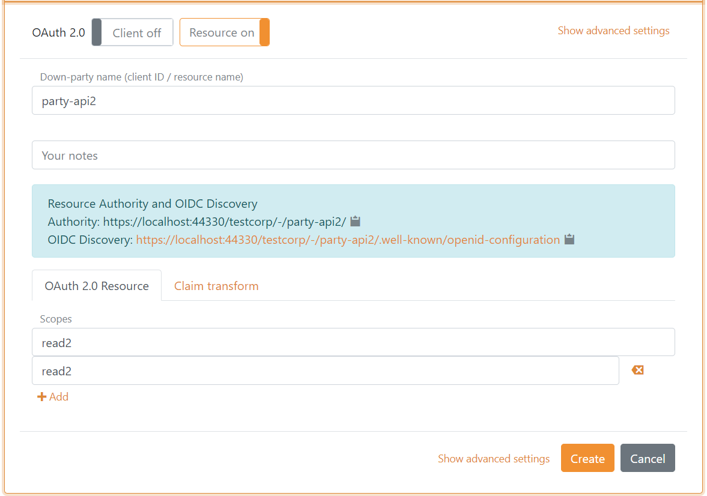

# Down-party OAuth 2.0 and OpenID Connect

FoxIDs support OpenID Connect as down-party [OpenID Provider (OP)](openid-provider-op) authenticating the client using OpenID Connect. Besides receiving a ID token the client can request an access token for multiple APIs defined as [OAuth 2.0 resources]( oauth-20-resource).

## OpenID Provider (OP)
An application (RP) can be connected to FoxIDs with OpenID Connect where FoxIDs acts as a down-party OpenID Provider (OP).

FoxIDs support login and front channel logout (end session). A session is established when the user authenticates and the session id is included in the id token. The session is invalidated on logout, if the ID token is included in the logout request.

Default both id token and access token are issued with the client's client id as the audience. The default resource can be removed from the access token in FoxIDs Control. 
Access tokens can be issued with a list of audiences and thereby be issued to multiple API`s defined in FoxIDs as OAuth 2.0 resources.  
The application can then call an API securing the call with the access token using the OAuth 2.0 Bearer Token standard.

FoxIDs support both client secret and PKCE. If a client is configured with both PKCE and secret(s) they will both (all) be validated. PKCE and client secret is not validated in implicit flow.  

There can be configured a maximum of 10 secrets per client.

FoxIDs support the OpenID Connect UserInfo endpoint.

### Configuration
The relaying party (RP) client (application) is configured in a FoxIDs track as an OpenID Connect down-party client.

> The clients FoxIDs discovery document is `https://foxids.com/tenant-x/track-y/party-client1/.well-known/openid-configuration`  
> if the client is located in tenant `tenant-x` and track `track-y` with the down-party client name `party-client1`  
> An up-party name e.g. `login` can possible be added to the discovery URL `https://foxids.com/tenant-x/track-y/party-client1(login)/.well-known/openid-configuration`

### Configure Authorization Code Flow for a confidant client
A confidant client could be a web application where the security is handled by the webserver which also stores the client secret.

- Specify client name in down-party name.
- Select allowed up-parties.
- Specify redirect URIs including both login and logout.
- Select `code` as response type or possible but not recemented `code token` or `code token id_token`.
- It is not required to use PKCE in a confidant client but recommended to mitigate replay attacks.
- Specify a secret.

### Configure Authorization Code Flow for a public client
A public client could be a browser-based riches client, Blazor client or mobile app. The application should use PKCE and not a client secret.

- Specify client name in down-party name.
- Select allowed up parties.
- Specify redirect URIs including both login and logout.
- Select `code` as response type.
- Use PKCE, default enabled.

> Click "Show advanced settings" to configure allowed CORS origins.

### Configure Implicit Code Flow for a public client
A public client could be a web application where the security is handled by the webserver or a browser-based riches client. The application neither use PKCE or client secret.  
*It is not recemented to use Implicit Code Flow because it is insecure.*

- Specify client name in down-party name.
- Select allowed up parties.
- Specify redirect URIs including both login and logout.
- Select `token id_token` as response type or possible only `token`.
- Disable PKCE.
- Do not specify a secret.

### Client and API
It is possible to configure both client and API (resource) in the same OpenID Connect down-party configuration, where both the client and API is defined with the same name. Furthermore, it is possible to configure resource scopes for the API.

**Client tap**

**Resource tab**

### Resource and Scopes
An API is defined as a resource under which it is possible to define scopes. Such scopes are defined as the resource name dot scope e.g. `party-api1.read1` or `party-api1.read2`.

In the client configuration tab, the scopes are defined underneath the resource name field.

In the resource configuration tab, the scopes are defined as a list of scope values.

Scopes configured in the client is validated if the scopes exist on the API. If the client and API is configured in the same down-party configuration, scopes added to the client is automatically added to the resource.

### Scopes
The scopes can be configured in the client configuration tab. It is possible to define a set of claims which should be issued for at scope as voluntary claims.

A set of default scopes is added to the client configuration, which subsequently can be changed or deleted.

## OAuth 2.0 Resource
An API is configured as a down-party OAuth 2.0 resource with a name and one or more scopes.

A client can subsequently be given access by configuring [Resource and scopes](#resource-and-scopes) in the client.

## Client Credentials Grant
An application using Client Credentials Grant could be a backend service secured by a client id and secret. PKCE is not validated in Client Credentials Grant.

- Specify client name in down-party name.
- Specify redirect URI.
- Select `token` as response type.
- Disable PKCE.
- Specify a secret.

## Resource Owner Password Credentials Grant
Resource Owner Password Credentials Grant is not supported for security reasons because it is insecure and should not be used.
