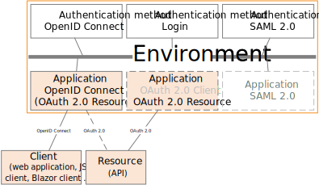
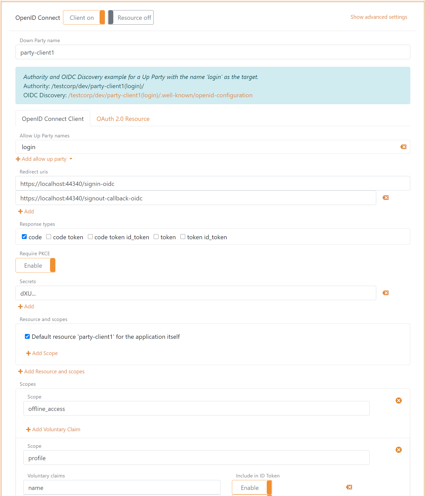
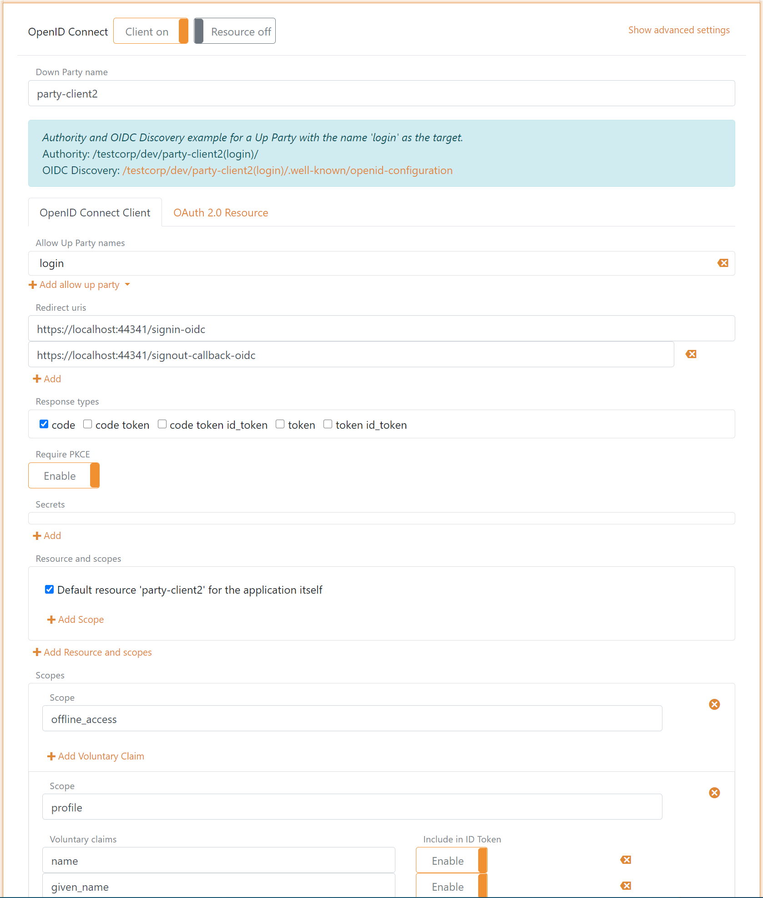
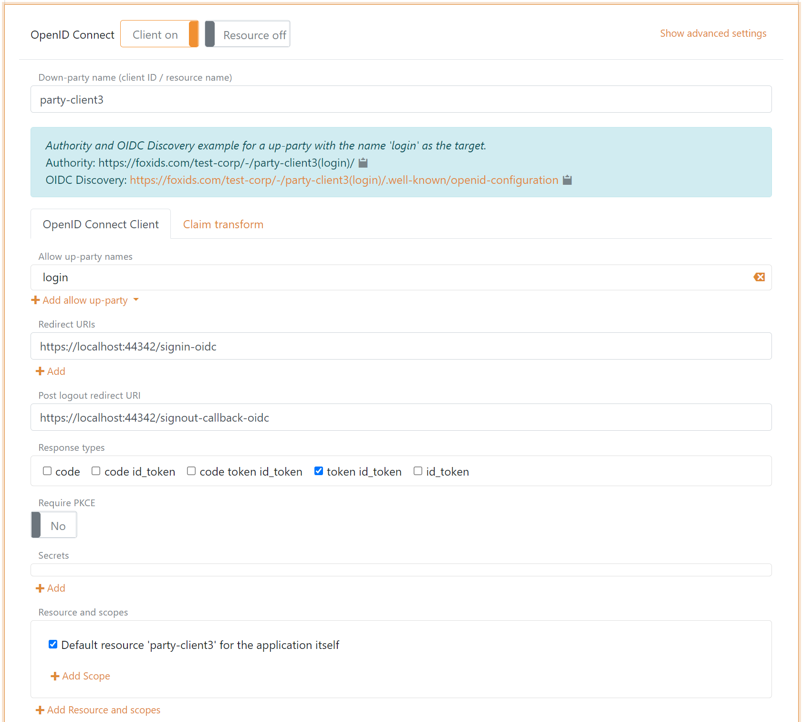
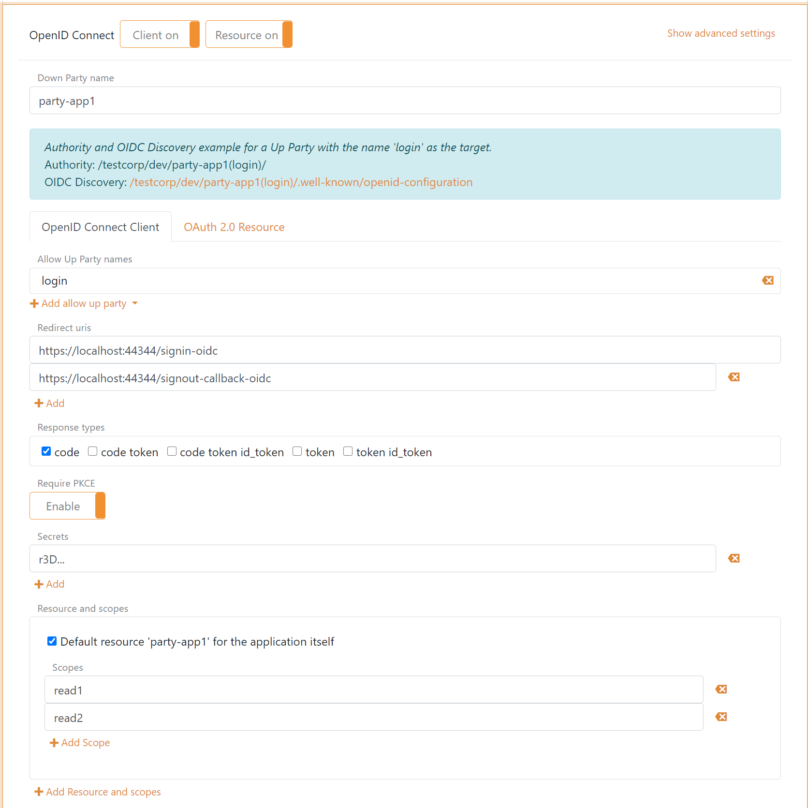
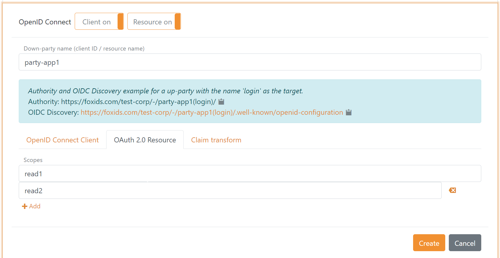
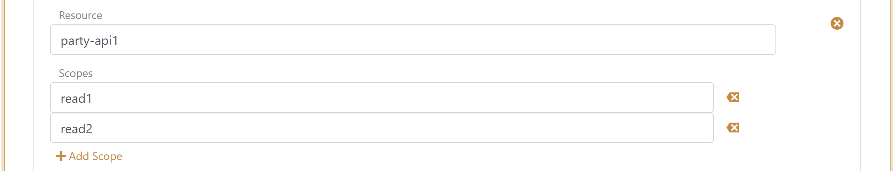
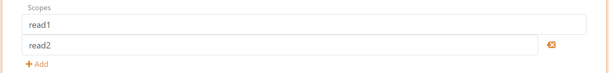

# Down-party - OpenID Connect

FoxIDs down-party [OpenID Connect](https://openid.net/specs/openid-connect-core-1_0.html) enable you to connect an OpenID Connect based application. 

Your application become a Relying Party (RP) and FoxIDs acts as an OpenID Provider (OP).

FoxIDs support [OpenID Connect Discovery](https://openid.net/specs/openid-connect-discovery-1_0.html) where your application can discover the OpenID Provider.

FoxIDs support [OpenID Connect authentication](https://openid.net/specs/openid-connect-core-1_0.html#Authentication) (login), [RP-initiated logout](https://openid.net/specs/openid-connect-rpinitiated-1_0.html) and [front-channel logout](https://openid.net/specs/openid-connect-frontchannel-1_0.html). A session is established when the user authenticates and the session id is included in the id token. The session is invalidated on logout.  
FoxIDs can show a logout confirmation dialog depending on configuration and rather an ID token is included in the logout request or not.

Default both id token and access token are issued with the client's client id as the audience. The default resource can be removed from the access token in FoxIDs Control. 
Access tokens can be issued with a list of audiences and thereby be issued to multiple APIs defined in FoxIDs as [OAuth 2.0 resources](down-party-oauth-2.0.md#oauth-20-resource).  
The application can then call an API securing the call with the access token using the [The OAuth 2.0 Authorization Framework: Bearer Token Usage](https://datatracker.ietf.org/doc/html/rfc6750).

FoxIDs support both client secret and [Proof Key for Code Exchange
(PKCE)](https://datatracker.ietf.org/doc/html/rfc7636), and default require PKCE. If a client is configured with both PKCE and secret(s) they will both (all) be validated. PKCE and client secret is not validated in implicit flow.  

There can be configured a maximum of 10 secrets per client.

FoxIDs support the OpenID Connect [UserInfo endpoint](https://openid.net/specs/openid-connect-core-1_0.html#UserInfo).

How to guides:

- Connect two FoxIDs tracks in the same or different tenants with [OpenID connect](howto-oidc-foxids.md)

> It is recommended to use OpenID Connect Authorization Code flow with PKCE, because it is considered a secure flow.

## Require multi-factor authentication (MFA)
The OpenID Connect client can require multi-factor authentication by specifying the `urn:foxids:mfa` value in the `AcrValues` parameter.

The `AcrValues` parameter can be set in the `OnRedirectToIdentityProvider` event in `Startup.cs`:

    options.Events.OnRedirectToIdentityProvider = (context) =>
    {
        // To require MFA
        context.ProtocolMessage.AcrValues = "urn:foxids:mfa";
        return Task.FromResult(string.Empty);
    };

See more code in the [AspNetCoreOidcAuthorizationCodeSample](samples.md#aspnetcoreoidcauthorizationcodesample) and [Startup.cs line 141](https://github.com/ITfoxtec/FoxIDs.Samples/blob/master/src/AspNetCoreOidcAuthorizationCodeSample/Startup.cs#L141).

## Configuration
How to configure your application as a down-party OpenID Connect Relaying Party (RP) / client.

> The clients FoxIDs discovery document is `https://foxids.com/tenant-x/track-y/party-client1/.well-known/openid-configuration`  
> if the client is configured in tenant `tenant-x` and track `track-y` with the down-party client name `party-client1`.

> A down-party client can possibly support login through multiple [up-parties](parties.md#up-party) by adding the up-party name to the URL.  
> An up-party name e.g. `login` can possible be added to the discovery URL like this `https://foxids.com/tenant-x/track-y/party-client1(login)/.well-known/openid-configuration`

During RP-initiated logout the up-party name can be omitted in the URL if the ID Token is provided in the request.

### Configure Authorization Code Flow for a confidential client
A confidential client could be a web application where the security is handled by the webserver which also stores the client secret.

- Specify client name in down-party name.
- Select allowed up-parties.
- Specify redirect URIs.
- Specify post logout redirect URI.
- Select `code` as response type or possible but not recommended `code token` or `code token id_token`.
- It is not required to use PKCE in a confidential client but recommended to mitigate replay attacks.
- Specify a secret.

### Configure Authorization Code Flow for a public client
A public client could be a browser-based riches client, Blazor client or mobile app. The application should use PKCE and not a client secret.

- Specify client name in down-party name.
- Select allowed up-parties.
- Specify redirect URIs.
- Specify post logout redirect URI.
- Select `code` as response type.
- Use PKCE, default enabled.

> Click "Show advanced settings" to configure allowed CORS origins.

### Configure Implicit Code Flow for a public client
A public client could be a web application where the security is handled by the webserver or a browser-based riches client. The application neither use PKCE or client secret.  
*It is not recommended to use Implicit Code Flow because it is insecure.*

- Specify client name in down-party name.
- Select allowed up-parties.
- Specify redirect URIs.
- Specify post logout redirect URI.
- Select `token id_token` as response type or possible only `token`.
- Disable PKCE.
- Do not specify a secret.

## Client and API
It is possible to configure both client and API ([OAuth 2.0 resource](down-party-oauth-2.0.md#oauth-20-resource)) in the same OpenID Connect down-party configuration, where both the client and API is defined with the same name. Furthermore, it is possible to configure resource scopes for the API.

**Client tap**

**Resource tab**

## Resource and Scopes
An API is defined as a resource under which it is possible to define scopes. Such scopes are defined as the resource name dot scope e.g. `party-api1.read1` or `party-api1.read2`.

In the client configuration tab, the scopes are defined underneath the resource name field.

In the resource configuration tab, the scopes are defined as a list of scope values.

Scopes configured in the client is validated if the scopes exist on the API. If the client and API is configured in the same down-party configuration, scopes added to the client is automatically added to the resource.

## Scopes
The scopes can be configured in the client configuration tab. It is possible to define a set of claims which should be issued for at scope as voluntary claims.

> Change the claims the down-party pass on with [claim transforms](claim-transform.md).

A set of default scopes is added to the client configuration, which subsequently can be changed or deleted.

