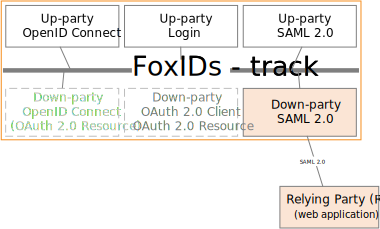

# Down-party - SAML 2.0

FoxIDs down-party [SAML 2.0 Relying Party (RP)](https://docs.oasis-open.org/security/saml/v2.0/saml-core-2.0-os.pdf) enable you to connect an SAML 2.0 based application. 

FoxIDs support [redirect and post bindings](https://docs.oasis-open.org/security/saml/v2.0/saml-bindings-2.0-os.pdf).

A up-party expose [SAML 2.0 metadata](https://docs.oasis-open.org/security/saml/v2.0/saml-metadata-2.0-os.pdf).

Both the login, logout and single logout [SAML 2.0 profiles](https://docs.oasis-open.org/security/saml/v2.0/saml-profiles-2.0-os.pdf) is supported. The Artifact profile is not supported.

How to guides:

- Connect [AD SF](down-party-howto-saml-2.0-adfs.md)
- Connect yyy

## Configuration
//TODO

