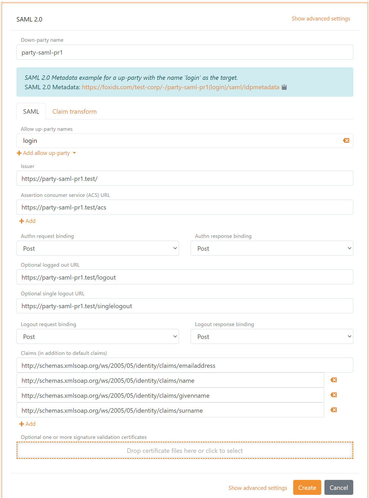

# Down-party - SAML 2.0

FoxIDs down-party [SAML 2.0](https://docs.oasis-open.org/security/saml/v2.0/saml-core-2.0-os.pdf) enable you to connect an SAML 2.0 based application. 

Your application become a SAML 2.0 Relying Party (RP) and FoxIDs acts as an SAML 2.0 Identity Provider (IdP).

FoxIDs support [SAML 2.0 redirect and post bindings](https://docs.oasis-open.org/security/saml/v2.0/saml-bindings-2.0-os.pdf).

A down-party expose [SAML 2.0 metadata](https://docs.oasis-open.org/security/saml/v2.0/saml-metadata-2.0-os.pdf) where your application can discover the SAML 2.0 Identity Provider (IdP).

Both the login, logout and single logout [SAML 2.0 profiles](https://docs.oasis-open.org/security/saml/v2.0/saml-profiles-2.0-os.pdf) are supported. The Artifact profile is not supported.

> The FoxIDs SAML 2.0 metadata do only include logout and single logout information if logout is configured in the SAML 2.0 down-party.

How to guides:

- Connect [AD SF](down-party-howto-saml-2.0-adfs.md)
- Connect yyy

## Configuration
How to configure your application as an SAML 2.0 Relying Party (RP).

> The FoxIDs down-party SAML 2.0 metadata endpoint is `https://foxids.com/tenant-x/track-y/party-saml-pr1/saml/idpmetadata`  
> if the application is configured in tenant `tenant-x` and track `track-y` with the down-party name `party-saml-pr1`.

> A down-party application can possibly support login through multiple [up-parties](parties.md#up-party) by adding the up-party name to the URL.  
> An up-party name e.g. `login` can possible be added to the metadata URL like this `https://foxids.com/tenant-x/track-y/party-saml-pr1(login)/saml/idpmetadata`

The following screen shot show the basic FoxIDs down-party SAML 2.0 configuration available in [FoxIDs Control Client](control.md#foxids-control-client).

> More configuration options become available by clicking `Show advanced settings`.

