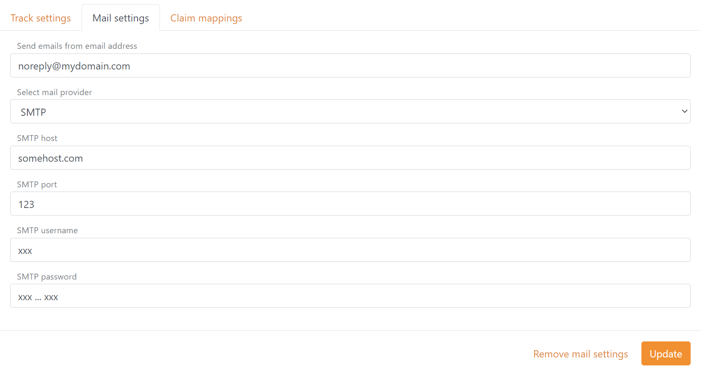

# Email provider

FoxIDs supports sending email with [SendGrid](#sendgrid) and SMTP. Both can be configured as an email provider in [each track](#configure-email-provider-in-track) or [generally](#configure-email-provider-generally) in the FoxIDs site configuration.  
FoxIDs sends emails to the users for e.g., account verification and password reset.  

## SendGrid

You can either [create Sendgrid in Azure](https://docs.microsoft.com/en-us/azure/sendgrid-dotnet-how-to-send-email) or directly on [Sendgrid](https://Sendgrid.com), there are more free emails in an Azure managed Sendgrid.

> Remember to setup up [domain authentication](https://sendgrid.com/docs/ui/account-and-settings/how-to-set-up-domain-authentication/) in Sendgrid for the from email.

## Configure email provider in track

The email provider can be configured in each track, where the from email address is required.  
If an email provider is configured in the track, it is used instead of any [general](#configure-email-provider-generally) configured email provider.

Configuring SendGrid:

Configuring SMTP:

## Configure email provider generally

The email provider can optionally be configured generally in the FoxIDs sites application settings. The from email address is required.  
If both a SendGrid and SMTP email provider is configured the SendGrid email provider is used.

Configuring SendGrid with the application setting names:

- Settings:Sendgrid:FromEmail
- Settings:Sendgrid:ApiKey

Configuring SMTP with the application setting names:

- Settings:Smtp:FromEmail
- Settings:Smtp:Host
- Settings:Smtp:Port
- Settings:Smtp:Username
- Settings:Smtp:Password