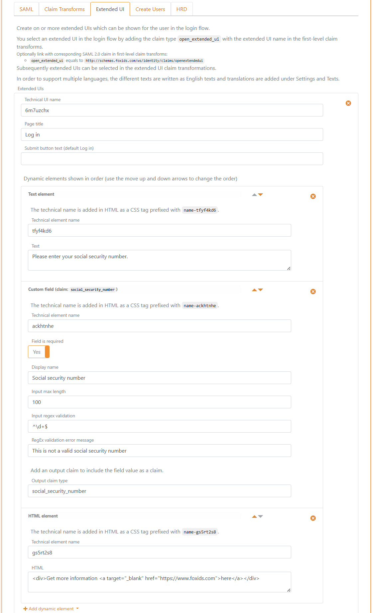
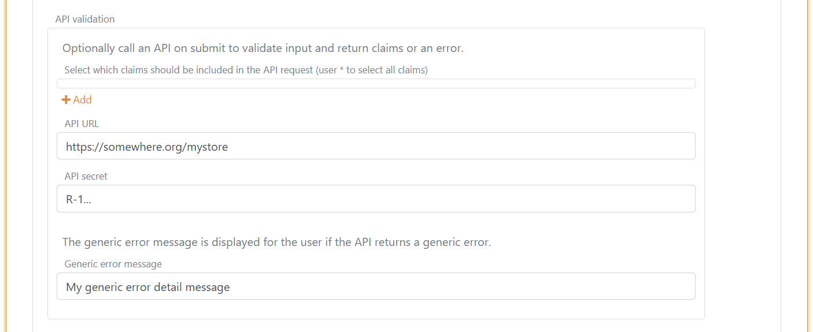

<!--
{
    "title":  "Extended UI",
    "description":  "You can extend the login user interface (UI) flow with custom login pages build with dynamic elements. The extended UIs have full support for culture / multi language. It is possible to create multiple custom UIs with different dynamic e...",
    "ogTitle":  "Extended UI",
    "ogDescription":  "You can extend the login user interface (UI) flow with custom login pages build with dynamic elements. The extended UIs have full support for culture / multi language. It is possible to create multiple custom UIs with different dynamic e...",
    "ogType":  "article",
    "ogImage":  "/images/foxids_logo.png",
    "twitterCard":  "summary_large_image",
    "additionalMeta":  {
                           "keywords":  "extended ui, FoxIDs docs"
                       }
}
-->

# Extended UI

You can extend the login user interface (UI) flow with custom login pages build with dynamic elements. The extended UIs have full support for culture / multi language. 
It is possible to create multiple custom UIs with different dynamic elements.  
Each extended UI page can optionally [call an API](#implement-api). If an API is called the returned claims is added to the claims collection otherwise the input values is added as the output claim type defined on the dynamic elements.

The dynamic elements consist of fixed fields a customisable field and both text and HTML content elements. With this you can easily ask for the user's name, use one or more self defined fields and show a logo and a link on a extended UI page.

> Extended UIs can be added to the following authentication methods in the **Extended UI** tab; login, external login, OpenID Connect, SAML 2.0 and environment link. 

**Select extended UI page**  
You select an extended UI page in the login flow by adding the claim type `open_extended_ui` with the extended UI page name in the first-level claim transforms.
In a SAML 2.0 authentication method optionally select with the corresponding SAML 2.0 claim `http://schemas.foxids.com/ws/identity/claims/openextendedui` in the first-level claim transforms.  
Subsequently extended UI pages can be selected in the extended UI claim transforms by adding the claim type `open_extended_ui` (JWT claim only) with the next extended UI page name.

**Example**  
This example page asks the user to enter their social security number (shown in two languages). 
The example extended UI adds the input value to the claims collection as the claim type `social_security_number`. In a real-world scenario, you would probably call an API to validate the social security number.  
In English:  


In Danish:  


The example page is configured in a SAML 2.0 authentication method with three elements.



> The extended UI can be customised with CSS in the login authentication method called **Default login**, unless you create another login method and use that instead. There's quite a lot of flexibility in how the dialogs can be designed.

## Translations
The texts (and error messages) used in dynamic elements is automatically translated if they are defined as global text with translations. Otherwise, there is automatically created a text element in the environments on winch you can add translations. 
If you want to support multi languages, you should create the texts as English texts and add translations for the texts.

You find the texts and translations in the **Settings** tab and then the **Texts** tab.


## Implement API

Each extended UI page can [call an API](#implement-api) with the result from the dynamic elements and selected claims. The API can then validate the user input and either on success return claims or an error message to the user.

You need to implement a simple API that FoxIDs calls on every page request.  
Please have a look at the [sample code](#api-sample).

The API has a base URL, and the functionality is divided into folders. Currently, only the `validate` folder (functionality) for validating the dynamic elements and selected claims is support.  
*Other folders may be added later.*

If the base URL for the API is `https://somewhere.org/mystore` the URL for the `validate` folder will be `https://somewhere.org/mystore/validate`.

> FoxIDs Cloud calls your API from the IP address `57.128.60.142`.  
  *The outgoing IP address can be changed and more can be added over time.*

### Request
The API call is secured with [HTTP Basic authentication scheme](https://datatracker.ietf.org/doc/html/rfc6749#section-2.3.1) where FoxIDs sends the ID `external_extended_ui` as the username and the configured secret as the password.

The API is called with HTTP POST and a JSON body.

This is a request JSON body with two dynamic elements and two claims:
```JSON
{
 "elements": [
        {
            "Name": "ne5uqp5z",
            "Type": "Email",
            "ClaimType": "email",
            "Value": "some@test.org"
        },
        {
            "Name": "ktvywqwc",
            "Type": "Custom",
            "ClaimType": "my_claim",
            "Value": "123456"
        }
    ],
 "claims": [
        {
            "type": "sub",
            "value": "1b1ac05e-5937-4939-a49c-0e84a89662df"
        },
        {
            "type": "email",
            "value": "some_other@test.org"
        }
    ]
}
```

### Response
**Success**  
On success the API should return HTTP code 200 and a list of `claims` (the list can be empty).

For example, the valid input values as claims:
```JSON
{
    "claims": [
        {
            "type": "email",
            "value": "some@test.org"
        },
        {
            "type": "my_claim",
            "value": "123456"
        }
    ]
}
```

**Error**  
The API must return HTTP code 401 (Unauthorized) and an `error` (required) if the Basic authentication is rejected. Optionally add an error description in `ErrorMessage`.
```JSON
{
    "error": "invalid_api_id_secret",
    "ErrorMessage": "Invalid API ID or secret"
}
```


The API can return HTTP code 400 (401 and 403 is also supported), and an `error` (required) if the input is rejected. Optionally add an error message to the user in `UiErrorMessage` and an error description in `ErrorMessage`.  
The `UiErrorMessage` is translated as a text and should be in English if you want to support multi languages.

A general validation error:
```JSON
{
    "error": "invalid",
    "ErrorMessage": "Something is not accepted.",
    "UiErrorMessage": "Please change the thing that is wrong."
}
```

A validation error connected to a dynamic element by the elements name:
```JSON
{
    "error": "invalid",    
    "elements": [
           {
               "Name": "ktvywqwc",
               "ErrorMessage": "The element is not valid because of something.",
               "UiErrorMessage": "Please change the value to the correct value."
           }
       ]   
}
```

If other errors occur, the API should return HTTP code 500 or another appropriate error code. 
It is recommended to add a technical error message in `ErrorMessage`. The error message can then later be found in the FoxIDs logs.  

> Error messages returned from the API in `ErrorMessage` is NOT displayed for the user only logged.

## API Sample
The sample [ExternalExtendedUiApiSample](https://github.com/ITfoxtec/FoxIDs.Samples/tree/main/src/ExternalExtendedUiApiSample) show how to implement the API in ASP.NET Core.

You can user this [Postman collection](https://github.com/ITfoxtec/FoxIDs.Samples/tree/main/src/ExternalExtendedUiApiSample/external-extended-ui-api.postman_collection.json) to call and test your API with [Postman](https://www.postman.com/downloads/).

## Configure 
Configure an extended UI page in a authentication method to call your API in [FoxIDs Control Client](control.md#foxids-control-client).

Navigate the **Authentication** tab and select the authentication method, then select the **Extended UI** tab. Find the extended UI page and configure the API.



- Optionally select claims that should be send to the API.
- Add the base API URL without the `validate` folder in **API URL**
- Add the **API secret**
- Add a generic error message which is displayed for the user if the API returns an error without a `UiErrorMessage`

