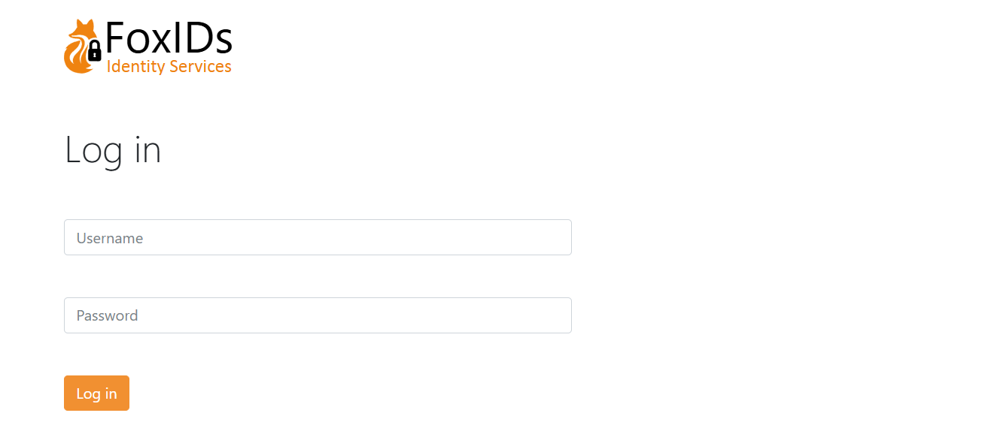
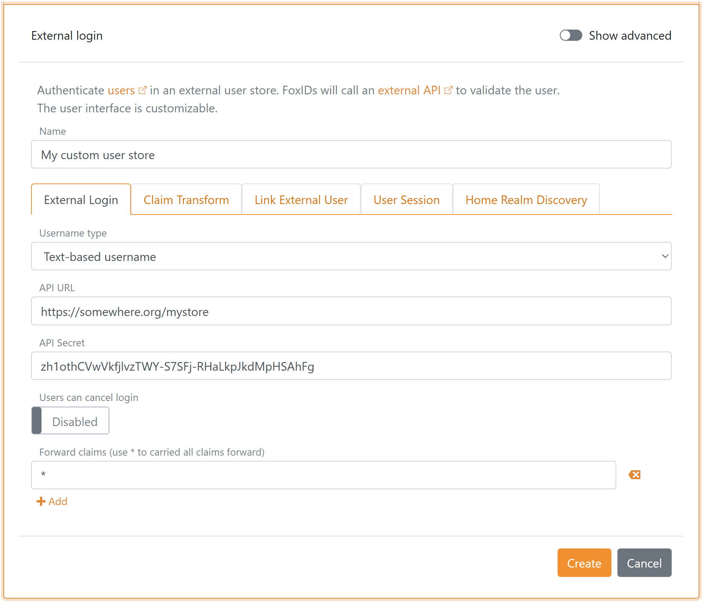

# External API Login

With external login you can authenticate users in your existing user database with an [API call](#api). You implement the API which is called with a username and password, and the API then validate the username and password combination and return a response indicating success or failure.  
You would use an external login authentication method if you have an existing user store to leverage the user store as a possible authentication method in FoxIDs. 
After login it is possible to create [external users](users.md#external-users) and optionally show a dialog where the user e.g., can put in a name, email.

> If desired, you can possible over time migrate users to FoxIDs and phase out the API and existing user store. However, it requires that emails have been added to the users.

External login support two username types:
- **Email** - the user's email as the username
- **Text** - a text-based username

If you choose a text-based username, the username format is not validated in FoxIDs. With text-based username it is possible to combination different username formats, include using an email.

It is only possible to use [home realm discovery (HRD) based on the domain](login.md#home-realm-discovery-hrd) if you select the email username type.

This is the default external login UI with a text-based username.



The external login UI can be [customized](customization.md).

## API

You need to implement a simple API that FoxIDs calls on every authentication request.  
Please have a look at the [sample code](#api-sample).

The API has a base URL and the functionality is divided into folders. Currently, only the `authentication` folder (functionality) for validating the username and password is support.  
*Other folders for changing passwords and creating new users will be added later.*

If the base URL for the API is `https://somewhere.org/mystore` the URL for the `authentication` folder will be `https://somewhere.org/mystore/authentication`.

> FoxIDs cloud call the API from the IP address `57.128.60.142`.

### Request
The API call is secured with [HTTP Basic authentication scheme](https://datatracker.ietf.org/doc/html/rfc6749#section-2.3.1) where FoxIDs sends the ID `external_login` as the username and the configured secret as the password.

The API is called with HTTP POST and a JSON body.

This is a JSON body for the username type `email`:
```JSON
{
    "usernameType": 100,
    "username": "user1@somewhere.org",
    "password": "testpass1"
}
```

And this is a JSON body for the username type `text`:
```JSON
{
    "usernameType": 200,
    "username": "user1",
    "password": "testpass1"
}
```

The username types:
- **email** is `100` 
- **text** is `200`

### Response
**Success**  
On success the API should return HTTP code 200 and optionally a list of `claims` for the authenticated user.

For example, the user's, sub (unique ID / username), name, email and maybe even a role:
```JSON
{
    "claims": [
        {
            "type": "sub",
            "value": "somewhere/user2"
        },
        {
            "type": "given_name",
            "value": "Joe"
        },
        {
            "type": "family_name",
            "value": "Smith"
        },
        {
            "type": "email",
            "value": "user2@somewhere.org"
        },
        {
            "type": "role",
            "value": "some_access"
        }
    ]
}
```

**Error**  
The API must return HTTP code 401 (Unauthorized) and an `error` (required) if the Basic authentication is rejected. Optionally add an error description in `errorDescription`.
```JSON
{
    "error": "invalid_api_id_secret",
    "errorDescription": "Invalid API ID or secret"
}
```

The API must return HTTP code 400, 401 or 403 and an `error` (required) if the username and password combination is rejected. Optionally add an error description in `errorDescription`.
```JSON
{
    "error": "invalid_username_password",
    "errorDescription": "Invalid username or password."
}
```

If other errors occur, the API should return HTTP code 500 or another appropriate error code. 
It is recommended to add a technical error message in to the return body. The error message can then later be found in the FoxIDs logs.  

> Error messages returned from the API is NOT displayed for the user.

## API Sample
The sample [ExternalLoginApiSample](https://github.com/ITfoxtec/FoxIDs.Samples/tree/main/src/ExternalApiLoginSample) show how to implement the API in ASP.NET Core 8.

You can user this [Postman collection](https://github.com/ITfoxtec/FoxIDs.Samples/tree/main/src/ExternalLoginApiSample/external-api-login.postman_collection.json) to call and test the sample with [Postman](https://www.postman.com/downloads/).

## Configure 
Configure a external login authentication method to call your API in [FoxIDs Control Client](control.md#foxids-control-client).

 1. Navigate to the **Authentication Methods** tab
 2. Click **New authentication**
 3. Select **Show advanced**
 4. Select **External Login**
 5. Add the **Name**
 6. Select **Username type** (in this case a text-based username)
 7. Add the base API URL without the `authentication` folder in **API URL**
 8. Add the **API secret**
    
 9. Click **Create**

 Optionally click **Show advanced** in the top right corner of the configuration section to [customized](customization.md) the login UI.
