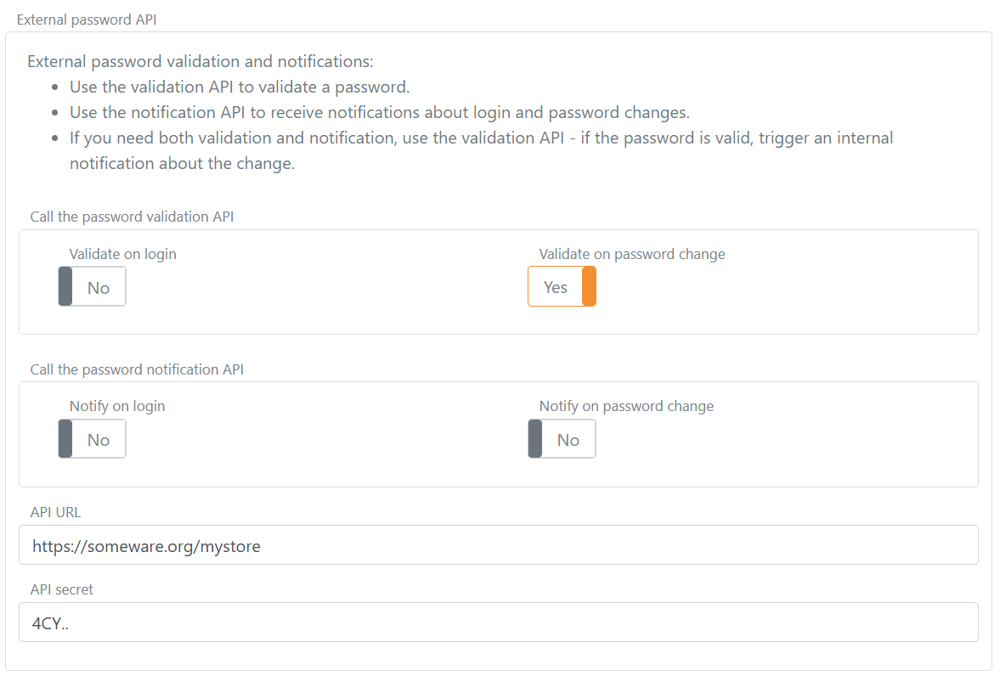

# External Password - API

Use an external password API when you need FoxIDs to (a) delegate password validation to an existing password store or policy engine, (b) notify an external system about password changes performed in FoxIDs, or (c) handle both scenarios.

You implement the external password API and configure FoxIDs to call it.
- **Validation API:** validates a password (e.g., during login or before accepting a password change) and can optionally notify you of a password change in the same call.
- **Notification API:** notifies about a password change after the password has passed all policy checks.

If the built-in password policy rejects the password, the external password API is not called. The external password API's notification method is only called if the password has passed all configured policy checks.

If you require both validation and change notification, and both can be handled by the same system, implement only the validation API. 
When you receive a validation request where the password is accepted, perform your notification logic internally. Implement both endpoints only if you must call two different backend systems.

External password APIs are part of the possible password checks for [internal users](users-internal.md).

## Implement API

You must implement a simple API that FoxIDs calls for validation / notification requests (see [sample](#api-sample)).

The API has a base URL; functionality is grouped into folders: the `validation` folder (validate password) and the `notification` folder (notify about password changes).

If the base URL is `https://somewhere.org/mystore`,
 - the validation endpoint is: `https://somewhere.org/mystore/validation`
 - and the notification endpoint is: `https://somewhere.org/mystore/notification`.

> FoxIDs Cloud calls your API from IP `57.128.60.142`.  
> *IP(s) can change or be expanded.*

The request and response are the same for both validation and notification methods. The validation method has an additional error case returned if the password is not accepted.

### Request
Secured with [HTTP Basic authentication](https://datatracker.ietf.org/doc/html/rfc6749#section-2.3.1): username `external_password`, password is the configured secret.

The call is HTTP POST with a JSON body.

This is a request JSON body with only the email as a user identifier:
```json
{
  "email": "user1@somewhere.org",
  "password": "testpass1"
}
```

This is a request JSON body with all three user identifiers:
```json
{
  "email": "user1@somewhere.org",
  "phone": "+4011223344",
  "username": "user1",
  "password": "testpass1"
}
```

The user identifiers are optional, but at least one must be present. The password is required.

### Response
**Success**  
On success the API should return HTTP status code 200.

**Error**  
The API must return HTTP status code 401 (Unauthorized) and an `error` (required) if the Basic authentication is rejected. Optionally add an error description in `ErrorMessage`.
```JSON
{
  "error": "invalid_api_id_secret",
  "ErrorMessage": "Invalid API ID or secret"
}
```

**Error - only for the validation method**  
The API must return HTTP status code 400, 401, or 403 and an `error` (required) if the password is not accepted. Optionally add an error description in `ErrorMessage`.
```JSON
{
  "error": "password_not_accepted",
  "ErrorMessage": "Password not accepted."
}
```

If other errors occur, the API should return HTTP status code 500 or another appropriate error code.  
It is recommended to add a technical error message in `ErrorMessage` for diagnostics (it is only logged; never shown to the end user).

## API Sample
The sample [ExternalPasswordApiSample](https://github.com/ITfoxtec/FoxIDs.Samples/tree/main/src/ExternalPasswordApiSample) shows how to implement the API in ASP.NET Core.

Use the Postman collection [external-password-api.postman_collection.json](https://github.com/ITfoxtec/FoxIDs.Samples/tree/main/src/ExternalPasswordApiSample/external-password-api.postman_collection.json) to call and test your API with [Postman](https://www.postman.com/downloads/).

### Configure

The external password API is configured in the environment settings in the [FoxIDs Control Client](control.md#foxids-control-client).

1. Select the **Settings** tab
2. And subsequently select the **Environment** tab
3. Find the **External password API** section
4. Select **Use validation API** or **Use notification API**, or in rare cases both.
5. Add the base API URL without the `validation` and `notification` folders in **API URL**
6. Add the **API secret**
   
7. Click **Update**