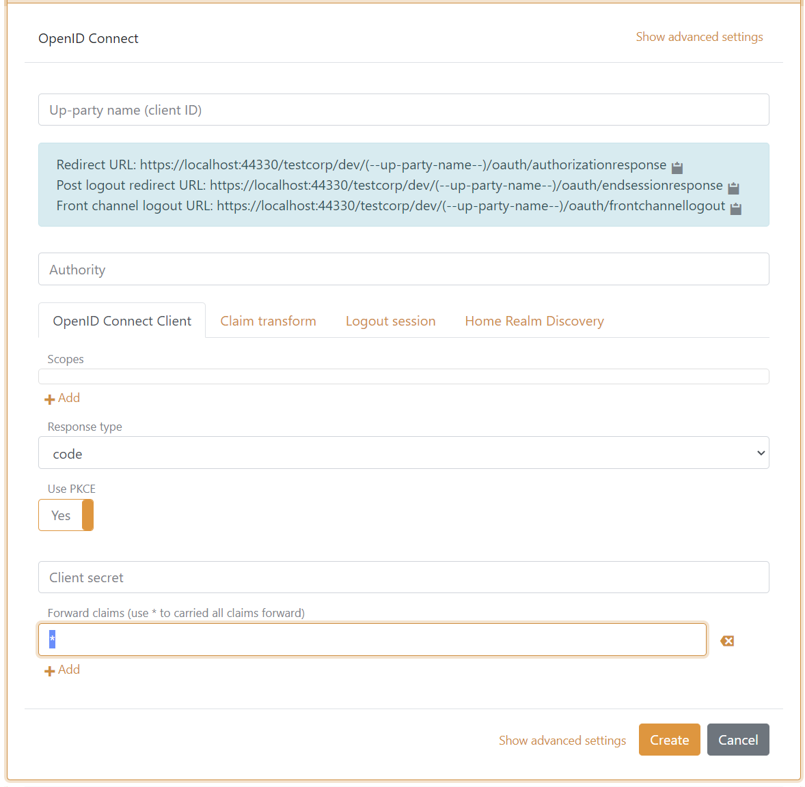
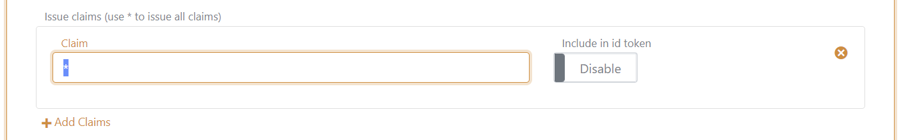
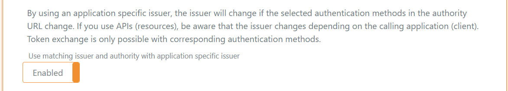

# FAQ

##### Only the `sub`, `sid`, `acr` and `amr` claims are pass through. I get more claims from the authentication method by using log claims trace. What am I doing wrong?
By default an authentication method should pass through all claims to the application registration if Forward Claims has a `*`.

You can also make the application registration (in this case a OpenID Connect client) add all claims to the access token issued to the application (not default).  
Navigating to the application registration then click Show advanced and add a `*` in the Issue claims field. Optionally also include all claims in the issued ID token.

##### Is it possible to avoid the "Pick an account" dialog?
Yes FoxIDs support to forward the login hint from an authentication method to an external IdP or another FoxIDs application registration. In OpenID Connect the login hint is forwarded in the `login_hint` parameter. 
In SAML 2.0 the login hint is forwarded as a `NameID` with the Email Format `urn:oasis:names:tc:SAML:1.1:nameid-format:emailAddress` in the `Subject` element.

##### I am unable to logout of a client using OIDC if I login and theafter changed the certificate container type.
The problem occurs if the OIDC logout require an ID Token before accepting logout. In this case the ID Token is invalid because the container type and there by the signing certificate have changed.  
Solution: You need to close the browser and start over.

##### How is an external SAML 2.0 IdPs certificate updated and can it be automated?
FoxIDs will automatically start accepting the new certificate if the external IdP add the new certificate to the existing SAML 2.0 metadata file/endpoint at least 24 hours in advance. A SAML 2.0 metadata file can have many certificates.  
You force a metadata refresh by clicking **Update** on the authentication method in FoxIDs.

If external IdP create a new SAML 2.0 metadata file or only hands over the certificate, there is only the manual way.

##### Who owns the security components used to build FoxIDs?
FoxIDs is build with open-source security components owned by FoxIDs ApS. 

- SAMl 2.0 is implemented with the [ITfoxtec.Identity.Saml2](https://github.com/ITfoxtec/ITfoxtec.Identity.Saml2) ([docs](https://www.foxids.com/components/identitysaml2)) component
- OAuth 2.0 and OpenID Connect is implemented with the [ITfoxtec.Identity](https://github.com/ITfoxtec/ITfoxtec.Identity) component
- OpenID Connect in the Control Client is implemented with the [ITfoxtec.Identity.BlazorWebAssembly.OpenidConnect](https://github.com/ITfoxtec/ITfoxtec.Identity.BlazorWebAssembly.OpenidConnect) component.

FoxIDs is former known as ITfoxtec.

##### Is matching issuer and authority support?
The [OpenID Connect Discovery 1.0](https://openid.net/specs/openid-connect-discovery-1_0.html) standard specifies:  
*The issuer value returned MUST be identical to the Issuer URL that was used as the prefix to /.well-known/openid-configuration to retrieve the configuration information.*

However, this part of the specification is known to be problematic, forcing the OpenID Provider to provide separate issuers for clients and resources to enable specific OIDC Discovery for clients and resources.  
By default, FoxIDs therefore provide one issuer per environment.

You can enable matching issuer and authority on OpenID Connect and OAuth 2.0 applications.

1. Find and open the application registration
2. Select **Show advanced**
3. Enable **Use matching issuer and authority with application specific issuer**
 

By using an application specific issuer, the issuer will change if the selected authentication methods in the authority URL change.
If you use APIs (resources), be aware that the issuer changes depending on the calling application (client).  
Token exchange is only possible with corresponding authentication methods.

