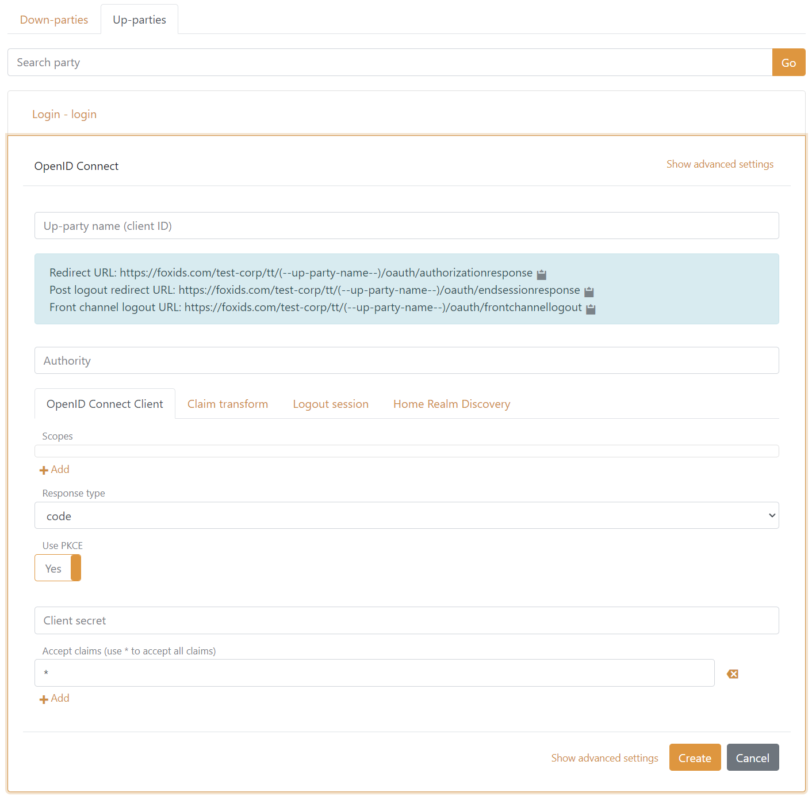

# FAQ

##### Only the `sub`, `sid`, `acr` and `amr` claims are pass through. I get more claims from the up-party by using log claims trace. What am I doing wrong?
By default an up-party should pass through all claims to the application registration if Forward Claims has a `*`.

You can also make the application registration (in this case a OpenID Connect client) add all claims to the access token issued to the application (not default).  
Navigating to the application registration then click Show advanced settings and add a `*` in the Issue claims field. Optionally also include all claims in the issued ID token.

##### Is it possible to avoid the "Pick an account" dialog?
Yes FoxIDs support to forward the login hint from an up-party to an external IdP or another FoxIDs application registration. In OpenID Connect the login hint is forwarded in the `login_hint` parameter. 
In SAML 2.0 the login hint is forwarded as a `NameID` with the Email Format `urn:oasis:names:tc:SAML:1.1:nameid-format:emailAddress` in the `Subject` element.

##### Way am I unable to login for a moment when I change the certificate container types to 'Key Vault renewed self-signed certificates'?
The first certificate have to be generated by Key Vault before the track can perform logins again. Thereafter the certificate is renewed seamlessly.

##### I am unable to logout of a client using OIDC if I login and theafter changed the certificate container type.
The problem occurs if the OIDC logout require an ID Token before accepting logout. In this case the ID Token is invalid because the container type and there by the signing certificate have changed.  
Solution: You need to close the browser and start over.

