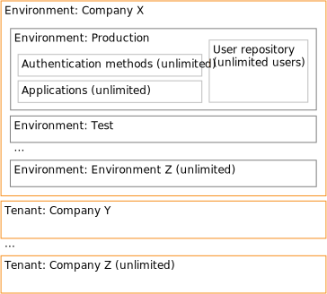

# FoxIDs inside

## Structure

FoxIDs keeps tenants isolated and separates environments, with each environment operating as its own identity provider.

**Master tenant and master environment** hold the platform-wide master configuration together with the FoxIDs admin users.

**Tenants** represent customer organizations (for example Company X, Company Y, Company Z) and can be created without limit. Every tenant includes its own master environment that stores the tenant-specific master configuration and tenant admin users.

**Environments** such as Production, Test, or bespoke stages live inside a tenant. An environment acts as an Identity Provider with a dedicated [user repository](users.md), unique [certificate](certificates.md), authentication methods, and application registrations.

**Authentications** define the upstream trusts with [OpenID Connect 1.0](auth-method-oidc.md), [SAML 2.0](auth-method-saml-2.0.md), or [login](login.md). 

**Applications** configure relying parties for [OAuth 2.0](app-reg-oauth-2.0.md), [OpenID Connect 1.0](app-reg-oidc.md), and [SAML 2.0](app-reg-saml-2.0.md). 

**User repository** keeps the users for an environment and can contain an unlimited number of users.

> FoxIDs supports unlimited tenants, unlimited environments per tenant, and unlimited users per environment.

## Limitations

For performance and security reasons FoxIDs enforces maximum lengths on all handled strings. Values are truncated or rejected if they exceed the allowed size.

The most important limitations are listed below.

**URL**  
The maximum length of a URL is 10k (10,240) characters. The maximum length of a query string is also 10k (10,240) characters.

**Claim**  
A claim consists of both a type and a value. The maximum claim type length is 80 characters for JWT (access tokens and ID tokens) and 300 characters for SAML 2.0. When FoxIDs processes claim values in a token, the maximum length per value and the combined length is 200,000 characters.

**Tokens**   
A JWT (access tokens, ID tokens, and refresh tokens) received by FoxIDs can have a maximum length of 256,000 characters. Claims that exceed their maximum lengths are truncated.  
FoxIDs can create larger tokens where each claim is capped instead of truncating the entire token.

If a JWT is included as a claim it is truncated if it exceeds the maximum allowed claim value length. 

A SAML 2.0 request or response can have a maximum length of 256,000 characters. The request is indirectly limited if it is sent using a redirect binding in the URL query string. 
Claims received in a SAML 2.0 AuthnResponse (SAML 2.0 token) are truncated if they exceed the maximum allowed lengths.