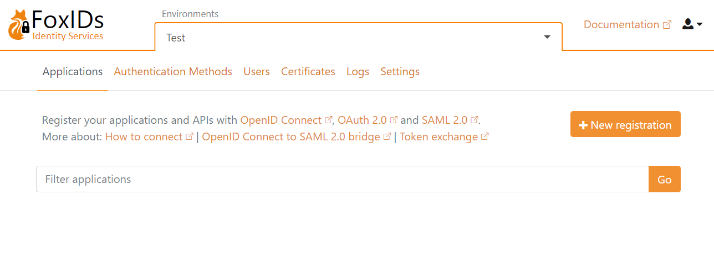
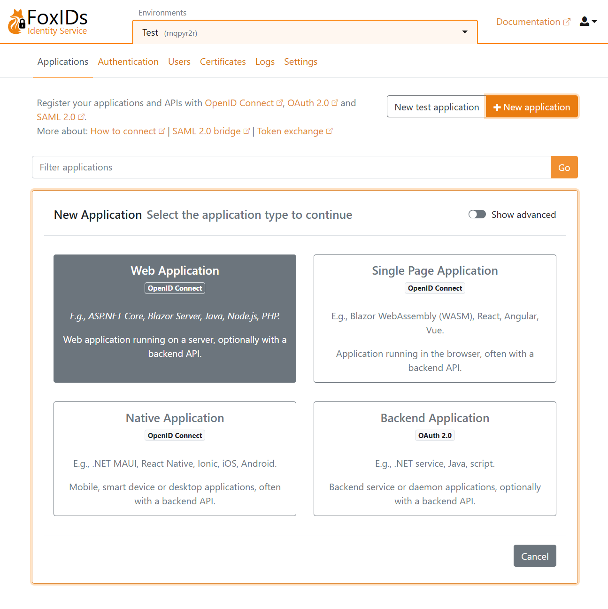
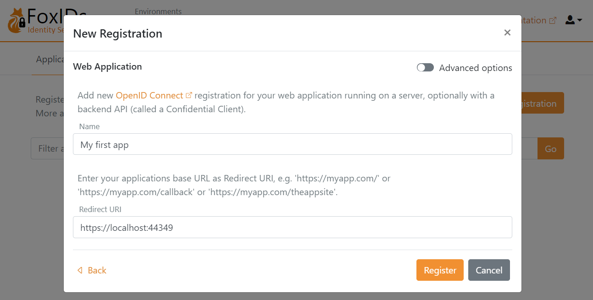
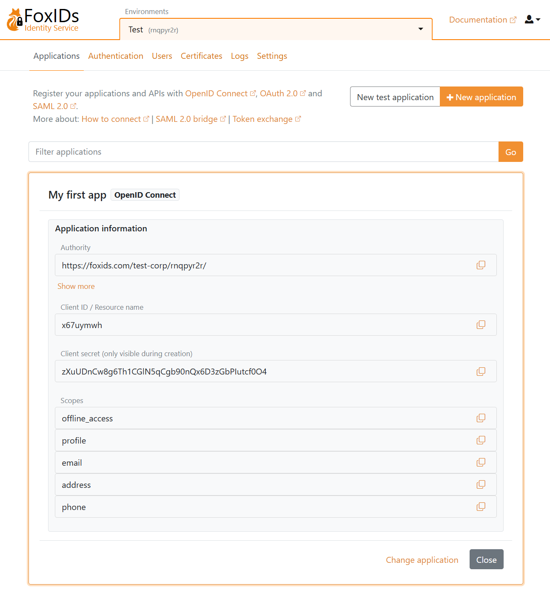
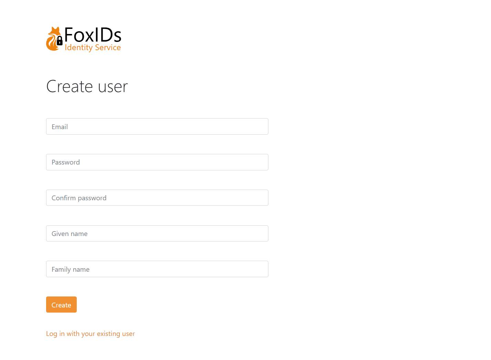
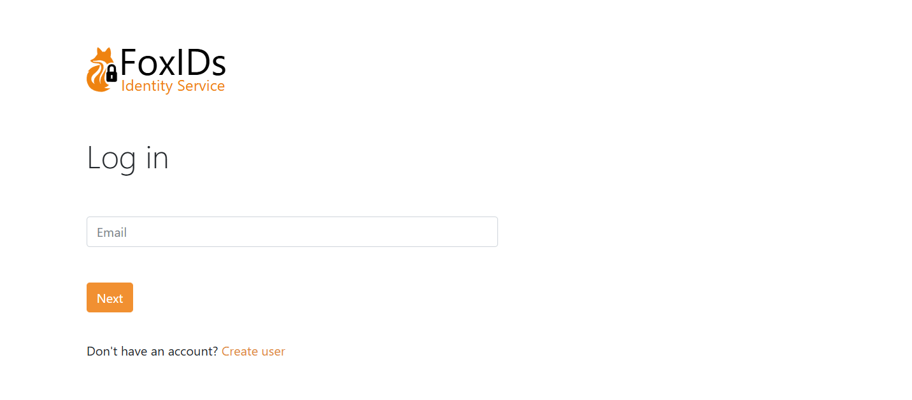

# Get started
FoxIDs is available online at [FoxIDs.com](https://www.foxids.com/action/createtenant) or you can [deploy](deployment.md) FoxIDs anywhere yourself.

> **FoxIDs as a Service (SaaS)**  
> FoxIDs.com is hosted in Azure Europe as an Identity Services (IDS).
>   
> [Register on FoxIDs.com](https://www.foxids.com/action/createtenant), where you get access to your one FoxIDs tenant.  
> 
> ---
> 
> **Self-Hosted**  
> You can [deploy](deployment.md) FoxIDs anywhere using Docker or Kubernetes (K8s).

## 1) First login

Open the FoxIDs Control admin portal and log in. You are now in the test environment where no applications have been configured yet.

You can select another environment, create a new environment or start building in the test environment.

## 2) Configure your first application
Let's configure the first OpenID Connect application and log in with a test user.  
You can optionally start by taking a look at the [sample applications](samples.md) which also can be [configured](samples.md#configure-samples-in-foxids-environment) in the you test environment. 

Click `New registration` to configure your OpenID Connect application and select the type of application.

I'll select Web Application, and then fill in the `Name` and base URL as the `Redirect URI`

Click `Register` to save the application configuration. Copy the `Authority`, `Client ID` and `Client secret` and optionally the `scopes`.

Configure your application with the `Authority`, `Client ID` and `Client secret`.  
You are presented with a detailed configuration view then you close the pop-up. If needed you can find the OpenID Connect (OIDC) Discovery endpoint and do configuration changes.

Open you application and start the login flow. You are then redirected to the FoxIDs login prompt where you can create a new test user.

And log in

