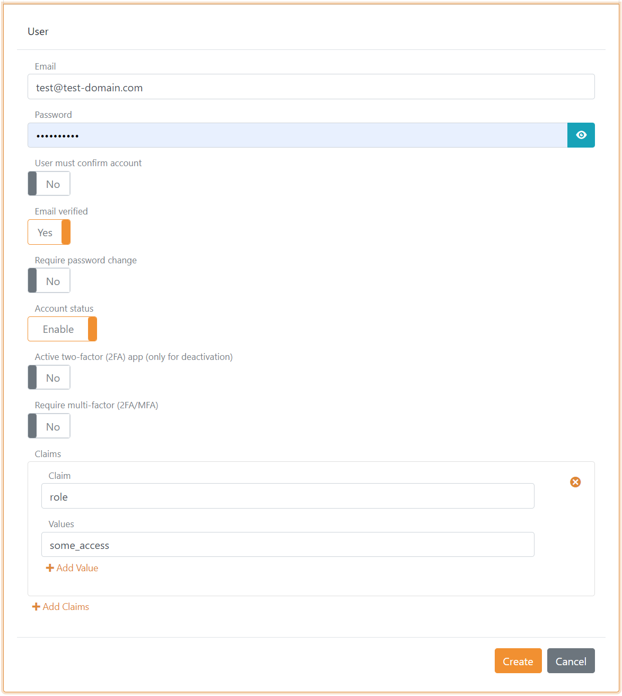
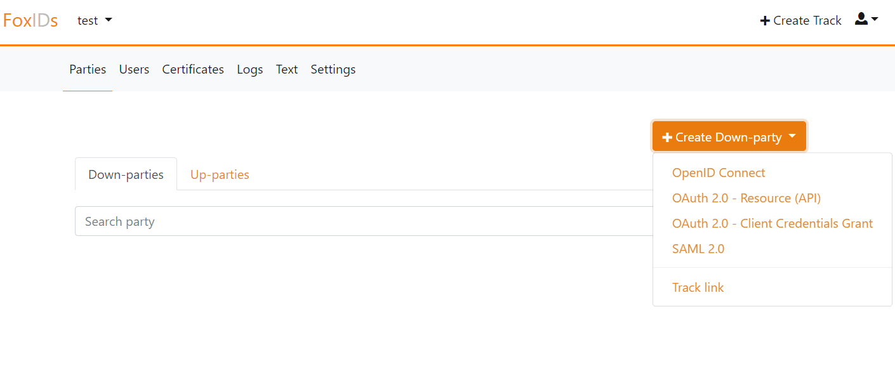

# Get started
Foxids is available at [Foxids.com](https://foxids.com) or you can [deploy](deployment.md) Foxids in your Microsoft Azure tenant as your own private cloud.

#### Foxids.com 
[Foxids.com](https://foxids.com) is deployed in Europe in Microsoft Azure Holland as an Identity Services (IDS) also called Identity as a Service (IDaaS).

a. [Register on Foxids.com](https://foxids.com/action/createtenant), where you get access to your one Foxids tenant. The tenant will hold your organizations entire security service.  
You become the first admin user and you can add more [admin users](control.md#create-administrator-users) later on. You can optionally configure [external trust](howto-connect.md#auth-method---how-to-connect-identity-provider-idp) in the `master` environment to authorize external admin users.

---

#### Foxids Private Cloud
Foxids is [open-source](index.md#free-and-open-source) and you are free to deploy Foxids as your own private cloud in your Microsoft Azure tenant.

a. [Deploy](deployment.md) Foxids in your Microsoft Azure tenant.
b. After successfully deployment, [login](deployment.md#first-login-and-admin-users) to the `master` tenant.  
You can create more [admin users](control.md#create-administrator-users) in the `master` tenant. You can optionally configure [external trust](howto-connect.md#auth-method---how-to-connect-identity-provider-idp) to authorize external admin users.
c. Create the tenant for your organizations security services. Applications, APIs and connections in general is configured in this tenant.  
You can create more [admin users](control.md#create-administrator-users) in the new tenants `master` environment. 
You can optionally [connect](howto-oidc-foxids.md) the `master` tenants `master` environment to the new tenants `master` environment to authorize admin users from the `master` tenant.

## 1) First login
You are presented with a list of your environments when you login.

The default environments in a tenant:

- `master` is the environment responsible for access to the tenant and the subsequently environments.  
The [Control Client](control.md#foxids-control-client) and [Control API](control.md#foxids-control-api) is configured in the `master` environment and admin users is added to the `master` environment. 
You should normally not add applications in the `master` environment.
- `-` (dash) is the production environment holding your organizations production security service
- `test` is a environment meant for testing. You probably need more environments for dev, test QA etc.

You can add and delete environments as you wish including deleting the default `-` (dash) and `test` tasks.

## 2) Run the first application
You can e.g. start by configuring the first application in the `test` environment, add [test user(s)](get-started.md#add-test-users) and login.

You can either configure [your own application](get-started.md#configure-your-own-application) or configure the samples and run a [sample application](get-started.md#sample-application).

> Add a test user to be able to login!

### Add test user(s)
Select the `test` environment and go to the `Users` tab to create a test user(s).

Then click `Create User`, fill out the page and click `Create`.

### Default login UI
In the `test` environment go to the `Authentication methods` tab where you find the default [login](login.md) authentication method which handles the user login and logout.

### Configure your own application 
In the `test` environment go to the `Applications` tab to configure your application. 

A web based applications (client / relaying party) can be configured with [OpenID Connect](app-reg-oidc.md) or [SAML 2.0](app-reg-saml-2.0.md).

> It is possible to add more authentication methods to federate with [external Identity Providers (IdPs)](howto-connect.md#auth-method---how-to-connect-identity-provider-idp). Thereafter, a new authentication method can be added to your application registration.

### Sample application
The [sample applications](samples.md) can be found in the [samples repository](https://github.com/ITfoxtec/Foxids.Samples).

The samples contains a configuration [seed tool](samples.md#configure-the-sample-seed-tool) which is used to configure all the samples in the `test` environment or another environment.

After successfully configuring the samples a good starting point is the [AspNetCoreOidcAuthCodeAllUpPartiesSample](samples.md#aspnetcoreoidcauthcodealluppartiessample) web application.  
You need to update the tenant and environment configuration in the `appsettings.json` config file and thereafter the sample should work.
