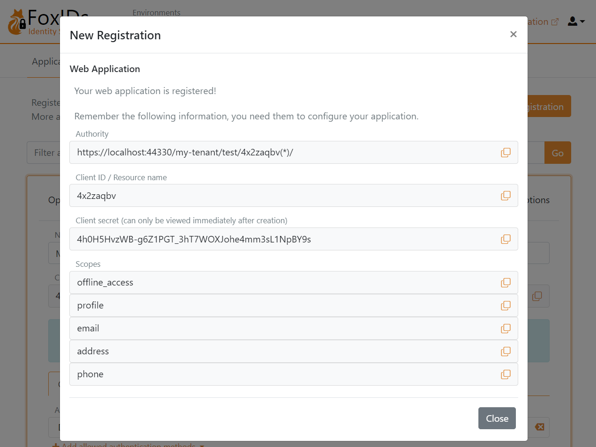

# Get started
You can [create a tenant](https://www.foxids.com/action/signup) on FoxIDs Cloud or you can [deploy](deployment.md) FoxIDs anywhere yourself.

> **FoxIDs Cloud**  
> FoxIDs.com is hosted in Europe as an Identity Service (IDS).
>   
> [Create a new tenant](https://www.foxids.com/action/signup) or [log in](https://www.foxids.com/action/login) to your tenant. 
> 
> ---
> 
> **Self-Hosted**  
> You can [deploy](deployment.md) FoxIDs anywhere using Docker or Kubernetes (K8s).

## 1) First login

Open the FoxIDs Control admin portal and log in. You are now in the test environment where no applications have been configured yet.

You can select another environment, create a new environment or start building in the test environment.

## 2) Configure your first application
Let's configure the first OpenID Connect application and log in with a test user.  

Click `New application` and then select a OpenID Connect Web Application.

Then fill in the `Name` and the base URL as the `Redirect URI`

Click `Create` to save the application configuration. Copy the `Authority`, `Client ID`, and `Client secret`, and optionally the `scopes`.
Click `Show more` if you need the OpenID Connect (OIDC) Discovery endpoint.

Add the configuration details `Authority`, `Client ID`, and `Client secret` to your application.  

Open your application and start the login flow.  
You are then redirected to the FoxIDs login prompt (displayed in your language) where you can choose to create a new test user.

Then log in

