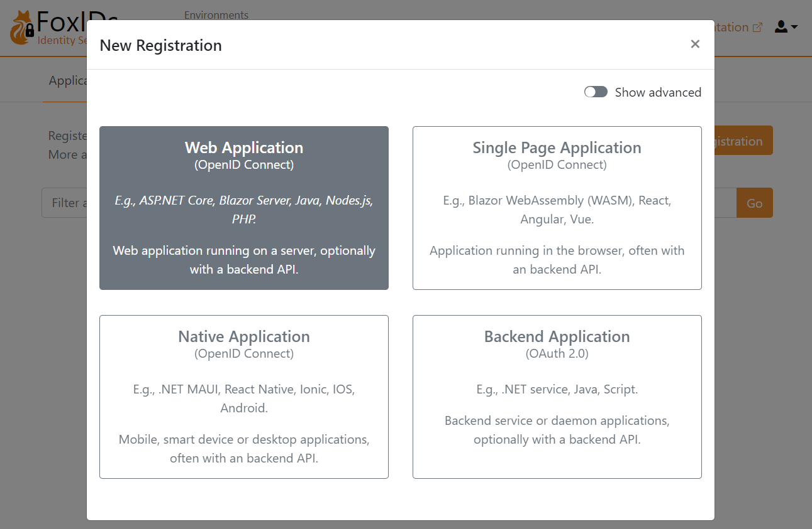

# Get started
FoxIDs Cloud lets you create a tenant in minutes and start configuring secure identity flows right away. [Create a new tenant](https://www.foxids.com/action/createtenant) or [log in](https://www.foxids.com/action/login) with an existing account to open FoxIDs Control.

Looking to run FoxIDs yourself? See the [self-host deployment guide](deployment.md).

## 1) Create or access your tenant
1. Sign up for FoxIDs Cloud or sign in to FoxIDs Control.  
2. Confirm your email and create a password (if requested) and you are taken directly to FoxIDs Control.

FoxIDs.com is hosted in Europe and operates as a managed Identity Service (IDS), so you do not need to handle infrastructure or updates.

## 2) Choose your environment
FoxIDs tenants include a dedicated **master** environment plus application environments:

- **Master environment**: Manage tenant-wide settings, change plans, add payment cards, and control which environments are available to your team.
- **Application environments**: Each environment has its own configuration and user store. Tenants start with a **test** and a **production** environment to keep work and live traffic separated.
- **Isolation**: Users, data, and settings never carry over between environments. Create test users and validate changes without impacting production sign-ins.
- **Flexibility**: Delete environments you no longer need or add new ones as your release process grows. The Free plan includes two environments; upgrade to a Pro or Enterprise plan from the master environment to unlock additional environments.

Use the environment selector in FoxIDs Control to switch between test and production (or any extra environments you create) before making changes.

## 3) Configure your first application
Let's configure the first OpenID Connect application and log in with a test user in the test environment.

Click `New application` and then select an OpenID Connect Web Application.

Fill in the `Name` and the base URL as the `Redirect URI`.

Click `Create` to save the application configuration. Copy the `Authority`, `Client ID`, and `Client secret`, and optionally the `scopes`. Click `Show more` if you need the OpenID Connect (OIDC) Discovery endpoint.

Add the configuration details `Authority`, `Client ID`, and `Client secret` to your application.

Open your application and start the login flow. You are then redirected to the FoxIDs login prompt (displayed in your language) where you can choose to create a new test user.

Then log in.

