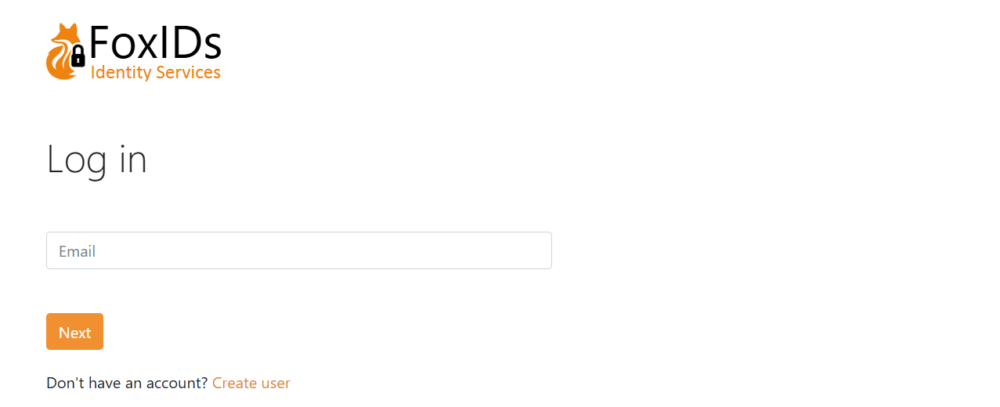

# Get started
You can [create a tenant](https://www.foxids.com/action/signup) on FoxIDs Cloud or you can [deploy](deployment.md) FoxIDs anywhere yourself.

> **FoxIDs Cloud**  
> FoxIDs.com is hosted in Europe as an Identity Service (IDS).
>   
> [Create a new tenant](https://www.foxids.com/action/signup) or [log in](https://www.foxids.com/action/login) to your tenant. 
> 
> ---
> 
> **Self-Hosted**  
> You can [deploy](deployment.md) FoxIDs anywhere using Docker or Kubernetes (K8s).

## 1) First login

Open the FoxIDs Control admin portal and log in. You are now in the test environment where no applications have been configured yet.

You can select another environment, create a new environment or start building in the test environment.

## 2) Configure your first application
Let's configure the first OpenID Connect application and log in with a test user.  
You may want to start by looking at the [sample applications](samples.md), which can also be [configured](samples.md#configure-samples-in-foxids-environment) in your test environment. 

Click `New application` to configure your OpenID Connect application and select the type of application.

I'll select Web Application, and then fill in the `Name` and base URL as the `Redirect URI`

Click `Register` to save the application configuration. Copy the `Authority`, `Client ID` and `Client secret` and optionally the `scopes`.

Configure your application with the `Authority`, `Client ID` and `Client secret`.  
You are presented with a detailed configuration view then you close the pop-up. If needed you can find the OpenID Connect (OIDC) Discovery endpoint and do configuration changes.

Open you application and start the login flow. You are then redirected to the FoxIDs login prompt where you can select to create a new test user.

> Each environment has a separate user store. You cannot log in with your administrator user, which only exists in the master environment. Therefore, you need to create a new or the same user in the test environment.

And log in

