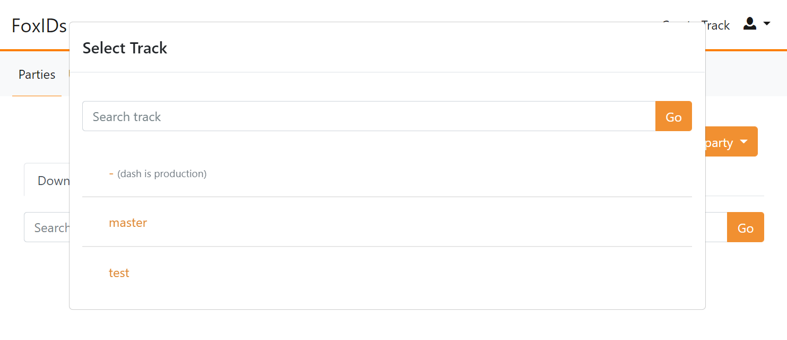
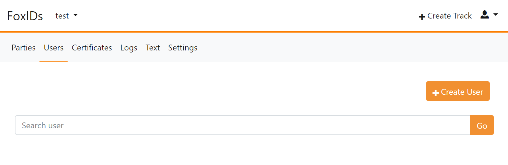
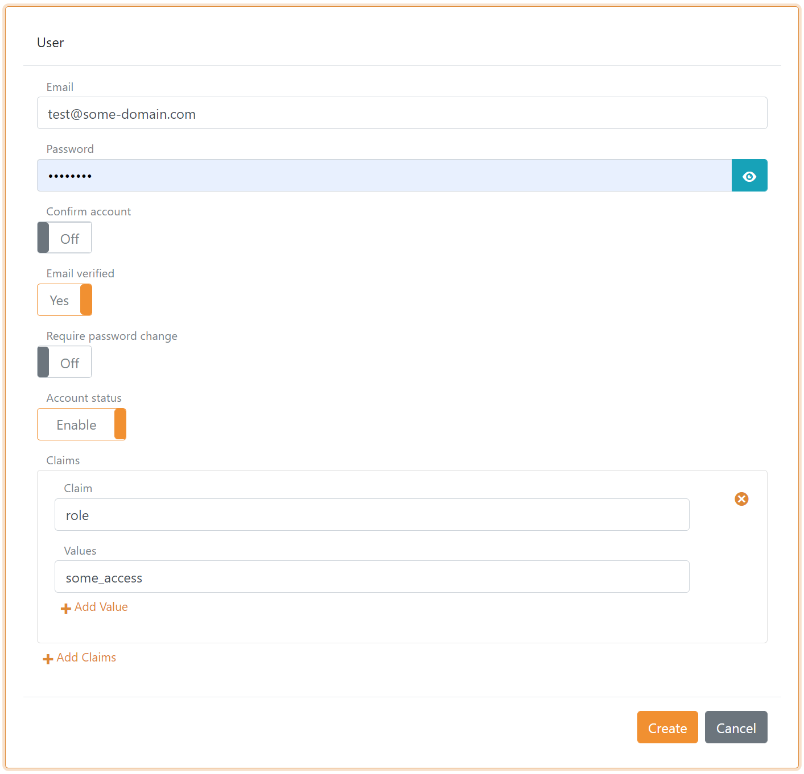
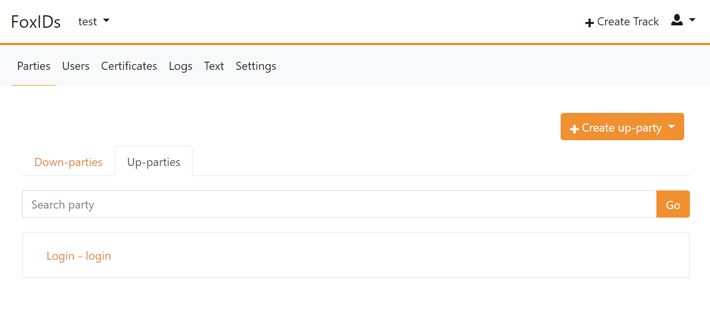
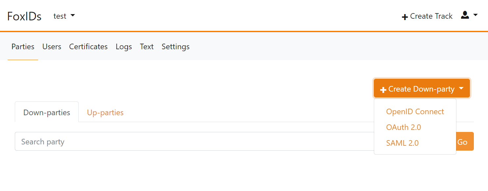

# Getting started
The get started guide is mend to get you started using FoxIDs and to help you configure the first application as a down-party in FoxIDs.

## 1) Get access to FoxIDs tenant
FoxIDs is available at [FoxIDs.com](https://foxids.com) or you can [deploy](deployment.md) FoxIDs in a Microsoft Azure tenant as your own private cloud.  
The only different is how you get access to the tenant, from there on the rest is the same.

#### FoxIDs.com 
[FoxIDs.com](https://foxids.com) is deployed in Europe in Microsoft Azure Holland as an Identity Services (IDS) also called Identity as a Service (IDaaS).

1. Register at [FoxIDs.com](https://foxids.com), where you get access to your one FoxIDs tenant. The tenant will hold your organizations entire security service.  
You can create more [admin users](control.md#create-administrator-users) in your one new tenants `master` track.

#### FoxIDs Private Cloud
FoxIDs is [open source](index.md#free-and-open-source) and you are free to deploy FoxIDs as your own private cloud in a Microsoft Azure tenant.

1. [Deploy](deployment.md) FoxIDs in a Microsoft Azure tenant.
2. After successfully deployment, [login](deployment.md#first-login-and-admin-users) to the `master` tenant in [FoxIDs Control Client](control.md#foxids-control-client).  
You can create more [admin users](control.md#create-administrator-users) in the `master` tenant. But you should normally not add applications in the `master` tenant.
2. Create the tenant for your organizations security service.  
You can create more [admin users](control.md#create-administrator-users) in the new tenants `master` track.

## 2) First login
Every time you log into your FoxIDs tenant you are presented with a list of the tracks in the tenant.

The default tracks in a tenant:

- `master` is the track responsible for access to the tenant and the subsequently tracks.  
The [Control Client](control.md#foxids-control-client) and [Control API](control.md#foxids-control-api) is configured in the `master` track and admin users is added to the `master` track. 
You should normally not add applications in the `master` track.
- `-` (dash) is the production track holding your organizations production security service
- `test` is a track meant for testing. You probably need more tracks for dev, test QA etc.

You can add and delete tracks including deleting default `-` (dash) and `test` tasks.

## 3) Run the first application
You can start by configuring the first application in the `test` track, add [test user(s)](getting-started.md#add-test-users) and do a login.

You can either configure [your own application](getting-started.md#configure-your-own-application) or configure the samples and run a [sample application](getting-started.md#sample-application).

### Add test user(s)
Select the `test` track and go to the `Users` tab to create a test user(s).

Then click `Create User` and thereafter click `Create`.

### Default login dialog
In the `test` track and go to the `Parties` tab and `Up-parties` subtab. 

Each track contains a default [login](login.md) up-party which is responsible for handling the login dialog doing login and logout.

The login up-party with the default name `login` is selected in the down-party to enable login with users in the track.  

> It is possible to add more up-parties to federate with external IdPs (identity providers) using [OpenID Connect](up-party-oidc.md) and [SAML 2.0](up-party-saml-2.0.md). 
These also need to be configured in the down-party to be enabled.

### Configure your own application 
In the `test` track go to the `Parties` tab and `Down-parties` subtab to configure your application. 

Web based applications (client / relaying party) can be configured with [OpenID Connect](down-party-oidc.md) and [SAML 2.0](down-party-saml-2.0.md). APIs (resource) can be configured with [OAuth 2.0](down-party-oauth-2.0.md).

You can e.g., configure your application as confidential client with [OpenID Connect Authorization Code Flow](down-party-oidc.md#configure-authorization-code-flow-for-a-confidential-client).

### Sample application
The [sample applications](samples.md) can be found in the [samples repository](https://github.com/ITfoxtec/FoxIDs.Samples).

> The samples are in a Visual Studio solution and can eminently run using the pre-configured test tenant at [FoxIDs.com](https://foxids.com).

The samples contains a configuration [seed tool](samples.md#configure-the-sample-seed-tool) which is used to configure all the samples in e.g., the `test` track.  
The seed tool is given access by configuring it in the `master` track and the tool has thereafter access to add the configuration in a track in the tenant.

After successfully configuring the samples in the `test` track you can e.g., select to test with the ASP.NET OIDC Authorization Code sample - [AspNetCoreOidcAuthorizationCodeSample](https://github.com/ITfoxtec/FoxIDs.Samples/tree/master/src/AspNetCoreOidcAuthorizationCodeSample).  
You need to update the tenant and track configuration in the `appsettings.json` config file and thereafter the sample should work.
